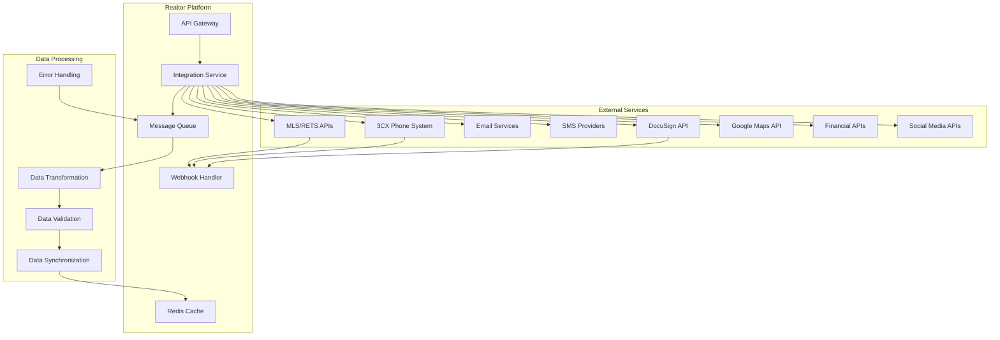

# API Integrations Plan

## Overview

The realtor platform requires seamless integration with multiple external services to provide comprehensive functionality. This plan covers all major API integrations including MLS/RETS, 3CX phone system, email services, SMS providers, document signing, mapping services, and financial systems.

## Integration Architecture

### 1. API Integration Framework



### 2. Integration Service Architecture

```typescript
// Base integration service
abstract class BaseIntegrationService {
  protected apiClient: AxiosInstance;
  protected rateLimiter: RateLimiter;
  protected cache: Redis;
  protected logger: Logger;
  
  constructor(config: IntegrationConfig) {
    this.apiClient = this.createApiClient(config);
    this.rateLimiter = new RateLimiter(config.rateLimit);
    this.cache = new Redis(process.env.REDIS_URL);
    this.logger = new Logger(`Integration:${config.serviceName}`);
  }
  
  protected createApiClient(config: IntegrationConfig): AxiosInstance {
    const client = axios.create({
      baseURL: config.baseUrl,
      timeout: config.timeout || 30000,
      headers: {
        'User-Agent': 'RealtorPlatform/1.0',
        ...config.defaultHeaders
      }
    });
    
    // Request interceptor for authentication
    client.interceptors.request.use(async (request) => {
      await this.rateLimiter.checkLimit();
      request.headers.Authorization = await this.getAuthHeader();
      return request;
    });
    
    // Response interceptor for error handling
    client.interceptors.response.use(
      (response) => response,
      (error) => this.handleApiError(error)
    );
    
    return client;
  }
  
  protected abstract getAuthHeader(): Promise<string>;
  
  protected async handleApiError(error: AxiosError): Promise<never> {
    this.logger.error('API Error:', {
      url: error.config?.url,
      method: error.config?.method,
      status: error.response?.status,
      message: error.message
    });
    
    // Handle specific error types
    if (error.response?.status === 429) {
      // Rate limit exceeded
      await this.handleRateLimit(error);
    } else if (error.response?.status === 401) {
      // Authentication failed
      await this.refreshAuthentication();
    }
    
    throw new IntegrationError(
      `API call failed: ${error.message}`,
      error.response?.status,
      error.config?.url
    );
  }
  
  protected async cacheResponse(
    key: string,
    data: any,
    ttl: number = 3600
  ): Promise<void> {
    await this.cache.setex(key, ttl, JSON.stringify(data));
  }
  
  protected async getCachedResponse(key: string): Promise<any | null> {
    const cached = await this.cache.get(key);
    return cached ? JSON.parse(cached) : null;
  }
}
```

## MLS/RETS Integration

### 1. MLS Data Synchronization

```typescript
// MLS integration service
class MLSIntegrationService extends BaseIntegrationService {
  private retsClient: RETSClient;
  
  constructor() {
    super({
      serviceName: 'MLS',
      baseUrl: process.env.MLS_BASE_URL,
      rateLimit: { requests: 100, window: 60000 } // 100 requests per minute
    });
    
    this.retsClient = new RETSClient({
      loginUrl: process.env.MLS_LOGIN_URL,
      username: process.env.MLS_USERNAME,
      password: process.env.MLS_PASSWORD,
      userAgent: process.env.MLS_USER_AGENT
    });
  }
  
  async syncProperties(lastSyncTime?: Date): Promise<PropertySyncResult> {
    try {
      await this.retsClient.login();
      
      // Build query for updated properties
      const query = this.buildPropertyQuery(lastSyncTime);
      
      // Fetch properties in batches
      const properties = await this.fetchPropertiesBatch(query);
      
      // Process and store properties
      const results = await this.processProperties(properties);
      
      await this.retsClient.logout();
      
      return results;
    } catch (error) {
      this.logger.error('MLS sync failed:', error);
      throw new IntegrationError('Failed to sync MLS properties', 500);
    }
  }
  
  private async fetchPropertiesBatch(query: string): Promise<MLSProperty[]> {
    const batchSize = 1000;
    let offset = 0;
    const allProperties: MLSProperty[] = [];
    
    while (true) {
      const batch = await this.retsClient.search({
        resource: 'Property',
        class: 'Residential',
        query: query,
        format: 'COMPACT-DECODED',
        limit: batchSize,
        offset: offset
      });
      
      if (batch.results.length === 0) break;
      
      allProperties.push(...batch.results);
      offset += batchSize;
      
      // Rate limiting
      await this.delay(1000);
    }
    
    return allProperties;
  }
  
  private async processProperties(properties: MLSProperty[]): Promise<PropertySyncResult> {
    let processed = 0;
    let errors = 0;
    const errorDetails: string[] = [];
    
    for (const mlsProperty of properties) {
      try {
        await this.processIndividualProperty(mlsProperty);
        processed++;
      } catch (error) {
        errors++;
        errorDetails.push(`Property ${mlsProperty.ListingId}: ${error.message}`);
        this.logger.error(`Failed to process property ${mlsProperty.ListingId}:`, error);
      }
    }
    
    return {
      totalProcessed: processed,
      totalErrors: errors,
      errorDetails,
      syncTimestamp: new Date()
    };
  }
  
  async getPropertyPhotos(mlsNumber: string): Promise<PropertyPhoto[]> {
    const cacheKey = `mls:photos:${mlsNumber}`;
    const cached = await this.getCachedResponse(cacheKey);
    if (cached) return cached;
    
    try {
      const photos = await this.retsClient.getObject({
        resource: 'Property',
        type: 'Photo',
        id: mlsNumber
      });
      
      const processedPhotos = await this.processPropertyPhotos(photos, mlsNumber);
      
      // Cache for 24 hours
      await this.cacheResponse(cacheKey, processedPhotos, 86400);
      
      return processedPhotos;
    } catch (error) {
      this.logger.error(`Failed to fetch photos for ${mlsNumber}:`, error);
      return [];
    }
  }
  
  protected async getAuthHeader(): Promise<string> {
    // RETS uses session-based authentication
    return '';
  }
}
```

### 2. Real-time MLS Updates

```typescript
// MLS webhook handler
class MLSWebhookHandler {
  async handlePropertyUpdate(webhook: MLSWebhook): Promise<void> {
    try {
      // Validate webhook signature
      await this.validateWebhookSignature(webhook);
      
      // Process update based on type
      switch (webhook.eventType) {
        case 'property.created':
          await this.handlePropertyCreated(webhook.data);
          break;
        case 'property.updated':
          await this.handlePropertyUpdated(webhook.data);
          break;
        case 'property.deleted':
          await this.handlePropertyDeleted(webhook.data);
          break;
        case 'property.status_changed':
          await this.handlePropertyStatusChanged(webhook.data);
          break;
      }
      
      // Log webhook processing
      await this.logWebhookEvent(webhook);
      
    } catch (error) {
      this.logger.error('Webhook processing failed:', error);
      throw error;
    }
  }
  
  private async handlePropertyUpdated(data: MLSPropertyData): Promise<void> {
    // Find existing property
    const existingProperty = await db.property.findUnique({
      where: { mlsNumber: data.ListingId }
    });
    
    if (!existingProperty) {
      // Property doesn't exist, create it
      await this.handlePropertyCreated(data);
      return;
    }
    
    // Detect significant changes
    const changes = await this.detectPropertyChanges(existingProperty, data);
    
    // Update property
    await this.mlsService.processMLSProperty(data);
    
    // Notify interested clients if significant changes
    if (changes.length > 0) {
      await this.notifyClientsOfPropertyChanges(existingProperty.id, changes);
    }
  }
  
  private async notifyClientsOfPropertyChanges(
    propertyId: string,
    changes: PropertyChange[]
  ): Promise<void> {
    // Find clients with saved searches matching this property
    const interestedClients = await this.findInterestedClients(propertyId);
    
    for (const client of interestedClients) {
      await this.sendPropertyUpdateNotification(client, propertyId, changes);
    }
  }
}
```

## Communication Service Integrations

### 1. Email Service Integration

```typescript
// Email service integration
class EmailIntegrationService extends BaseIntegrationService {
  private providers: Map<string, EmailProvider> = new Map();
  
  constructor() {
    super({
      serviceName: 'Email',
      baseUrl: '',
      rateLimit: { requests: 1000, window: 60000 }
    });
    
    this.initializeProviders();
  }
  
  private initializeProviders(): void {
    // Primary provider: Resend
    this.providers.set('resend', new ResendProvider({
      apiKey: process.env.RESEND_API_KEY,
      fromDomain: process.env.EMAIL_FROM_DOMAIN
    }));
    
    // Backup provider: SendGrid
    this.providers.set('sendgrid', new SendGridProvider({
      apiKey: process.env.SENDGRID_API_KEY,
      fromEmail: process.env.SENDGRID_FROM_EMAIL
    }));
    
    // Transactional provider: AWS SES
    this.providers.set('ses', new SESProvider({
      region: process.env.AWS_REGION,
      accessKeyId: process.env.AWS_ACCESS_KEY_ID,
      secretAccessKey: process.env.AWS_SECRET_ACCESS_KEY
    }));
  }
  
  async sendEmail(emailRequest: EmailRequest): Promise<EmailResult> {
    const provider = this.selectProvider(emailRequest.type);
    
    try {
      // Validate email content
      await this.validateEmailContent(emailRequest);
      
      // Apply email template if specified
      if (emailRequest.templateId) {
        emailRequest = await this.applyEmailTemplate(emailRequest);
      }
      
      // Send email
      const result = await provider.sendEmail(emailRequest);
      
      // Log email sent
      await this.logEmailSent(emailRequest, result);
      
      // Track email metrics
      await this.trackEmailMetrics(emailRequest, result);
      
      return result;
      
    } catch (error) {
      // Try backup provider if primary fails
      if (provider !== this.providers.get('sendgrid')) {
        this.logger.warn('Primary email provider failed, trying backup');
        return await this.providers.get('sendgrid')!.sendEmail(emailRequest);
      }
      
      throw new IntegrationError(`Email sending failed: ${error.message}`);
    }
  }
  
  async sendBulkEmail(
    recipients: EmailRecipient[],
    emailTemplate: EmailTemplate
  ): Promise<BulkEmailResult> {
    const batchSize = 100;
    const results: EmailResult[] = [];
    
    for (let i = 0; i < recipients.length; i += batchSize) {
      const batch = recipients.slice(i, i + batchSize);
      
      const batchPromises = batch.map(recipient => 
        this.sendEmail({
          to: recipient.email,
          subject: this.personalizeSubject(emailTemplate.subject, recipient),
          content: this.personalizeContent(emailTemplate.content, recipient),
          templateId: emailTemplate.id,
          type: 'marketing'
        })
      );
      
      const batchResults = await Promise.allSettled(batchPromises);
      
      batchResults.forEach((result, index) => {
        if (result.status === 'fulfilled') {
          results.push(result.value);
        } else {
          this.logger.error(`Failed to send email to ${batch[index].email}:`, result.reason);
        }
      });
      
      // Rate limiting between batches
      await this.delay(1000);
    }
    
    return {
      totalSent: results.filter(r => r.success).length,
      totalFailed: results.filter(r => !r.success).length,
      results
    };
  }
  
  async trackEmailEvents(webhook: EmailWebhook): Promise<void> {
    // Handle email events (opens, clicks, bounces, etc.)
    switch (webhook.event) {
      case 'delivered':
        await this.handleEmailDelivered(webhook);
        break;
      case 'opened':
        await this.handleEmailOpened(webhook);
        break;
      case 'clicked':
        await this.handleEmailClicked(webhook);
        break;
      case 'bounced':
        await this.handleEmailBounced(webhook);
        break;
      case 'complained':
        await this.handleEmailComplaint(webhook);
        break;
    }
  }
  
  protected async getAuthHeader(): Promise<string> {
    return `Bearer ${process.env.RESEND_API_KEY}`;
  }
}
```

### 2. SMS Integration

```typescript
// SMS service integration
class SMSIntegrationService extends BaseIntegrationService {
  private twilioClient: Twilio;
  
  constructor() {
    super({
      serviceName: 'SMS',
      baseUrl: 'https://api.twilio.com',
      rateLimit: { requests: 100, window: 60000 }
    });
    
    this.twilioClient = new Twilio(
      process.env.TWILIO_ACCOUNT_SID,
      process.env.TWILIO_AUTH_TOKEN
    );
  }
  
  async sendSMS(smsRequest: SMSRequest): Promise<SMSResult> {
    try {
      // Validate phone number
      const validatedNumber = await this.validatePhoneNumber(smsRequest.to);
      
      // Check opt-out status
      const isOptedOut = await this.checkOptOutStatus(validatedNumber);
      if (isOptedOut) {
        throw new IntegrationError('Recipient has opted out of SMS');
      }
      
      // Send SMS
      const message = await this.twilioClient.messages.create({
        body: smsRequest.message,
        from: process.env.TWILIO_PHONE_NUMBER,
        to: validatedNumber
      });
      
      // Log SMS sent
      await this.logSMSSent(smsRequest, message);
      
      return {
        success: true,
        messageId: message.sid,
        status: message.status,
        cost: message.price
      };
      
    } catch (error) {
      this.logger.error('SMS sending failed:', error);
      throw new IntegrationError(`SMS sending failed: ${error.message}`);
    }
  }
  
  async sendBulkSMS(
    recipients: string[],
    message: string
  ): Promise<BulkSMSResult> {
    const results: SMSResult[] = [];
    
    for (const recipient of recipients) {
      try {
        const result = await this.sendSMS({
          to: recipient,
          message: message
        });
        results.push(result);
      } catch (error) {
        results.push({
          success: false,
          error: error.message,
          phoneNumber: recipient
        });
      }
      
      // Rate limiting
      await this.delay(100);
    }
    
    return {
      totalSent: results.filter(r => r.success).length,
      totalFailed: results.filter(r => !r.success).length,
      results
    };
  }
  
  async handleSMSWebhook(webhook: TwilioWebhook): Promise<void> {
    switch (webhook.MessageStatus) {
      case 'delivered':
        await this.handleSMSDelivered(webhook);
        break;
      case 'failed':
        await this.handleSMSFailed(webhook);
        break;
      case 'undelivered':
        await this.handleSMSUndelivered(webhook);
        break;
    }
  }
  
  private async validatePhoneNumber(phoneNumber: string): Promise<string> {
    try {
      const lookup = await this.twilioClient.lookups.v1
        .phoneNumbers(phoneNumber)
        .fetch();
      
      return lookup.phoneNumber;
    } catch (error) {
      throw new IntegrationError(`Invalid phone number: ${phoneNumber}`);
    }
  }
  
  protected async getAuthHeader(): Promise<string> {
    const credentials = Buffer.from(
      `${process.env.TWILIO_ACCOUNT_SID}:${process.env.TWILIO_AUTH_TOKEN}`
    ).toString('base64');
    return `Basic ${credentials}`;
  }
}
```

## Document & Mapping Integrations

### 1. DocuSign Integration

```typescript
// DocuSign integration service
class DocuSignIntegrationService extends BaseIntegrationService {
  private apiClient: ApiClient;
  
  constructor() {
    super({
      serviceName: 'DocuSign',
      baseUrl: process.env.DOCUSIGN_BASE_PATH,
      rateLimit: { requests: 1000, window: 3600000 } // 1000 per hour
    });
    
    this.apiClient = new ApiClient();
    this.apiClient.setBasePath(process.env.DOCUSIGN_BASE_PATH);
  }
  
  async sendEnvelopeForSignature(
    envelopeRequest: EnvelopeRequest
  ): Promise<EnvelopeResult> {
    try {
      // Create envelope definition
      const envelopeDefinition = await this.createEnvelopeDefinition(envelopeRequest);
      
      // Send envelope
      const envelopesApi = new EnvelopesApi(this.apiClient);
      const result = await envelopesApi.createEnvelope(
        process.env.DOCUSIGN_ACCOUNT_ID,
        { envelopeDefinition }
      );
      
      // Store envelope information
      await this.storeEnvelopeInfo(envelopeRequest.documentId, result);
      
      // Set up webhook for status updates
      await this.setupEnvelopeWebhook(result.envelopeId);
      
      return {
        envelopeId: result.envelopeId,
        status: result.status,
        uri: result.uri
      };
      
    } catch (error) {
      this.logger.error('DocuSign envelope creation failed:', error);
      throw new IntegrationError(`Failed to send document for signature: ${error.message}`);
    }
  }
  
  async getEnvelopeStatus(envelopeId: string): Promise<EnvelopeStatus> {
    const cacheKey = `docusign:status:${envelopeId}`;
    const cached = await this.getCachedResponse(cacheKey);
    if (cached) return cached;
    
    try {
      const envelopesApi = new EnvelopesApi(this.apiClient);
      const envelope = await envelopesApi.getEnvelope(
        process.env.DOCUSIGN_ACCOUNT_ID,
        envelopeId
      );
      
      const status = {
        envelopeId,
        status: envelope.status,
        completedDateTime: envelope.completedDateTime,
        signers: envelope.recipients.signers.map(signer => ({
          email: signer.email,
          name: signer.name,
          status: signer.status,
          signedDateTime: signer.signedDateTime
        }))
      };
      
      // Cache for 5 minutes
      await this.cacheResponse(cacheKey, status, 300);
      
      return status;
    } catch (error) {
      throw new IntegrationError(`Failed to get envelope status: ${error.message}`);
    }
  }
  
  async downloadCompletedDocument(envelopeId: string): Promise<Buffer> {
    try {
      const envelopesApi = new EnvelopesApi(this.apiClient);
      const document = await envelopesApi.getDocument(
        process.env.DOCUSIGN_ACCOUNT_ID,
        envelopeId,
        'combined'
      );
      
      return Buffer.from(document, 'binary');
    } catch (error) {
      throw new IntegrationError(`Failed to download document: ${error.message}`);
    }
  }
  
  async handleDocuSignWebhook(webhook: DocuSignWebhook): Promise<void> {
    try {
      // Validate webhook
      await this.validateDocuSignWebhook(webhook);
      
      // Process envelope status change
      switch (webhook.event) {
        case 'envelope-completed':
          await this.handleEnvelopeCompleted(webhook);
          break;
        case 'envelope-declined':
          await this.handleEnvelopeDeclined(webhook);
          break;
        case 'envelope-voided':
          await this.handleEnvelopeVoided(webhook);
          break;
        case 'recipient-completed':
          await this.handleRecipientCompleted(webhook);
          break;
      }
    } catch (error) {
      this.logger.error('DocuSign webhook processing failed:', error);
    }
  }
  
  protected async getAuthHeader(): Promise<string> {
    const accessToken = await this.getDocuSignAccessToken();
    return `Bearer ${accessToken}`;
  }
  
  private async getDocuSignAccessToken(): Promise<string> {
    const cacheKey = 'docusign:access_token';
    const cached = await this.cache.get(cacheKey);
    if (cached) return cached;
    
    // Implement OAuth2 flow for DocuSign
    const tokenResponse = await this.requestAccessToken();
    
    // Cache token with expiry
    await this.cache.setex(
      cacheKey,
      tokenResponse.expires_in - 60, // Refresh 1 minute early
      tokenResponse.access_token
    );
    
    return tokenResponse.access_token;
  }
}
```

### 2. Google Maps Integration

```typescript
// Google Maps integration service
class GoogleMapsIntegrationService extends BaseIntegrationService {
  private mapsClient: Client;
  
  constructor() {
    super({
      serviceName: 'GoogleMaps',
      baseUrl: 'https://maps.googleapis.com',
      rateLimit: { requests: 2500, window: 86400000 } // 2500 per day
    });
    
    this.mapsClient = new Client({
      key: process.env.GOOGLE_MAPS_API_KEY
    });
  }
  
  async geocodeAddress(address: string): Promise<GeocodeResult> {
    const cacheKey = `geocode:${Buffer.from(address).toString('base64')}`;
    const cached = await this.getCachedResponse(cacheKey);
    if (cached) return cached;
    
    try {
      const response = await this.mapsClient.geocode({
        params: {
          address: address,
          key: process.env.GOOGLE_MAPS_API_KEY
        }
      });
      
      if (response.data.results.length === 0) {
        throw new IntegrationError('Address not found');
      }
      
      const result = response.data.results[0];
      const geocodeResult = {
        latitude: result.geometry.location.lat,
        longitude: result.geometry.location.lng,
        formattedAddress: result.formatted_address,
        addressComponents: result.address_components,
        placeId: result.place_id
      };
      
      // Cache for 30 days
      await this.cacheResponse(cacheKey, geocodeResult, 2592000);
      
      return geocodeResult;
    } catch (error) {
      throw new IntegrationError(`Geocoding failed: ${error.message}`);
    }
  }
  
  async getPlaceDetails(placeId: string): Promise<PlaceDetails> {
    const cacheKey = `place:${placeId}`;
    const cached = await this.getCachedResponse(cacheKey);
    if (cached) return cached;
    
    try {
      const response = await this.mapsClient.placeDetails({
        params: {
          place_id: placeId,
          fields: [
            'name', 'formatted_address', 'geometry', 'photos',
            'rating', 'reviews', 'types', 'website', 'formatted_phone_number'
          ],
          key: process.env.GOOGLE_MAPS_API_KEY
        }
      });
      
      const place = response.data.result;
      const placeDetails = {
        placeId: place.place_id,
        name: place.name,
        address: place.formatted_address,
        location: place.geometry.location,
        rating: place.rating,
        photos: place.photos?.map(photo => ({
          reference: photo.photo_reference,
          width: photo.width,
          height: photo.height
        })),
        types: place.types,
        website: place.website,
        phoneNumber: place.formatted_phone_number
      };
      
      // Cache for 7 days
      await this.cacheResponse(cacheKey, placeDetails, 604800);
      
      return placeDetails;
    } catch (error) {
      throw new IntegrationError(`Place details failed: ${error.message}`);
    }
  }
  
  async calculateDistance(
    origin: string,
    destination: string,
    mode: 'driving' | 'walking' | 'transit' = 'driving'
  ): Promise<DistanceResult> {
    try {
      const response = await this.mapsClient.distancematrix({
        params: {
          origins: [origin],
          destinations: [destination],
          mode: mode,
          units: 'imperial',
          key: process.env.GOOGLE_MAPS_API_KEY
        }
      });
      
      const element = response.data.rows[0].elements[0];
      
      if (element.status !== 'OK') {
        throw new IntegrationError(`Distance calculation failed: ${element.status}`);
      }
      
      return {
        distance: element.distance,
        duration: element.duration,
        mode: mode
      };
    } catch (error) {
      throw new IntegrationError(`Distance calculation failed: ${error.message}`);
    }
  }
  
  async getNearbyPlaces(
    location: { lat: number; lng: number },
    type: string,
    radius: number = 5000
  ): Promise<NearbyPlace[]> {
    const cacheKey = `nearby:${location.lat}:${location.lng}:${type}:${radius}`;
    const cached = await this.getCachedResponse(cacheKey);
    if (cached) return cached;
    
    try {
      const response = await this.mapsClient.placesNearby({
        params: {
          location: location,
          radius: radius,
          type: type,
          key: process.env.GOOGLE_MAPS_API_KEY
        }
      });
      
      const places = response.data.results.map(place => ({
        placeId: place.place_id,
        name: place.name,
        location: place.geometry.location,
        rating: place.rating,
        priceLevel: place.price_level,
        types: place.types,
        vicinity: place.vicinity
      }));
      
      // Cache for 1 hour
      await this.cacheResponse(cacheKey, places, 3600);
      
      return places;
    } catch (error) {
      throw new IntegrationError(`Nearby places search failed: ${error.message}`);
    }
  }
  
  protected async getAuthHeader(): Promise<string> {
    return `Bearer ${process.env.GOOGLE_MAPS_API_KEY}`;
  }
}
```

## Integration Management

### 1. Integration Health Monitoring

```typescript
// Integration health monitoring service
class IntegrationHealthService {
  private healthChecks: Map<string, HealthCheck> = new Map();
  
  constructor() {
    this.setupHealthChecks();
    this.startHealthMonitoring();
  }
  
  private setupHealthChecks(): void {
    this.healthChecks.set('mls', {
      name: 'MLS/RETS',
      endpoint: process.env.MLS_LOGIN_URL,
      timeout: 30000,
      interval: 300000, // 5 minutes
      critical: true
    });
    
    this.healthChecks.set('3cx', {
      name: '3CX Phone System',
      endpoint: `${process.env.CX_SERVER_URL}/api/system/status`,
      timeout: 10000,
      interval: 60000, // 1 minute
      critical: true
    });
    
    this.healthChecks.set('email', {
      name: 'Email Service',
      endpoint: 'https://api.resend.com/domains',
      timeout: 10000,
      interval: 300000, // 5 minutes
      critical: false
    });
    
    this.healthChecks.set('sms', {
      name: 'SMS Service',
      endpoint: 'https://api.twilio.