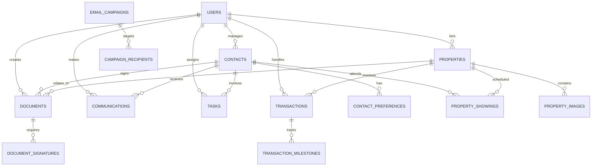

# Database Schema Design

## Core Entities Overview

The database is designed around these main entities:
- **Users & Authentication**
- **Contacts & CRM**
- **Properties & Listings**
- **Documents & Files**
- **Communications**
- **Tasks & Activities**
- **Transactions & Deals**

## Detailed Schema

### 1. Users & Authentication

```sql
-- Users table (realtor and system users)
CREATE TABLE users (
    id UUID PRIMARY KEY DEFAULT gen_random_uuid(),
    email VARCHAR(255) UNIQUE NOT NULL,
    password_hash VARCHAR(255),
    first_name VARCHAR(100) NOT NULL,
    last_name VARCHAR(100) NOT NULL,
    phone VARCHAR(20),
    avatar_url TEXT,
    role VARCHAR(50) DEFAULT 'realtor',
    license_number VARCHAR(100),
    brokerage VARCHAR(255),
    is_active BOOLEAN DEFAULT true,
    email_verified BOOLEAN DEFAULT false,
    created_at TIMESTAMP DEFAULT NOW(),
    updated_at TIMESTAMP DEFAULT NOW()
);

-- User sessions for authentication
CREATE TABLE user_sessions (
    id UUID PRIMARY KEY DEFAULT gen_random_uuid(),
    user_id UUID REFERENCES users(id) ON DELETE CASCADE,
    token VARCHAR(255) UNIQUE NOT NULL,
    expires_at TIMESTAMP NOT NULL,
    created_at TIMESTAMP DEFAULT NOW()
);
```

### 2. Contacts & CRM

```sql
-- Main contacts table (leads, clients, vendors)
CREATE TABLE contacts (
    id UUID PRIMARY KEY DEFAULT gen_random_uuid(),
    user_id UUID REFERENCES users(id) ON DELETE CASCADE,
    type VARCHAR(50) NOT NULL, -- 'lead', 'buyer', 'seller', 'vendor', 'referral'
    status VARCHAR(50) DEFAULT 'active', -- 'active', 'inactive', 'converted', 'lost'
    source VARCHAR(100), -- 'website', 'referral', 'social', 'cold_call'
    first_name VARCHAR(100) NOT NULL,
    last_name VARCHAR(100) NOT NULL,
    email VARCHAR(255),
    phone VARCHAR(20),
    secondary_phone VARCHAR(20),
    address TEXT,
    city VARCHAR(100),
    state VARCHAR(50),
    zip_code VARCHAR(20),
    date_of_birth DATE,
    occupation VARCHAR(255),
    employer VARCHAR(255),
    annual_income DECIMAL(12,2),
    notes TEXT,
    tags TEXT[], -- Array of tags for categorization
    lead_score INTEGER DEFAULT 0,
    last_contact_date TIMESTAMP,
    next_follow_up_date TIMESTAMP,
    created_at TIMESTAMP DEFAULT NOW(),
    updated_at TIMESTAMP DEFAULT NOW()
);

-- Contact preferences and requirements
CREATE TABLE contact_preferences (
    id UUID PRIMARY KEY DEFAULT gen_random_uuid(),
    contact_id UUID REFERENCES contacts(id) ON DELETE CASCADE,
    property_type VARCHAR(50)[], -- ['single_family', 'condo', 'townhouse']
    min_price DECIMAL(12,2),
    max_price DECIMAL(12,2),
    min_bedrooms INTEGER,
    max_bedrooms INTEGER,
    min_bathrooms DECIMAL(3,1),
    max_bathrooms DECIMAL(3,1),
    preferred_areas TEXT[],
    must_have_features TEXT[],
    nice_to_have_features TEXT[],
    timeline VARCHAR(50), -- 'immediate', '3_months', '6_months', '1_year'
    financing_type VARCHAR(50), -- 'cash', 'conventional', 'fha', 'va'
    pre_approved BOOLEAN DEFAULT false,
    pre_approval_amount DECIMAL(12,2),
    created_at TIMESTAMP DEFAULT NOW(),
    updated_at TIMESTAMP DEFAULT NOW()
);
```

### 3. Properties & Listings

```sql
-- Properties table
CREATE TABLE properties (
    id UUID PRIMARY KEY DEFAULT gen_random_uuid(),
    user_id UUID REFERENCES users(id) ON DELETE CASCADE,
    mls_number VARCHAR(100) UNIQUE,
    status VARCHAR(50) DEFAULT 'active', -- 'active', 'pending', 'sold', 'withdrawn'
    property_type VARCHAR(50) NOT NULL, -- 'single_family', 'condo', 'townhouse', 'land'
    listing_type VARCHAR(50) NOT NULL, -- 'sale', 'rent', 'lease'
    address TEXT NOT NULL,
    city VARCHAR(100) NOT NULL,
    state VARCHAR(50) NOT NULL,
    zip_code VARCHAR(20) NOT NULL,
    county VARCHAR(100),
    latitude DECIMAL(10, 8),
    longitude DECIMAL(11, 8),
    price DECIMAL(12,2) NOT NULL,
    original_price DECIMAL(12,2),
    price_per_sqft DECIMAL(8,2),
    bedrooms INTEGER,
    bathrooms DECIMAL(3,1),
    half_baths INTEGER,
    square_feet INTEGER,
    lot_size DECIMAL(10,2),
    year_built INTEGER,
    garage_spaces INTEGER,
    parking_spaces INTEGER,
    stories INTEGER,
    basement BOOLEAN DEFAULT false,
    pool BOOLEAN DEFAULT false,
    fireplace BOOLEAN DEFAULT false,
    central_air BOOLEAN DEFAULT false,
    heating_type VARCHAR(50),
    cooling_type VARCHAR(50),
    flooring_types TEXT[],
    appliances_included TEXT[],
    features TEXT[],
    description TEXT,
    public_remarks TEXT,
    private_remarks TEXT,
    showing_instructions TEXT,
    list_date DATE,
    expiration_date DATE,
    days_on_market INTEGER,
    virtual_tour_url TEXT,
    created_at TIMESTAMP DEFAULT NOW(),
    updated_at TIMESTAMP DEFAULT NOW()
);

-- Property images
CREATE TABLE property_images (
    id UUID PRIMARY KEY DEFAULT gen_random_uuid(),
    property_id UUID REFERENCES properties(id) ON DELETE CASCADE,
    url TEXT NOT NULL,
    caption TEXT,
    is_primary BOOLEAN DEFAULT false,
    sort_order INTEGER DEFAULT 0,
    created_at TIMESTAMP DEFAULT NOW()
);

-- Property showings
CREATE TABLE property_showings (
    id UUID PRIMARY KEY DEFAULT gen_random_uuid(),
    property_id UUID REFERENCES properties(id) ON DELETE CASCADE,
    contact_id UUID REFERENCES contacts(id) ON DELETE CASCADE,
    user_id UUID REFERENCES users(id) ON DELETE CASCADE,
    scheduled_date TIMESTAMP NOT NULL,
    duration_minutes INTEGER DEFAULT 30,
    status VARCHAR(50) DEFAULT 'scheduled', -- 'scheduled', 'completed', 'cancelled', 'no_show'
    feedback TEXT,
    interest_level INTEGER, -- 1-5 scale
    notes TEXT,
    created_at TIMESTAMP DEFAULT NOW(),
    updated_at TIMESTAMP DEFAULT NOW()
);
```

### 4. Documents & Files

```sql
-- Document categories and templates
CREATE TABLE document_templates (
    id UUID PRIMARY KEY DEFAULT gen_random_uuid(),
    user_id UUID REFERENCES users(id) ON DELETE CASCADE,
    name VARCHAR(255) NOT NULL,
    category VARCHAR(100) NOT NULL, -- 'contract', 'disclosure', 'marketing', 'legal'
    file_url TEXT NOT NULL,
    is_active BOOLEAN DEFAULT true,
    created_at TIMESTAMP DEFAULT NOW()
);

-- Document instances
CREATE TABLE documents (
    id UUID PRIMARY KEY DEFAULT gen_random_uuid(),
    user_id UUID REFERENCES users(id) ON DELETE CASCADE,
    template_id UUID REFERENCES document_templates(id),
    contact_id UUID REFERENCES contacts(id),
    property_id UUID REFERENCES properties(id),
    transaction_id UUID REFERENCES transactions(id),
    name VARCHAR(255) NOT NULL,
    category VARCHAR(100) NOT NULL,
    file_url TEXT NOT NULL,
    file_size INTEGER,
    mime_type VARCHAR(100),
    status VARCHAR(50) DEFAULT 'draft', -- 'draft', 'pending_signature', 'signed', 'completed'
    docusign_envelope_id VARCHAR(255),
    signature_required BOOLEAN DEFAULT false,
    signed_date TIMESTAMP,
    expiration_date TIMESTAMP,
    notes TEXT,
    created_at TIMESTAMP DEFAULT NOW(),
    updated_at TIMESTAMP DEFAULT NOW()
);

-- Document signatures tracking
CREATE TABLE document_signatures (
    id UUID PRIMARY KEY DEFAULT gen_random_uuid(),
    document_id UUID REFERENCES documents(id) ON DELETE CASCADE,
    signer_contact_id UUID REFERENCES contacts(id),
    signer_email VARCHAR(255) NOT NULL,
    signer_name VARCHAR(255) NOT NULL,
    signature_status VARCHAR(50) DEFAULT 'pending', -- 'pending', 'signed', 'declined'
    signed_date TIMESTAMP,
    ip_address INET,
    created_at TIMESTAMP DEFAULT NOW()
);
```

### 5. Communications

```sql
-- Communication log (calls, emails, texts, meetings)
CREATE TABLE communications (
    id UUID PRIMARY KEY DEFAULT gen_random_uuid(),
    user_id UUID REFERENCES users(id) ON DELETE CASCADE,
    contact_id UUID REFERENCES contacts(id),
    property_id UUID REFERENCES properties(id),
    type VARCHAR(50) NOT NULL, -- 'call', 'email', 'sms', 'meeting', 'note'
    direction VARCHAR(20), -- 'inbound', 'outbound'
    subject VARCHAR(255),
    content TEXT,
    duration_seconds INTEGER, -- for calls
    phone_number VARCHAR(20),
    email_address VARCHAR(255),
    status VARCHAR(50), -- 'completed', 'missed', 'voicemail', 'sent', 'delivered'
    scheduled_date TIMESTAMP,
    completed_date TIMESTAMP,
    recording_url TEXT, -- for call recordings
    attachments TEXT[], -- file URLs
    tags TEXT[],
    created_at TIMESTAMP DEFAULT NOW(),
    updated_at TIMESTAMP DEFAULT NOW()
);

-- Email campaigns and automation
CREATE TABLE email_campaigns (
    id UUID PRIMARY KEY DEFAULT gen_random_uuid(),
    user_id UUID REFERENCES users(id) ON DELETE CASCADE,
    name VARCHAR(255) NOT NULL,
    subject VARCHAR(255) NOT NULL,
    content TEXT NOT NULL,
    template_id VARCHAR(100),
    status VARCHAR(50) DEFAULT 'draft', -- 'draft', 'scheduled', 'sent', 'completed'
    scheduled_date TIMESTAMP,
    sent_date TIMESTAMP,
    recipient_count INTEGER DEFAULT 0,
    opened_count INTEGER DEFAULT 0,
    clicked_count INTEGER DEFAULT 0,
    created_at TIMESTAMP DEFAULT NOW()
);

-- Campaign recipients
CREATE TABLE campaign_recipients (
    id UUID PRIMARY KEY DEFAULT gen_random_uuid(),
    campaign_id UUID REFERENCES email_campaigns(id) ON DELETE CASCADE,
    contact_id UUID REFERENCES contacts(id) ON DELETE CASCADE,
    status VARCHAR(50) DEFAULT 'pending', -- 'pending', 'sent', 'delivered', 'opened', 'clicked', 'bounced'
    sent_date TIMESTAMP,
    opened_date TIMESTAMP,
    clicked_date TIMESTAMP
);
```

### 6. Tasks & Activities

```sql
-- Tasks and reminders
CREATE TABLE tasks (
    id UUID PRIMARY KEY DEFAULT gen_random_uuid(),
    user_id UUID REFERENCES users(id) ON DELETE CASCADE,
    contact_id UUID REFERENCES contacts(id),
    property_id UUID REFERENCES properties(id),
    transaction_id UUID REFERENCES transactions(id),
    title VARCHAR(255) NOT NULL,
    description TEXT,
    type VARCHAR(50), -- 'call', 'email', 'meeting', 'document', 'showing', 'follow_up'
    priority VARCHAR(20) DEFAULT 'medium', -- 'low', 'medium', 'high', 'urgent'
    status VARCHAR(50) DEFAULT 'pending', -- 'pending', 'in_progress', 'completed', 'cancelled'
    due_date TIMESTAMP,
    completed_date TIMESTAMP,
    reminder_date TIMESTAMP,
    estimated_duration INTEGER, -- minutes
    actual_duration INTEGER, -- minutes
    notes TEXT,
    created_at TIMESTAMP DEFAULT NOW(),
    updated_at TIMESTAMP DEFAULT NOW()
);

-- Activity log for audit trail
CREATE TABLE activity_log (
    id UUID PRIMARY KEY DEFAULT gen_random_uuid(),
    user_id UUID REFERENCES users(id) ON DELETE CASCADE,
    entity_type VARCHAR(50) NOT NULL, -- 'contact', 'property', 'document', 'task'
    entity_id UUID NOT NULL,
    action VARCHAR(100) NOT NULL, -- 'created', 'updated', 'deleted', 'viewed'
    description TEXT,
    old_values JSONB,
    new_values JSONB,
    ip_address INET,
    user_agent TEXT,
    created_at TIMESTAMP DEFAULT NOW()
);
```

### 7. Transactions & Deals

```sql
-- Real estate transactions
CREATE TABLE transactions (
    id UUID PRIMARY KEY DEFAULT gen_random_uuid(),
    user_id UUID REFERENCES users(id) ON DELETE CASCADE,
    property_id UUID REFERENCES properties(id) ON DELETE CASCADE,
    buyer_contact_id UUID REFERENCES contacts(id),
    seller_contact_id UUID REFERENCES contacts(id),
    transaction_type VARCHAR(50) NOT NULL, -- 'purchase', 'sale', 'lease'
    status VARCHAR(50) DEFAULT 'active', -- 'active', 'pending', 'closed', 'cancelled'
    contract_date DATE,
    closing_date DATE,
    possession_date DATE,
    purchase_price DECIMAL(12,2),
    commission_rate DECIMAL(5,4), -- e.g., 0.0600 for 6%
    commission_amount DECIMAL(12,2),
    commission_split DECIMAL(5,4), -- split with brokerage
    net_commission DECIMAL(12,2),
    earnest_money DECIMAL(12,2),
    down_payment DECIMAL(12,2),
    loan_amount DECIMAL(12,2),
    loan_type VARCHAR(50),
    lender VARCHAR(255),
    title_company VARCHAR(255),
    inspector VARCHAR(255),
    appraiser VARCHAR(255),
    notes TEXT,
    created_at TIMESTAMP DEFAULT NOW(),
    updated_at TIMESTAMP DEFAULT NOW()
);

-- Transaction milestones and deadlines
CREATE TABLE transaction_milestones (
    id UUID PRIMARY KEY DEFAULT gen_random_uuid(),
    transaction_id UUID REFERENCES transactions(id) ON DELETE CASCADE,
    name VARCHAR(255) NOT NULL,
    description TEXT,
    due_date DATE,
    completed_date DATE,
    status VARCHAR(50) DEFAULT 'pending', -- 'pending', 'completed', 'overdue'
    is_critical BOOLEAN DEFAULT false,
    sort_order INTEGER DEFAULT 0,
    created_at TIMESTAMP DEFAULT NOW()
);
```

## Indexes for Performance

```sql
-- User and authentication indexes
CREATE INDEX idx_users_email ON users(email);
CREATE INDEX idx_user_sessions_token ON user_sessions(token);
CREATE INDEX idx_user_sessions_user_id ON user_sessions(user_id);

-- Contact indexes
CREATE INDEX idx_contacts_user_id ON contacts(user_id);
CREATE INDEX idx_contacts_type ON contacts(type);
CREATE INDEX idx_contacts_status ON contacts(status);
CREATE INDEX idx_contacts_email ON contacts(email);
CREATE INDEX idx_contacts_phone ON contacts(phone);
CREATE INDEX idx_contacts_last_contact ON contacts(last_contact_date);

-- Property indexes
CREATE INDEX idx_properties_user_id ON properties(user_id);
CREATE INDEX idx_properties_status ON properties(status);
CREATE INDEX idx_properties_mls ON properties(mls_number);
CREATE INDEX idx_properties_location ON properties(city, state, zip_code);
CREATE INDEX idx_properties_price ON properties(price);
CREATE INDEX idx_properties_type ON properties(property_type);
CREATE INDEX idx_properties_coordinates ON properties(latitude, longitude);

-- Communication indexes
CREATE INDEX idx_communications_user_id ON communications(user_id);
CREATE INDEX idx_communications_contact_id ON communications(contact_id);
CREATE INDEX idx_communications_type ON communications(type);
CREATE INDEX idx_communications_date ON communications(completed_date);

-- Task indexes
CREATE INDEX idx_tasks_user_id ON tasks(user_id);
CREATE INDEX idx_tasks_status ON tasks(status);
CREATE INDEX idx_tasks_due_date ON tasks(due_date);
CREATE INDEX idx_tasks_contact_id ON tasks(contact_id);

-- Document indexes
CREATE INDEX idx_documents_user_id ON documents(user_id);
CREATE INDEX idx_documents_contact_id ON documents(contact_id);
CREATE INDEX idx_documents_property_id ON documents(property_id);
CREATE INDEX idx_documents_status ON documents(status);

-- Transaction indexes
CREATE INDEX idx_transactions_user_id ON transactions(user_id);
CREATE INDEX idx_transactions_property_id ON transactions(property_id);
CREATE INDEX idx_transactions_status ON transactions(status);
CREATE INDEX idx_transactions_closing_date ON transactions(closing_date);
```

## Data Relationships Summary



This schema provides a comprehensive foundation for all realtor business operations while maintaining data integrity and performance through proper indexing and relationships.