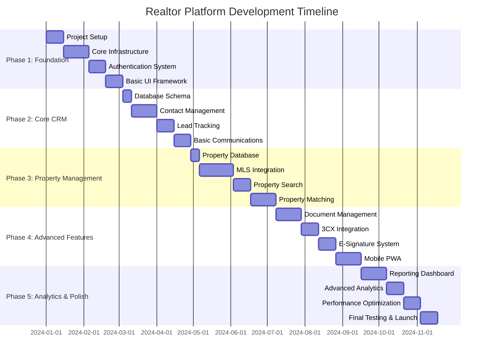

# Development Timeline and Milestones

## Overview

This comprehensive development timeline breaks down the realtor platform project into manageable phases, each with specific deliverables, timelines, and success criteria. The project is structured to deliver value incrementally while building toward a complete business management solution.

## Project Phases Overview



## Phase 1: Foundation & Infrastructure (9 weeks)

### Week 1-2: Project Setup & Planning
**Duration**: 2 weeks  
**Team**: 2 developers, 1 architect

#### Deliverables:
- [ ] Project repository setup with CI/CD pipeline
- [ ] Development environment configuration
- [ ] Code standards and documentation guidelines
- [ ] Initial Next.js application with TypeScript
- [ ] Database setup (Supabase/PostgreSQL)
- [ ] Basic deployment pipeline to Vercel

#### Success Criteria:
- ✅ All team members can run the application locally
- ✅ Automated deployment to staging environment
- ✅ Code quality gates (linting, testing) in place
- ✅ Project documentation structure established

### Week 3-5: Core Infrastructure
**Duration**: 3 weeks  
**Team**: 3 developers, 1 DevOps

#### Deliverables:
- [ ] Database schema implementation (Prisma)
- [ ] API route structure and middleware
- [ ] Error handling and logging system
- [ ] Security headers and CORS configuration
- [ ] Redis cache integration
- [ ] File storage setup (Cloudflare R2)
- [ ] Monitoring and analytics integration

#### Success Criteria:
- ✅ Database migrations run successfully
- ✅ API endpoints return proper responses
- ✅ Error tracking captures and reports issues
- ✅ File upload/download functionality works
- ✅ Performance monitoring is active

### Week 6-7: Authentication System
**Duration**: 2 weeks  
**Team**: 2 developers

#### Deliverables:
- [ ] NextAuth.js integration
- [ ] Multi-factor authentication (MFA)
- [ ] Role-based access control (RBAC)
- [ ] Password reset functionality
- [ ] Session management
- [ ] Security audit logging

#### Success Criteria:
- ✅ Users can register and login securely
- ✅ MFA works via SMS and email
- ✅ Different user roles have appropriate access
- ✅ Password policies are enforced
- ✅ Security events are logged

### Week 8-9: Basic UI Framework
**Duration**: 2 weeks  
**Team**: 2 frontend developers, 1 designer

#### Deliverables:
- [ ] Design system implementation (Tailwind CSS)
- [ ] Responsive layout components
- [ ] Navigation and routing structure
- [ ] Form components and validation
- [ ] Loading states and error boundaries
- [ ] Dark/light theme support

#### Success Criteria:
- ✅ Consistent UI components across the application
- ✅ Mobile-responsive design on all screen sizes
- ✅ Accessible components (WCAG 2.1 AA)
- ✅ Form validation provides clear feedback
- ✅ Theme switching works properly

## Phase 2: Core CRM Functionality (8 weeks)

### Week 10: Database Schema Refinement
**Duration**: 1 week  
**Team**: 1 backend developer, 1 architect

#### Deliverables:
- [ ] Complete CRM database schema
- [ ] Data relationships and constraints
- [ ] Indexing strategy for performance
- [ ] Data migration scripts
- [ ] Backup and recovery procedures

#### Success Criteria:
- ✅ All CRM entities properly modeled
- ✅ Database queries perform within SLA
- ✅ Data integrity constraints work
- ✅ Backup/restore procedures tested

### Week 11-13: Contact Management
**Duration**: 3 weeks  
**Team**: 2 backend developers, 2 frontend developers

#### Deliverables:
- [ ] Contact CRUD operations
- [ ] Contact search and filtering
- [ ] Contact categorization (leads, clients, vendors)
- [ ] Contact import/export functionality
- [ ] Contact deduplication logic
- [ ] Contact activity timeline

#### Success Criteria:
- ✅ Users can manage contacts efficiently
- ✅ Search returns relevant results quickly
- ✅ Import handles various file formats
- ✅ Duplicate contacts are identified and merged
- ✅ Contact history is preserved

### Week 14-15: Lead Tracking System
**Duration**: 2 weeks  
**Team**: 2 backend developers, 1 frontend developer

#### Deliverables:
- [ ] Lead scoring algorithm
- [ ] Lead source tracking
- [ ] Lead assignment rules
- [ ] Lead conversion pipeline
- [ ] Lead nurturing workflows
- [ ] Lead reporting dashboard

#### Success Criteria:
- ✅ Leads are automatically scored and prioritized
- ✅ Lead sources are tracked accurately
- ✅ Lead assignment follows business rules
- ✅ Conversion rates are measurable
- ✅ Nurturing campaigns can be configured

### Week 16-17: Basic Communications
**Duration**: 2 weeks  
**Team**: 2 backend developers, 1 frontend developer

#### Deliverables:
- [ ] Email integration (Resend/SendGrid)
- [ ] SMS integration (Twilio)
- [ ] Communication logging
- [ ] Email templates system
- [ ] Bulk messaging capabilities
- [ ] Communication preferences

#### Success Criteria:
- ✅ Emails and SMS send reliably
- ✅ All communications are logged
- ✅ Templates can be customized
- ✅ Bulk messages respect opt-out preferences
- ✅ Delivery status is tracked

## Phase 3: Property Management (10 weeks)

### Week 18: Property Database Setup
**Duration**: 1 week  
**Team**: 1 backend developer

#### Deliverables:
- [ ] Property data model
- [ ] Property image storage
- [ ] Property categorization
- [ ] Property status workflow
- [ ] Property search indexes

#### Success Criteria:
- ✅ Property data structure supports all requirements
- ✅ Images are stored and served efficiently
- ✅ Property status changes are tracked
- ✅ Search performance meets requirements

### Week 19-22: MLS Integration
**Duration**: 4 weeks  
**Team**: 2 backend developers, 1 integration specialist

#### Deliverables:
- [ ] RETS/RESO API integration
- [ ] Property data synchronization
- [ ] Image download and processing
- [ ] Real-time update handling
- [ ] Data transformation and validation
- [ ] Error handling and retry logic

#### Success Criteria:
- ✅ MLS data syncs automatically
- ✅ Property images are downloaded and optimized
- ✅ Updates are processed in real-time
- ✅ Data quality issues are handled gracefully
- ✅ Sync errors are logged and retried

### Week 23-24: Property Search
**Duration**: 2 weeks  
**Team**: 2 frontend developers, 1 backend developer

#### Deliverables:
- [ ] Advanced search interface
- [ ] Map-based property search
- [ ] Search filters and facets
- [ ] Saved searches functionality
- [ ] Search result optimization
- [ ] Mobile search experience

#### Success Criteria:
- ✅ Search returns relevant results quickly
- ✅ Map integration works smoothly
- ✅ Filters narrow results effectively
- ✅ Saved searches can be managed
- ✅ Mobile search is user-friendly

### Week 25-27: Property Matching Engine
**Duration**: 3 weeks  
**Team**: 2 backend developers, 1 data scientist

#### Deliverables:
- [ ] Client preference profiling
- [ ] Property matching algorithm
- [ ] Machine learning recommendations
- [ ] Automated property alerts
- [ ] Match scoring system
- [ ] A/B testing framework

#### Success Criteria:
- ✅ Matching algorithm produces relevant results
- ✅ ML recommendations improve over time
- ✅ Property alerts are timely and accurate
- ✅ Match scores correlate with user interest
- ✅ A/B tests can measure improvements

## Phase 4: Advanced Features (10 weeks)

### Week 28-30: Document Management
**Duration**: 3 weeks  
**Team**: 2 backend developers, 2 frontend developers

#### Deliverables:
- [ ] Document upload and storage
- [ ] Document categorization and tagging
- [ ] Document search and retrieval
- [ ] Document sharing and permissions
- [ ] Document version control
- [ ] OCR and text extraction

#### Success Criteria:
- ✅ Documents are stored securely
- ✅ Search finds documents quickly
- ✅ Sharing permissions work correctly
- ✅ Version history is maintained
- ✅ Text extraction enables search

### Week 31-32: 3CX Phone Integration
**Duration**: 2 weeks  
**Team**: 1 backend developer, 1 integration specialist

#### Deliverables:
- [ ] 3CX API integration
- [ ] Click-to-call functionality
- [ ] Call logging and recording
- [ ] WebRTC browser calling
- [ ] Call analytics and reporting
- [ ] Contact synchronization

#### Success Criteria:
- ✅ Phone calls can be initiated from the app
- ✅ Call history is automatically logged
- ✅ Call recordings are stored securely
- ✅ Browser calling works reliably
- ✅ Call metrics are tracked

### Week 33-34: E-Signature System
**Duration**: 2 weeks  
**Team**: 1 backend developer, 1 frontend developer

#### Deliverables:
- [ ] DocuSign API integration
- [ ] Document preparation workflow
- [ ] Signature request management
- [ ] Signature status tracking
- [ ] Completed document storage
- [ ] Signature audit trail

#### Success Criteria:
- ✅ Documents can be sent for signature
- ✅ Signature process is user-friendly
- ✅ Status updates are real-time
- ✅ Completed documents are stored
- ✅ Audit trail is comprehensive

### Week 35-37: Mobile PWA Development
**Duration**: 3 weeks  
**Team**: 2 frontend developers, 1 mobile specialist

#### Deliverables:
- [ ] Progressive Web App configuration
- [ ] Offline functionality
- [ ] Push notifications
- [ ] Mobile-optimized UI
- [ ] Device integration (camera, GPS)
- [ ] App store optimization

#### Success Criteria:
- ✅ App works offline for core features
- ✅ Push notifications are delivered
- ✅ Mobile UI is intuitive and fast
- ✅ Camera integration works for photos
- ✅ App can be installed on devices

## Phase 5: Analytics & Launch Preparation (9 weeks)

### Week 38-40: Reporting Dashboard
**Duration**: 3 weeks  
**Team**: 2 frontend developers, 1 backend developer

#### Deliverables:
- [ ] Executive dashboard
- [ ] Lead conversion analytics
- [ ] Sales performance metrics
- [ ] Activity tracking reports
- [ ] Custom report builder
- [ ] Data export functionality

#### Success Criteria:
- ✅ Dashboards load quickly with real data
- ✅ Charts and graphs are interactive
- ✅ Reports can be customized
- ✅ Data exports work in multiple formats
- ✅ Performance metrics are accurate

### Week 41-42: Advanced Analytics
**Duration**: 2 weeks  
**Team**: 1 data scientist, 1 backend developer

#### Deliverables:
- [ ] Predictive analytics models
- [ ] Market trend analysis
- [ ] ROI calculations
- [ ] Forecasting algorithms
- [ ] Behavioral analytics
- [ ] Automated insights

#### Success Criteria:
- ✅ Predictive models provide valuable insights
- ✅ Market analysis is accurate
- ✅ ROI calculations are reliable
- ✅ Forecasts help with planning
- ✅ Insights are actionable

### Week 43-44: Performance Optimization
**Duration**: 2 weeks  
**Team**: 2 developers, 1 performance specialist

#### Deliverables:
- [ ] Database query optimization
- [ ] Frontend performance tuning
- [ ] Caching strategy implementation
- [ ] Image optimization
- [ ] Bundle size reduction
- [ ] Load testing and optimization

#### Success Criteria:
- ✅ Page load times under 2 seconds
- ✅ Database queries under 100ms
- ✅ Mobile performance scores >90
- ✅ App handles expected user load
- ✅ Memory usage is optimized

### Week 45-46: Final Testing & Launch
**Duration**: 2 weeks  
**Team**: Full team

#### Deliverables:
- [ ] Comprehensive testing suite
- [ ] User acceptance testing
- [ ] Security penetration testing
- [ ] Performance benchmarking
- [ ] Documentation completion
- [ ] Production deployment
- [ ] Launch monitoring setup

#### Success Criteria:
- ✅ All tests pass consistently
- ✅ Users can complete key workflows
- ✅ Security vulnerabilities are addressed
- ✅ Performance meets requirements
- ✅ Documentation is complete
- ✅ Production deployment is successful

## Resource Allocation

### Team Structure
```
Phase 1-2 (17 weeks):
- 1 Technical Lead/Architect
- 3 Full-stack Developers
- 1 Frontend Specialist
- 1 DevOps Engineer
- 1 UI/UX Designer

Phase 3-4 (20 weeks):
- 1 Technical Lead/Architect
- 4 Full-stack Developers
- 2 Frontend Specialists
- 1 Integration Specialist
- 1 Mobile Developer
- 1 Data Scientist

Phase 5 (9 weeks):
- 1 Technical Lead/Architect
- 3 Full-stack Developers
- 1 Performance Specialist
- 1 QA Engineer
- 1 Data Scientist
```

### Budget Estimation

| Phase | Duration | Team Size | Estimated Cost |
|-------|----------|-----------|----------------|
| Phase 1 | 9 weeks | 6 people | $270,000 |
| Phase 2 | 8 weeks | 6 people | $240,000 |
| Phase 3 | 10 weeks | 7 people | $350,000 |
| Phase 4 | 10 weeks | 8 people | $400,000 |
| Phase 5 | 9 weeks | 6 people | $270,000 |
| **Total** | **46 weeks** | **6-8 avg** | **$1,530,000** |

*Note: Costs include salaries, benefits, tools, and infrastructure*

## Risk Management

### High-Risk Items
1. **MLS Integration Complexity**
   - Risk: MLS APIs vary significantly between regions
   - Mitigation: Start with one MLS, build flexible integration layer
   - Timeline Impact: +2-4 weeks if complex

2. **3CX Integration Challenges**
   - Risk: 3CX API limitations or changes
   - Mitigation: Build abstraction layer, have backup VoIP options
   - Timeline Impact: +1-2 weeks if issues arise

3. **Performance at Scale**
   - Risk: Application doesn't perform well with large datasets
   - Mitigation: Load testing throughout development, optimize early
   - Timeline Impact: +2-3 weeks if major optimization needed

4. **Mobile PWA Complexity**
   - Risk: PWA features don't work consistently across devices
   - Mitigation: Test on multiple devices, have web fallbacks
   - Timeline Impact: +1-2 weeks for compatibility issues

### Mitigation Strategies
- Weekly risk assessment meetings
- Prototype high-risk features early
- Maintain 15% buffer in timeline estimates
- Have backup solutions for critical integrations
- Continuous testing and quality assurance

## Success Metrics

### Technical Metrics
- **Performance**: Page load times <2s, API response times <100ms
- **Reliability**: 99.9% uptime, <0.1% error rate
- **Security**: Zero critical vulnerabilities, SOC 2 compliance
- **Scalability**: Handle 1000+ concurrent users

### Business Metrics
- **User Adoption**: 90% of features used within first month
- **User Satisfaction**: >4.5/5 rating, <5% churn rate
- **Efficiency Gains**: 40% reduction in administrative time
- **ROI**: Platform pays for itself within 12 months

### Quality Metrics
- **Code Coverage**: >80% test coverage
- **Documentation**: 100% API documentation, user guides
- **Accessibility**: WCAG 2.1 AA compliance
- **Mobile**: >90 Lighthouse performance score

## Post-Launch Roadmap

### Month 1-3: Stabilization
- Bug fixes and performance improvements
- User feedback integration
- Additional integrations based on demand
- Enhanced mobile features

### Month 4-6: Growth Features
- Multi-user/team functionality
- Advanced reporting and analytics
- Marketing automation features
- Third-party marketplace integrations

### Month 7-12: Scale & Optimize
- White-label capabilities
- Enterprise features
- Advanced AI/ML capabilities
- International expansion support

This comprehensive timeline provides a clear roadmap for delivering a world-class realtor platform while managing risks and ensuring quality throughout the development process.