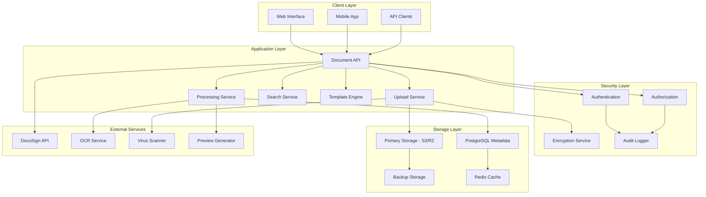

# Document Management System with Secure Storage

## Overview

The document management system is designed to handle all real estate documentation needs, from contract templates to signed agreements, with enterprise-grade security, compliance, and integration with e-signature platforms.

## System Architecture

### 1. Storage Architecture



### 2. File Storage Strategy

**Multi-Tier Storage**:
```typescript
// Storage configuration
interface StorageConfig {
  primary: {
    provider: 'aws-s3' | 'cloudflare-r2' | 'google-cloud';
    bucket: string;
    region: string;
    encryption: 'AES-256' | 'KMS';
  };
  backup: {
    provider: 'aws-s3' | 'azure-blob';
    bucket: string;
    region: string;
    retentionDays: number;
  };
  cdn: {
    provider: 'cloudflare' | 'aws-cloudfront';
    domain: string;
    cacheTtl: number;
  };
}

// File storage service
class FileStorageService {
  async uploadFile(
    file: File, 
    metadata: FileMetadata, 
    options: UploadOptions
  ): Promise<StoredFile> {
    // 1. Virus scan
    await this.virusScanService.scanFile(file);
    
    // 2. Generate unique file path
    const filePath = this.generateFilePath(metadata);
    
    // 3. Encrypt file if required
    const encryptedFile = options.encrypt 
      ? await this.encryptionService.encrypt(file)
      : file;
    
    // 4. Upload to primary storage
    const uploadResult = await this.primaryStorage.upload(filePath, encryptedFile);
    
    // 5. Create metadata record
    const storedFile = await this.createFileRecord({
      ...metadata,
      path: filePath,
      url: uploadResult.url,
      size: file.size,
      checksum: await this.calculateChecksum(file),
      encrypted: options.encrypt
    });
    
    // 6. Async backup
    this.scheduleBackup(filePath, encryptedFile);
    
    return storedFile;
  }
  
  private generateFilePath(metadata: FileMetadata): string {
    const date = new Date();
    const year = date.getFullYear();
    const month = String(date.getMonth() + 1).padStart(2, '0');
    const uuid = crypto.randomUUID();
    
    return `documents/${year}/${month}/${metadata.category}/${uuid}/${metadata.originalName}`;
  }
}
```

## Document Categories & Templates

### 1. Document Categories

```typescript
// Document category definitions
enum DocumentCategory {
  // Listing Documents
  LISTING_AGREEMENT = 'listing_agreement',
  PROPERTY_DISCLOSURE = 'property_disclosure',
  MLS_LISTING = 'mls_listing',
  
  // Purchase Documents
  PURCHASE_AGREEMENT = 'purchase_agreement',
  ADDENDUM = 'addendum',
  COUNTER_OFFER = 'counter_offer',
  
  // Legal Documents
  DEED = 'deed',
  TITLE_REPORT = 'title_report',
  SURVEY = 'survey',
  
  // Financial Documents
  PRE_APPROVAL = 'pre_approval',
  LOAN_DOCUMENTS = 'loan_documents',
  CLOSING_STATEMENT = 'closing_statement',
  
  // Inspection Documents
  INSPECTION_REPORT = 'inspection_report',
  APPRAISAL = 'appraisal',
  
  // Marketing Materials
  FLYER = 'flyer',
  BROCHURE = 'brochure',
  PHOTOS = 'photos',
  
  // Administrative
  COMMISSION_AGREEMENT = 'commission_agreement',
  REFERRAL_AGREEMENT = 'referral_agreement',
  CORRESPONDENCE = 'correspondence'
}

// Document template system
interface DocumentTemplate {
  id: string;
  name: string;
  category: DocumentCategory;
  description: string;
  fileUrl: string;
  fields: TemplateField[];
  requiredSignatures: SignatureRequirement[];
  isActive: boolean;
  version: string;
  createdBy: string;
  createdAt: Date;
  updatedAt: Date;
}

interface TemplateField {
  name: string;
  type: 'text' | 'number' | 'date' | 'signature' | 'checkbox';
  required: boolean;
  placeholder?: string;
  validation?: string;
  position: {
    page: number;
    x: number;
    y: number;
    width: number;
    height: number;
  };
}
```

### 2. Template Management

```typescript
// Template service
class DocumentTemplateService {
  async createTemplate(template: CreateTemplateRequest): Promise<DocumentTemplate> {
    // Upload template file
    const templateFile = await this.fileStorageService.uploadFile(
      template.file,
      {
        category: 'template',
        originalName: template.name,
        userId: template.createdBy
      },
      { encrypt: true }
    );
    
    // Create template record
    return await db.documentTemplate.create({
      data: {
        ...template,
        fileUrl: templateFile.url,
        version: '1.0'
      }
    });
  }
  
  async populateTemplate(
    templateId: string, 
    data: Record<string, any>
  ): Promise<PopulatedDocument> {
    const template = await this.getTemplate(templateId);
    
    // Use PDF manipulation library (pdf-lib, PDFtk)
    const pdfDoc = await PDFDocument.load(await fetch(template.fileUrl));
    const form = pdfDoc.getForm();
    
    // Fill form fields
    template.fields.forEach(field => {
      if (data[field.name]) {
        const formField = form.getField(field.name);
        formField.setText(String(data[field.name]));
      }
    });
    
    // Generate populated PDF
    const pdfBytes = await pdfDoc.save();
    
    // Upload populated document
    const populatedFile = await this.fileStorageService.uploadFile(
      new File([pdfBytes], `${template.name}-populated.pdf`),
      {
        category: template.category,
        originalName: `${template.name}-populated.pdf`,
        templateId: templateId
      },
      { encrypt: true }
    );
    
    return {
      templateId,
      fileUrl: populatedFile.url,
      fields: data
    };
  }
}
```

## E-Signature Integration

### 1. DocuSign Integration

```typescript
// DocuSign service
class DocuSignService {
  private client: ApiClient;
  
  constructor() {
    this.client = new ApiClient();
    this.client.setBasePath(process.env.DOCUSIGN_BASE_PATH);
  }
  
  async sendForSignature(request: SignatureRequest): Promise<EnvelopeResponse> {
    // Create envelope definition
    const envelopeDefinition = {
      emailSubject: request.subject,
      documents: [{
        documentBase64: await this.getDocumentBase64(request.documentUrl),
        name: request.documentName,
        fileExtension: 'pdf',
        documentId: '1'
      }],
      recipients: {
        signers: request.signers.map((signer, index) => ({
          email: signer.email,
          name: signer.name,
          recipientId: String(index + 1),
          tabs: {
            signHereTabs: signer.signatureFields.map(field => ({
              documentId: '1',
              pageNumber: field.page,
              xPosition: field.x,
              yPosition: field.y
            }))
          }
        }))
      },
      status: 'sent'
    };
    
    // Send envelope
    const envelopesApi = new EnvelopesApi(this.client);
    const result = await envelopesApi.createEnvelope(
      process.env.DOCUSIGN_ACCOUNT_ID,
      { envelopeDefinition }
    );
    
    // Store envelope information
    await this.storeEnvelopeInfo(request.documentId, result.envelopeId);
    
    return result;
  }
  
  async checkSignatureStatus(envelopeId: string): Promise<EnvelopeStatus> {
    const envelopesApi = new EnvelopesApi(this.client);
    const envelope = await envelopesApi.getEnvelope(
      process.env.DOCUSIGN_ACCOUNT_ID,
      envelopeId
    );
    
    return {
      status: envelope.status,
      completedDateTime: envelope.completedDateTime,
      signers: envelope.recipients.signers.map(signer => ({
        email: signer.email,
        name: signer.name,
        status: signer.status,
        signedDateTime: signer.signedDateTime
      }))
    };
  }
  
  async downloadSignedDocument(envelopeId: string): Promise<Buffer> {
    const envelopesApi = new EnvelopesApi(this.client);
    const document = await envelopesApi.getDocument(
      process.env.DOCUSIGN_ACCOUNT_ID,
      envelopeId,
      'combined'
    );
    
    return Buffer.from(document, 'binary');
  }
}
```

### 2. Signature Workflow Management

```typescript
// Signature workflow service
class SignatureWorkflowService {
  async initiateSignatureWorkflow(
    documentId: string,
    workflow: SignatureWorkflow
  ): Promise<WorkflowInstance> {
    // Create workflow instance
    const instance = await db.signatureWorkflow.create({
      data: {
        documentId,
        status: 'initiated',
        steps: workflow.steps,
        currentStep: 0
      }
    });
    
    // Start first step
    await this.executeWorkflowStep(instance.id, 0);
    
    return instance;
  }
  
  private async executeWorkflowStep(
    workflowId: string, 
    stepIndex: number
  ): Promise<void> {
    const workflow = await this.getWorkflow(workflowId);
    const step = workflow.steps[stepIndex];
    
    switch (step.type) {
      case 'signature':
        await this.requestSignature(workflow.documentId, step.signers);
        break;
      case 'review':
        await this.requestReview(workflow.documentId, step.reviewers);
        break;
      case 'notification':
        await this.sendNotification(step.recipients, step.message);
        break;
    }
    
    // Update workflow status
    await db.signatureWorkflow.update({
      where: { id: workflowId },
      data: { 
        currentStep: stepIndex,
        status: 'in_progress'
      }
    });
  }
  
  async handleSignatureComplete(envelopeId: string): Promise<void> {
    // Find workflow by envelope ID
    const workflow = await this.findWorkflowByEnvelope(envelopeId);
    
    // Download signed document
    const signedDoc = await this.docuSignService.downloadSignedDocument(envelopeId);
    
    // Store signed document
    const signedFile = await this.fileStorageService.uploadFile(
      new File([signedDoc], 'signed-document.pdf'),
      {
        category: 'signed_document',
        originalName: 'signed-document.pdf',
        documentId: workflow.documentId
      },
      { encrypt: true }
    );
    
    // Update document status
    await db.document.update({
      where: { id: workflow.documentId },
      data: {
        status: 'signed',
        signedFileUrl: signedFile.url,
        signedDate: new Date()
      }
    });
    
    // Continue workflow if more steps
    if (workflow.currentStep < workflow.steps.length - 1) {
      await this.executeWorkflowStep(workflow.id, workflow.currentStep + 1);
    } else {
      await this.completeWorkflow(workflow.id);
    }
  }
}
```

## Document Processing & OCR

### 1. Automatic Document Processing

```typescript
// Document processing service
class DocumentProcessingService {
  async processUploadedDocument(fileId: string): Promise<ProcessingResult> {
    const file = await this.getFile(fileId);
    
    const results: ProcessingResult = {
      fileId,
      extractedText: '',
      metadata: {},
      thumbnails: [],
      searchableContent: ''
    };
    
    // Generate thumbnails/previews
    if (this.isPDF(file)) {
      results.thumbnails = await this.generatePDFThumbnails(file);
      results.extractedText = await this.extractPDFText(file);
    } else if (this.isImage(file)) {
      results.thumbnails = await this.generateImageThumbnails(file);
      results.extractedText = await this.performOCR(file);
    } else if (this.isDocument(file)) {
      results.extractedText = await this.extractDocumentText(file);
      results.thumbnails = await this.convertToImageAndThumbnail(file);
    }
    
    // Extract metadata
    results.metadata = await this.extractMetadata(file);
    
    // Create searchable content
    results.searchableContent = this.createSearchableContent(
      results.extractedText,
      results.metadata,
      file.originalName
    );
    
    // Store processing results
    await this.storeProcessingResults(fileId, results);
    
    return results;
  }
  
  private async performOCR(file: StoredFile): Promise<string> {
    // Use Google Cloud Vision API or AWS Textract
    const vision = new ImageAnnotatorClient();
    
    const [result] = await vision.textDetection({
      image: { content: await this.getFileBuffer(file) }
    });
    
    return result.textAnnotations?.[0]?.description || '';
  }
  
  private async generatePDFThumbnails(file: StoredFile): Promise<string[]> {
    const pdf = await PDFDocument.load(await this.getFileBuffer(file));
    const thumbnails: string[] = [];
    
    for (let i = 0; i < Math.min(pdf.getPageCount(), 5); i++) {
      const thumbnail = await this.generatePageThumbnail(pdf, i);
      const thumbnailFile = await this.fileStorageService.uploadFile(
        thumbnail,
        {
          category: 'thumbnail',
          originalName: `${file.originalName}-thumb-${i}.jpg`,
          parentFileId: file.id
        },
        { encrypt: false }
      );
      thumbnails.push(thumbnailFile.url);
    }
    
    return thumbnails;
  }
}
```

### 2. Full-Text Search

```typescript
// Document search service
class DocumentSearchService {
  async indexDocument(document: ProcessedDocument): Promise<void> {
    // Create search index entry
    await db.documentSearchIndex.create({
      data: {
        documentId: document.id,
        content: document.searchableContent,
        title: document.name,
        category: document.category,
        tags: document.tags,
        contactId: document.contactId,
        propertyId: document.propertyId,
        createdAt: document.createdAt
      }
    });
  }
  
  async searchDocuments(
    query: string,
    filters: SearchFilters,
    userId: string
  ): Promise<SearchResult[]> {
    // Build search query with filters
    const searchQuery = this.buildSearchQuery(query, filters, userId);
    
    // Execute full-text search
    const results = await db.$queryRaw`
      SELECT 
        d.*,
        dsi.content,
        ts_rank(to_tsvector('english', dsi.content), plainto_tsquery('english', ${query})) as rank
      FROM documents d
      JOIN document_search_index dsi ON d.id = dsi.document_id
      WHERE 
        d.user_id = ${userId}
        AND to_tsvector('english', dsi.content) @@ plainto_tsquery('english', ${query})
        ${filters.category ? Prisma.sql`AND d.category = ${filters.category}` : Prisma.empty}
        ${filters.dateFrom ? Prisma.sql`AND d.created_at >= ${filters.dateFrom}` : Prisma.empty}
        ${filters.dateTo ? Prisma.sql`AND d.created_at <= ${filters.dateTo}` : Prisma.empty}
      ORDER BY rank DESC, d.created_at DESC
      LIMIT 50
    `;
    
    return results.map(result => ({
      document: result,
      relevanceScore: result.rank,
      highlights: this.extractHighlights(result.content, query)
    }));
  }
  
  private extractHighlights(content: string, query: string): string[] {
    const words = query.toLowerCase().split(' ');
    const sentences = content.split('.');
    
    return sentences
      .filter(sentence => 
        words.some(word => sentence.toLowerCase().includes(word))
      )
      .slice(0, 3)
      .map(sentence => sentence.trim());
  }
}
```

## Security & Compliance

### 1. Access Control

```typescript
// Document access control
class DocumentAccessControl {
  async checkAccess(
    userId: string, 
    documentId: string, 
    action: 'read' | 'write' | 'delete' | 'share'
  ): Promise<boolean> {
    const document = await db.document.findUnique({
      where: { id: documentId },
      include: { 
        user: true,
        sharedWith: true,
        transaction: {
          include: {
            buyerContact: true,
            sellerContact: true
          }
        }
      }
    });
    
    if (!document) return false;
    
    // Owner has full access
    if (document.userId === userId) return true;
    
    // Check shared access
    const sharedAccess = document.sharedWith.find(share => 
      share.userId === userId || share.email === await this.getUserEmail(userId)
    );
    
    if (sharedAccess) {
      return this.checkPermissionLevel(sharedAccess.permission, action);
    }
    
    // Check transaction-based access
    if (document.transaction) {
      const user = await this.getUser(userId);
      const isPartyToTransaction = 
        document.transaction.buyerContact?.email === user.email ||
        document.transaction.sellerContact?.email === user.email;
      
      if (isPartyToTransaction && action === 'read') return true;
    }
    
    return false;
  }
  
  async shareDocument(
    documentId: string,
    shareWith: string, // email or userId
    permission: 'read' | 'write',
    expiresAt?: Date
  ): Promise<DocumentShare> {
    return await db.documentShare.create({
      data: {
        documentId,
        sharedWith: shareWith,
        permission,
        expiresAt,
        createdBy: userId
      }
    });
  }
}
```

### 2. Encryption & Data Protection

```typescript
// Document encryption service
class DocumentEncryptionService {
  private readonly algorithm = 'aes-256-gcm';
  
  async encryptDocument(buffer: Buffer, documentId: string): Promise<EncryptedDocument> {
    // Generate unique key for this document
    const key = crypto.randomBytes(32);
    const iv = crypto.randomBytes(16);
    
    // Encrypt document
    const cipher = crypto.createCipher(this.algorithm, key, iv);
    const encrypted = Buffer.concat([cipher.update(buffer), cipher.final()]);
    const authTag = cipher.getAuthTag();
    
    // Store encryption key securely (encrypted with master key)
    await this.storeEncryptionKey(documentId, key, iv, authTag);
    
    return {
      encryptedData: encrypted,
      iv,
      authTag
    };
  }
  
  async decryptDocument(documentId: string, encryptedData: Buffer): Promise<Buffer> {
    // Retrieve encryption key
    const keyInfo = await this.getEncryptionKey(documentId);
    
    // Decrypt document
    const decipher = crypto.createDecipher(
      this.algorithm, 
      keyInfo.key, 
      keyInfo.iv
    );
    decipher.setAuthTag(keyInfo.authTag);
    
    return Buffer.concat([
      decipher.update(encryptedData), 
      decipher.final()
    ]);
  }
  
  private async storeEncryptionKey(
    documentId: string,
    key: Buffer,
    iv: Buffer,
    authTag: Buffer
  ): Promise<void> {
    // Encrypt key with master key from environment
    const masterKey = Buffer.from(process.env.MASTER_ENCRYPTION_KEY, 'hex');
    const keyEncrypted = this.encryptWithMasterKey(key, masterKey);
    
    await db.documentEncryption.create({
      data: {
        documentId,
        encryptedKey: keyEncrypted.toString('base64'),
        iv: iv.toString('base64'),
        authTag: authTag.toString('base64')
      }
    });
  }
}
```

### 3. Audit Logging

```typescript
// Document audit service
class DocumentAuditService {
  async logDocumentAccess(
    userId: string,
    documentId: string,
    action: string,
    metadata?: Record<string, any>
  ): Promise<void> {
    await db.documentAuditLog.create({
      data: {
        userId,
        documentId,
        action,
        metadata,
        ipAddress: metadata?.ipAddress,
        userAgent: metadata?.userAgent,
        timestamp: new Date()
      }
    });
  }
  
  async getDocumentAuditTrail(documentId: string): Promise<AuditLogEntry[]> {
    return await db.documentAuditLog.findMany({
      where: { documentId },
      include: { user: { select: { firstName: true, lastName: true, email: true } } },
      orderBy: { timestamp: 'desc' }
    });
  }
  
  async generateComplianceReport(
    dateFrom: Date,
    dateTo: Date
  ): Promise<ComplianceReport> {
    const accessLogs = await db.documentAuditLog.findMany({
      where: {
        timestamp: { gte: dateFrom, lte: dateTo }
      },
      include: { document: true, user: true }
    });
    
    return {
      totalAccesses: accessLogs.length,
      uniqueUsers: new Set(accessLogs.map(log => log.userId)).size,
      documentsAccessed: new Set(accessLogs.map(log => log.documentId)).size,
      accessByAction: this.groupByAction(accessLogs),
      suspiciousActivity: this.detectSuspiciousActivity(accessLogs)
    };
  }
}
```

## Performance & Scalability

### 1. Caching Strategy

```typescript
// Document caching service
class DocumentCacheService {
  private redis: Redis;
  
  async cacheDocumentMetadata(documentId: string, metadata: DocumentMetadata): Promise<void> {
    await this.redis.setex(
      `doc:metadata:${documentId}`,
      3600, // 1 hour
      JSON.stringify(metadata)
    );
  }
  
  async getCachedThumbnail(documentId: string, page: number): Promise<Buffer | null> {
    const cached = await this.redis.getBuffer(`doc:thumb:${documentId}:${page}`);
    return cached;
  }
  
  async cacheSearchResults(query: string, results: SearchResult[]): Promise<void> {
    const cacheKey = `search:${crypto.createHash('md5').update(query).digest('hex')}`;
    await this.redis.setex(cacheKey, 300, JSON.stringify(results)); // 5 minutes
  }
}
```

### 2. Background Processing

```typescript
// Background job processor for document operations
class DocumentJobProcessor {
  async processDocumentUpload(jobData: DocumentUploadJob): Promise<void> {
    try {
      // Process document (OCR, thumbnails, etc.)
      const processingResult = await this.documentProcessingService.processUploadedDocument(
        jobData.fileId
      );
      
      // Index for search
      await this.documentSearchService.indexDocument(processingResult);
      
      // Generate previews
      await this.generatePreviews(jobData.fileId);
      
      // Update document status
      await db.document.update({
        where: { id: jobData.documentId },
        data: { 
          status: 'processed',
          processedAt: new Date()
        }
      });
      
    } catch (error) {
      // Handle processing errors
      await this.handleProcessingError(jobData.documentId, error);
    }
  }
}
```

This document management system provides comprehensive functionality for handling all real estate documentation needs while maintaining enterprise-level security, compliance, and performance standards.