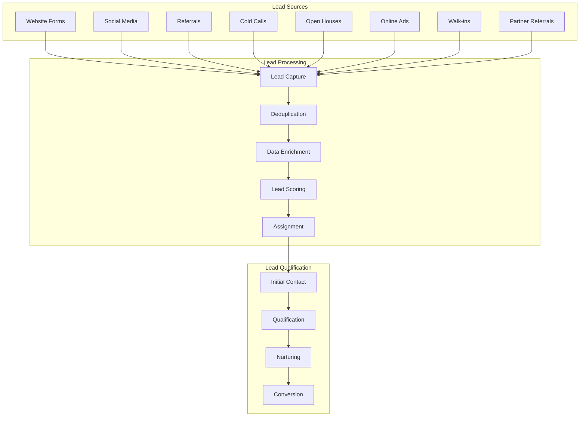

# Lead Management and Client Tracking Workflows

## Overview

The lead management system is designed to capture, qualify, nurture, and convert leads into clients while providing comprehensive tracking throughout the entire customer lifecycle. This system automates follow-ups, scores leads, and ensures no opportunities are missed.

## Lead Lifecycle Management

### 1. Lead Capture & Sources



### 2. Lead Scoring Algorithm

```typescript
// Lead scoring service
class LeadScoringService {
  async calculateLeadScore(leadId: string): Promise<number> {
    const lead = await this.getLeadWithDetails(leadId);
    let score = 0;
    
    // Demographic scoring
    score += this.scoreDemographics(lead);
    
    // Behavioral scoring
    score += this.scoreBehavior(lead);
    
    // Engagement scoring
    score += this.scoreEngagement(lead);
    
    // Timeline scoring
    score += this.scoreTimeline(lead);
    
    // Financial qualification scoring
    score += this.scoreFinancials(lead);
    
    // Normalize score to 0-100 range
    const normalizedScore = Math.min(100, Math.max(0, score));
    
    // Update lead score in database
    await this.updateLeadScore(leadId, normalizedScore);
    
    return normalizedScore;
  }
  
  private scoreDemographics(lead: Lead): number {
    let score = 0;
    
    // Location scoring
    if (lead.city && this.isInServiceArea(lead.city)) {
      score += 15;
    }
    
    // Age scoring (prime buying age)
    if (lead.age >= 25 && lead.age <= 45) {
      score += 10;
    }
    
    // Employment status
    if (lead.employmentStatus === 'employed') {
      score += 10;
    }
    
    return score;
  }
  
  private scoreBehavior(lead: Lead): number {
    let score = 0;
    
    // Website engagement
    score += Math.min(20, lead.pageViews * 2);
    score += lead.propertyViews * 3;
    score += lead.searchesPerformed * 2;
    
    // Email engagement
    score += lead.emailOpens * 1;
    score += lead.emailClicks * 3;
    
    // Social media engagement
    score += lead.socialEngagement * 2;
    
    return score;
  }
  
  private scoreEngagement(lead: Lead): number {
    let score = 0;
    
    // Response time to communications
    if (lead.averageResponseTime < 60) { // minutes
      score += 15;
    } else if (lead.averageResponseTime < 240) {
      score += 10;
    } else if (lead.averageResponseTime < 1440) {
      score += 5;
    }
    
    // Communication frequency
    score += Math.min(10, lead.communicationCount);
    
    // Appointment scheduling
    if (lead.hasScheduledAppointment) {
      score += 20;
    }
    
    return score;
  }
  
  private scoreTimeline(lead: Lead): number {
    let score = 0;
    
    switch (lead.timeline) {
      case 'immediate':
        score += 25;
        break;
      case '3_months':
        score += 20;
        break;
      case '6_months':
        score += 15;
        break;
      case '1_year':
        score += 10;
        break;
      default:
        score += 5;
    }
    
    return score;
  }
  
  private scoreFinancials(lead: Lead): number {
    let score = 0;
    
    // Pre-approval status
    if (lead.preApproved) {
      score += 25;
    } else if (lead.preApprovalInProgress) {
      score += 15;
    }
    
    // Budget alignment
    if (lead.budget && lead.budget >= 200000) {
      score += 10;
    }
    
    // Down payment readiness
    if (lead.downPaymentReady) {
      score += 15;
    }
    
    return score;
  }
}
```

## Automated Lead Nurturing

### 1. Drip Campaign System

```typescript
// Automated nurturing service
class LeadNurturingService {
  async setupNurturingCampaign(leadId: string, campaignType: string): Promise<void> {
    const campaign = await this.getCampaignTemplate(campaignType);
    
    // Create campaign instance for this lead
    const campaignInstance = await db.nurturingCampaign.create({
      data: {
        leadId,
        campaignType,
        status: 'active',
        currentStep: 0,
        steps: campaign.steps
      }
    });
    
    // Schedule first step
    await this.scheduleNextStep(campaignInstance.id);
  }
  
  private async scheduleNextStep(campaignId: string): Promise<void> {
    const campaign = await this.getCampaignInstance(campaignId);
    const currentStep = campaign.steps[campaign.currentStep];
    
    if (!currentStep) {
      // Campaign completed
      await this.completeCampaign(campaignId);
      return;
    }
    
    // Calculate next execution time
    const executeAt = new Date();
    executeAt.setHours(executeAt.getHours() + currentStep.delayHours);
    
    // Schedule job
    await this.jobQueue.add('execute-nurturing-step', {
      campaignId,
      stepIndex: campaign.currentStep
    }, {
      delay: currentStep.delayHours * 60 * 60 * 1000
    });
  }
  
  async executeNurturingStep(campaignId: string, stepIndex: number): Promise<void> {
    const campaign = await this.getCampaignInstance(campaignId);
    const step = campaign.steps[stepIndex];
    const lead = await this.getLead(campaign.leadId);
    
    // Check if lead is still eligible
    if (!this.isLeadEligible(lead, step)) {
      await this.pauseCampaign(campaignId, 'lead_not_eligible');
      return;
    }
    
    // Execute step action
    switch (step.type) {
      case 'email':
        await this.sendNurturingEmail(lead, step);
        break;
      case 'sms':
        await this.sendNurturingSMS(lead, step);
        break;
      case 'task':
        await this.createFollowUpTask(lead, step);
        break;
      case 'property_alert':
        await this.sendPropertyAlert(lead, step);
        break;
    }
    
    // Update campaign progress
    await db.nurturingCampaign.update({
      where: { id: campaignId },
      data: { 
        currentStep: stepIndex + 1,
        lastExecuted: new Date()
      }
    });
    
    // Schedule next step
    await this.scheduleNextStep(campaignId);
  }
  
  private async sendNurturingEmail(lead: Lead, step: NurturingStep): Promise<void> {
    // Personalize email content
    const personalizedContent = await this.personalizeContent(step.content, lead);
    
    // Send email
    await this.emailService.sendEmail({
      to: lead.email,
      subject: step.subject,
      content: personalizedContent,
      templateId: step.templateId,
      trackOpens: true,
      trackClicks: true
    });
    
    // Log communication
    await this.logCommunication(lead.id, {
      type: 'email',
      direction: 'outbound',
      subject: step.subject,
      content: personalizedContent,
      campaignId: step.campaignId
    });
  }
}
```

### 2. Behavioral Triggers

```typescript
// Behavioral trigger system
class BehavioralTriggerService {
  async setupTriggers(leadId: string): Promise<void> {
    const triggers = [
      {
        event: 'property_view',
        condition: { count: 3, timeframe: '24h' },
        action: 'send_property_info_email'
      },
      {
        event: 'email_open',
        condition: { consecutive: 3 },
        action: 'increase_lead_score'
      },
      {
        event: 'website_visit',
        condition: { frequency: 'daily', duration: 7 },
        action: 'schedule_call_task'
      },
      {
        event: 'search_performed',
        condition: { same_criteria: 5 },
        action: 'send_matching_properties'
      }
    ];
    
    for (const trigger of triggers) {
      await this.createTrigger(leadId, trigger);
    }
  }
  
  async processBehavioralEvent(leadId: string, event: BehavioralEvent): Promise<void> {
    const activeTriggers = await this.getActiveTriggers(leadId);
    
    for (const trigger of activeTriggers) {
      if (await this.evaluateTriggerCondition(trigger, event)) {
        await this.executeTriggerAction(trigger, leadId);
      }
    }
  }
  
  private async executeTriggerAction(trigger: Trigger, leadId: string): Promise<void> {
    const lead = await this.getLead(leadId);
    
    switch (trigger.action) {
      case 'send_property_info_email':
        await this.sendPropertyInfoEmail(lead);
        break;
      case 'increase_lead_score':
        await this.increaseLeadScore(leadId, 10);
        break;
      case 'schedule_call_task':
        await this.scheduleCallTask(leadId);
        break;
      case 'send_matching_properties':
        await this.sendMatchingProperties(lead);
        break;
    }
    
    // Log trigger execution
    await this.logTriggerExecution(trigger.id, leadId);
  }
}
```

## Lead Assignment & Distribution

### 1. Intelligent Lead Routing

```typescript
// Lead assignment service
class LeadAssignmentService {
  async assignLead(leadId: string): Promise<string> {
    const lead = await this.getLead(leadId);
    const availableAgents = await this.getAvailableAgents();
    
    // Apply assignment rules
    const assignedAgent = await this.applyAssignmentRules(lead, availableAgents);
    
    // Update lead assignment
    await db.contact.update({
      where: { id: leadId },
      data: { 
        assignedTo: assignedAgent.id,
        assignedAt: new Date()
      }
    });
    
    // Notify agent
    await this.notifyAgentOfNewLead(assignedAgent.id, leadId);
    
    // Create initial follow-up task
    await this.createInitialFollowUpTask(assignedAgent.id, leadId);
    
    return assignedAgent.id;
  }
  
  private async applyAssignmentRules(
    lead: Lead, 
    agents: Agent[]
  ): Promise<Agent> {
    // Rule 1: Geographic specialization
    const geoSpecialists = agents.filter(agent => 
      agent.serviceAreas.includes(lead.city)
    );
    
    if (geoSpecialists.length > 0) {
      agents = geoSpecialists;
    }
    
    // Rule 2: Property type specialization
    const typeSpecialists = agents.filter(agent =>
      agent.specializations.includes(lead.propertyType)
    );
    
    if (typeSpecialists.length > 0) {
      agents = typeSpecialists;
    }
    
    // Rule 3: Price range specialization
    const priceSpecialists = agents.filter(agent =>
      lead.budget >= agent.minPrice && lead.budget <= agent.maxPrice
    );
    
    if (priceSpecialists.length > 0) {
      agents = priceSpecialists;
    }
    
    // Rule 4: Workload balancing
    const sortedByWorkload = agents.sort((a, b) => 
      a.activeLeads - b.activeLeads
    );
    
    // Rule 5: Performance scoring
    const topPerformers = sortedByWorkload.filter(agent =>
      agent.conversionRate >= 0.15 // 15% or higher
    );
    
    return topPerformers.length > 0 ? topPerformers[0] : sortedByWorkload[0];
  }
}
```

## Client Lifecycle Tracking

### 1. Stage-Based Pipeline Management

```typescript
// Pipeline management service
class PipelineManagementService {
  private readonly stages = [
    { name: 'New Lead', order: 1, probability: 0.1 },
    { name: 'Qualified', order: 2, probability: 0.25 },
    { name: 'Appointment Set', order: 3, probability: 0.4 },
    { name: 'Property Shown', order: 4, probability: 0.6 },
    { name: 'Offer Prepared', order: 5, probability: 0.8 },
    { name: 'Under Contract', order: 6, probability: 0.9 },
    { name: 'Closed', order: 7, probability: 1.0 }
  ];
  
  async moveLeadToStage(leadId: string, newStage: string): Promise<void> {
    const lead = await this.getLead(leadId);
    const currentStage = this.getStageByName(lead.stage);
    const targetStage = this.getStageByName(newStage);
    
    // Validate stage progression
    if (targetStage.order < currentStage.order) {
      // Moving backwards - require reason
      await this.requireStageRegressionReason(leadId, currentStage, targetStage);
    }
    
    // Update lead stage
    await db.contact.update({
      where: { id: leadId },
      data: {
        stage: newStage,
        stageUpdatedAt: new Date(),
        probability: targetStage.probability
      }
    });
    
    // Log stage change
    await this.logStageChange(leadId, currentStage.name, newStage);
    
    // Trigger stage-specific actions
    await this.executeStageActions(leadId, newStage);
    
    // Update pipeline metrics
    await this.updatePipelineMetrics();
  }
  
  private async executeStageActions(leadId: string, stage: string): Promise<void> {
    const lead = await this.getLead(leadId);
    
    switch (stage) {
      case 'Qualified':
        await this.scheduleQualificationCall(leadId);
        await this.sendWelcomePacket(lead);
        break;
        
      case 'Appointment Set':
        await this.sendAppointmentConfirmation(lead);
        await this.createPreparationTasks(leadId);
        break;
        
      case 'Property Shown':
        await this.scheduleFollowUpCall(leadId, 24); // 24 hours
        await this.sendPropertyInformation(lead);
        break;
        
      case 'Offer Prepared':
        await this.notifyLender(lead);
        await this.prepareContractDocuments(leadId);
        break;
        
      case 'Under Contract':
        await this.createTransactionRecord(leadId);
        await this.scheduleInspections(leadId);
        break;
        
      case 'Closed':
        await this.sendClosingCongratulations(lead);
        await this.schedulePostClosingFollowUp(leadId);
        await this.requestReview(leadId);
        break;
    }
  }
}
```

### 2. Activity Timeline Tracking

```typescript
// Activity tracking service
class ActivityTrackingService {
  async logActivity(activity: ActivityLog): Promise<void> {
    // Create activity record
    await db.activityLog.create({
      data: {
        contactId: activity.contactId,
        userId: activity.userId,
        type: activity.type,
        description: activity.description,
        metadata: activity.metadata,
        timestamp: new Date()
      }
    });
    
    // Update contact last activity
    await db.contact.update({
      where: { id: activity.contactId },
      data: { lastActivityAt: new Date() }
    });
    
    // Check for milestone achievements
    await this.checkMilestones(activity.contactId);
  }
  
  async getActivityTimeline(contactId: string): Promise<ActivityTimelineItem[]> {
    const activities = await db.activityLog.findMany({
      where: { contactId },
      include: {
        user: { select: { firstName: true, lastName: true } }
      },
      orderBy: { timestamp: 'desc' }
    });
    
    return activities.map(activity => ({
      id: activity.id,
      type: activity.type,
      description: activity.description,
      timestamp: activity.timestamp,
      user: `${activity.user.firstName} ${activity.user.lastName}`,
      metadata: activity.metadata
    }));
  }
  
  private async checkMilestones(contactId: string): Promise<void> {
    const contact = await this.getContactWithActivities(contactId);
    const milestones = await this.getMilestoneDefinitions();
    
    for (const milestone of milestones) {
      if (await this.isMilestoneAchieved(contact, milestone)) {
        await this.recordMilestoneAchievement(contactId, milestone);
      }
    }
  }
}
```

## Follow-up Automation

### 1. Smart Follow-up Scheduling

```typescript
// Follow-up automation service
class FollowUpAutomationService {
  async scheduleSmartFollowUp(contactId: string, context: FollowUpContext): Promise<void> {
    const contact = await this.getContact(contactId);
    const followUpRules = await this.getFollowUpRules(context.type);
    
    // Calculate optimal follow-up time
    const followUpTime = await this.calculateOptimalFollowUpTime(contact, context);
    
    // Create follow-up task
    await db.task.create({
      data: {
        contactId,
        userId: contact.assignedTo,
        title: this.generateFollowUpTitle(context),
        description: this.generateFollowUpDescription(contact, context),
        type: 'follow_up',
        priority: this.calculateFollowUpPriority(contact, context),
        dueDate: followUpTime,
        metadata: {
          context: context.type,
          previousActivity: context.previousActivity,
          suggestedActions: this.getSuggestedActions(contact, context)
        }
      }
    });
    
    // Set reminder
    await this.scheduleFollowUpReminder(contactId, followUpTime);
  }
  
  private async calculateOptimalFollowUpTime(
    contact: Contact, 
    context: FollowUpContext
  ): Promise<Date> {
    const baseTime = new Date();
    
    // Analyze contact's response patterns
    const responsePattern = await this.analyzeResponsePattern(contact.id);
    
    // Apply context-specific timing
    let delayHours = 24; // default
    
    switch (context.type) {
      case 'property_inquiry':
        delayHours = 2; // Quick response for hot leads
        break;
      case 'showing_followup':
        delayHours = 24;
        break;
      case 'offer_response':
        delayHours = 4;
        break;
      case 'general_nurturing':
        delayHours = 72;
        break;
    }
    
    // Adjust based on contact preferences
    if (responsePattern.preferredTimeOfDay) {
      baseTime.setHours(responsePattern.preferredTimeOfDay);
    }
    
    // Adjust based on lead score
    if (contact.leadScore > 80) {
      delayHours = Math.max(1, delayHours / 2); // Faster follow-up for hot leads
    }
    
    baseTime.setHours(baseTime.getHours() + delayHours);
    return baseTime;
  }
  
  async processOverdueFollowUps(): Promise<void> {
    const overdueTasks = await db.task.findMany({
      where: {
        type: 'follow_up',
        status: 'pending',
        dueDate: { lt: new Date() }
      },
      include: { contact: true, user: true }
    });
    
    for (const task of overdueTasks) {
      // Escalate overdue follow-ups
      await this.escalateOverdueFollowUp(task);
      
      // Create new follow-up task
      await this.scheduleSmartFollowUp(task.contactId, {
        type: 'overdue_followup',
        previousActivity: task.id
      });
    }
  }
}
```

### 2. Multi-Channel Communication Orchestration

```typescript
// Communication orchestration service
class CommunicationOrchestrationService {
  async orchestrateFollowUp(contactId: string, strategy: CommunicationStrategy): Promise<void> {
    const contact = await this.getContactWithPreferences(contactId);
    
    // Determine optimal communication channels
    const channels = await this.selectOptimalChannels(contact, strategy);
    
    // Execute multi-channel sequence
    for (let i = 0; i < channels.length; i++) {
      const channel = channels[i];
      const delay = i * strategy.channelDelay;
      
      await this.scheduleChannelCommunication(contactId, channel, delay);
    }
  }
  
  private async selectOptimalChannels(
    contact: Contact, 
    strategy: CommunicationStrategy
  ): Promise<CommunicationChannel[]> {
    const availableChannels = ['email', 'sms', 'phone', 'social'];
    const selectedChannels: CommunicationChannel[] = [];
    
    // Analyze contact's channel preferences
    const channelPreferences = await this.analyzeChannelPreferences(contact.id);
    
    // Sort channels by effectiveness for this contact
    const sortedChannels = availableChannels.sort((a, b) => 
      channelPreferences[b] - channelPreferences[a]
    );
    
    // Select top channels based on strategy
    for (let i = 0; i < Math.min(strategy.maxChannels, sortedChannels.length); i++) {
      const channel = sortedChannels[i];
      
      // Verify channel availability
      if (await this.isChannelAvailable(contact, channel)) {
        selectedChannels.push({
          type: channel,
          priority: i + 1,
          content: await this.generateChannelContent(contact, channel, strategy)
        });
      }
    }
    
    return selectedChannels;
  }
  
  private async analyzeChannelPreferences(contactId: string): Promise<Record<string, number>> {
    const communications = await db.communication.findMany({
      where: { contactId },
      orderBy: { createdAt: 'desc' },
      take: 50
    });
    
    const channelStats = {
      email: { sent: 0, responded: 0 },
      sms: { sent: 0, responded: 0 },
      phone: { sent: 0, responded: 0 },
      social: { sent: 0, responded: 0 }
    };
    
    // Calculate response rates by channel
    communications.forEach(comm => {
      if (channelStats[comm.type]) {
        channelStats[comm.type].sent++;
        if (comm.status === 'responded') {
          channelStats[comm.type].responded++;
        }
      }
    });
    
    // Calculate preference scores
    const preferences: Record<string, number> = {};
    Object.keys(channelStats).forEach(channel => {
      const stats = channelStats[channel];
      preferences[channel] = stats.sent > 0 ? stats.responded / stats.sent : 0;
    });
    
    return preferences;
  }
}
```

## Performance Analytics

### 1. Lead Conversion Tracking

```typescript
// Lead analytics service
class LeadAnalyticsService {
  async generateLeadReport(dateRange: DateRange): Promise<LeadReport> {
    const leads = await this.getLeadsInRange(dateRange);
    
    return {
      totalLeads: leads.length,
      qualifiedLeads: leads.filter(l => l.leadScore >= 50).length,
      convertedLeads: leads.filter(l => l.stage === 'Closed').length,
      conversionRate: this.calculateConversionRate(leads),
      averageLeadScore: this.calculateAverageScore(leads),
      leadsBySource: this.groupBySource(leads),
      leadsByStage: this.groupByStage(leads),
      timeToConversion: this.calculateAverageTimeToConversion(leads),
      revenueGenerated: this.calculateRevenueFromLeads(leads)
    };
  }
  
  async trackLeadJourney(leadId: string): Promise<LeadJourney> {
    const activities = await db.activityLog.findMany({
      where: { contactId: leadId },
      orderBy: { timestamp: 'asc' }
    });
    
    const stageChanges = activities.filter(a => a.type === 'stage_change');
    const communications = activities.filter(a => a.type === 'communication');
    
    return {
      leadId,
      totalDuration: this.calculateJourneyDuration(activities),
      stageProgression: this.mapStageProgression(stageChanges),
      touchpoints: communications.length,
      conversionEvents: this.identifyConversionEvents(activities),
      dropOffPoint: this.identifyDropOffPoint(stageChanges)
    };
  }
}
```

This comprehensive lead management and client tracking system ensures that no opportunities are missed while providing intelligent automation and detailed analytics to optimize the sales process.