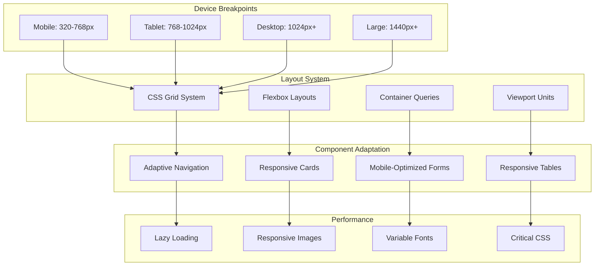

# Mobile Responsiveness and PWA Design

## Overview

The realtor platform is designed with a mobile-first approach, ensuring optimal performance and user experience across all devices. The Progressive Web App (PWA) implementation provides native app-like functionality including offline capabilities, push notifications, and device integration while maintaining the flexibility of web technologies.

## Mobile-First Design Strategy

### 1. Responsive Design Architecture



### 2. Breakpoint System

```css
/* Mobile-first breakpoint system */
:root {
  /* Base mobile styles (320px+) */
  --container-padding: 1rem;
  --grid-columns: 1;
  --font-size-base: 16px;
  --spacing-unit: 0.5rem;
}

/* Small mobile (375px+) */
@media (min-width: 23.4375em) {
  :root {
    --container-padding: 1.25rem;
    --font-size-base: 16px;
  }
}

/* Large mobile (414px+) */
@media (min-width: 25.875em) {
  :root {
    --container-padding: 1.5rem;
    --grid-columns: 2;
  }
}

/* Tablet (768px+) */
@media (min-width: 48em) {
  :root {
    --container-padding: 2rem;
    --grid-columns: 3;
    --font-size-base: 18px;
    --spacing-unit: 0.75rem;
  }
}

/* Desktop (1024px+) */
@media (min-width: 64em) {
  :root {
    --container-padding: 2.5rem;
    --grid-columns: 4;
    --spacing-unit: 1rem;
  }
}

/* Large desktop (1440px+) */
@media (min-width: 90em) {
  :root {
    --container-padding: 3rem;
    --grid-columns: 5;
  }
}
```

### 3. Adaptive Component System

```typescript
// Responsive component hook
const useResponsive = () => {
  const [breakpoint, setBreakpoint] = useState<Breakpoint>('mobile');
  const [orientation, setOrientation] = useState<'portrait' | 'landscape'>('portrait');
  
  useEffect(() => {
    const updateBreakpoint = () => {
      const width = window.innerWidth;
      
      if (width < 768) {
        setBreakpoint('mobile');
      } else if (width < 1024) {
        setBreakpoint('tablet');
      } else if (width < 1440) {
        setBreakpoint('desktop');
      } else {
        setBreakpoint('large');
      }
      
      setOrientation(window.innerHeight > window.innerWidth ? 'portrait' : 'landscape');
    };
    
    updateBreakpoint();
    window.addEventListener('resize', updateBreakpoint);
    window.addEventListener('orientationchange', updateBreakpoint);
    
    return () => {
      window.removeEventListener('resize', updateBreakpoint);
      window.removeEventListener('orientationchange', updateBreakpoint);
    };
  }, []);
  
  return {
    breakpoint,
    orientation,
    isMobile: breakpoint === 'mobile',
    isTablet: breakpoint === 'tablet',
    isDesktop: breakpoint === 'desktop' || breakpoint === 'large',
    isPortrait: orientation === 'portrait',
    isLandscape: orientation === 'landscape'
  };
};

// Adaptive navigation component
const AdaptiveNavigation: React.FC = () => {
  const { isMobile, isTablet } = useResponsive();
  const [isMenuOpen, setIsMenuOpen] = useState(false);
  
  if (isMobile) {
    return (
      <MobileNavigation 
        isOpen={isMenuOpen}
        onToggle={() => setIsMenuOpen(!isMenuOpen)}
      />
    );
  }
  
  if (isTablet) {
    return <TabletNavigation />;
  }
  
  return <DesktopNavigation />;
};

// Mobile navigation component
const MobileNavigation: React.FC<MobileNavProps> = ({ isOpen, onToggle }) => {
  return (
    <nav className="mobile-nav">
      <div className="mobile-nav-header">
        <Logo />
        <button 
          className="hamburger-menu"
          onClick={onToggle}
          aria-label="Toggle menu"
        >
          <HamburgerIcon />
        </button>
      </div>
      
      <div className={`mobile-nav-menu ${isOpen ? 'open' : ''}`}>
        <NavItems />
        <UserProfile />
      </div>
      
      {/* Bottom tab bar for primary actions */}
      <div className="bottom-tab-bar">
        <TabBarItem icon="home" label="Dashboard" />
        <TabBarItem icon="contacts" label="Contacts" />
        <TabBarItem icon="properties" label="Properties" />
        <TabBarItem icon="tasks" label="Tasks" />
        <TabBarItem icon="more" label="More" />
      </div>
    </nav>
  );
};
```

## Progressive Web App Implementation

### 1. PWA Configuration

```typescript
// PWA configuration
const pwaConfig = {
  name: 'Realtor Platform',
  short_name: 'RealtorApp',
  description: 'Complete real estate business management platform',
  theme_color: '#2563eb',
  background_color: '#ffffff',
  display: 'standalone',
  orientation: 'portrait-primary',
  scope: '/',
  start_url: '/',
  icons: [
    {
      src: '/icons/icon-72x72.png',
      sizes: '72x72',
      type: 'image/png',
      purpose: 'maskable any'
    },
    {
      src: '/icons/icon-96x96.png',
      sizes: '96x96',
      type: 'image/png',
      purpose: 'maskable any'
    },
    {
      src: '/icons/icon-128x128.png',
      sizes: '128x128',
      type: 'image/png',
      purpose: 'maskable any'
    },
    {
      src: '/icons/icon-144x144.png',
      sizes: '144x144',
      type: 'image/png',
      purpose: 'maskable any'
    },
    {
      src: '/icons/icon-152x152.png',
      sizes: '152x152',
      type: 'image/png',
      purpose: 'maskable any'
    },
    {
      src: '/icons/icon-192x192.png',
      sizes: '192x192',
      type: 'image/png',
      purpose: 'maskable any'
    },
    {
      src: '/icons/icon-384x384.png',
      sizes: '384x384',
      type: 'image/png',
      purpose: 'maskable any'
    },
    {
      src: '/icons/icon-512x512.png',
      sizes: '512x512',
      type: 'image/png',
      purpose: 'maskable any'
    }
  ],
  shortcuts: [
    {
      name: 'Add New Lead',
      short_name: 'New Lead',
      description: 'Quickly add a new lead',
      url: '/leads/new',
      icons: [{ src: '/icons/shortcut-lead.png', sizes: '96x96' }]
    },
    {
      name: 'Schedule Showing',
      short_name: 'Schedule',
      description: 'Schedule a property showing',
      url: '/showings/new',
      icons: [{ src: '/icons/shortcut-showing.png', sizes: '96x96' }]
    },
    {
      name: 'Quick Call',
      short_name: 'Call',
      description: 'Make a quick call',
      url: '/contacts?action=call',
      icons: [{ src: '/icons/shortcut-call.png', sizes: '96x96' }]
    }
  ],
  categories: ['business', 'productivity', 'finance'],
  screenshots: [
    {
      src: '/screenshots/mobile-dashboard.png',
      sizes: '390x844',
      type: 'image/png',
      form_factor: 'narrow'
    },
    {
      src: '/screenshots/desktop-dashboard.png',
      sizes: '1920x1080',
      type: 'image/png',
      form_factor: 'wide'
    }
  ]
};
```

### 2. Service Worker Implementation

```typescript
// Service worker for offline functionality
class RealtorServiceWorker {
  private cacheName = 'realtor-app-v1';
  private staticAssets = [
    '/',
    '/manifest.json',
    '/offline.html',
    '/css/app.css',
    '/js/app.js',
    '/icons/icon-192x192.png'
  ];
  
  async install(): Promise<void> {
    const cache = await caches.open(this.cacheName);
    await cache.addAll(this.staticAssets);
  }
  
  async activate(): Promise<void> {
    // Clean up old caches
    const cacheNames = await caches.keys();
    await Promise.all(
      cacheNames
        .filter(name => name !== this.cacheName)
        .map(name => caches.delete(name))
    );
  }
  
  async fetch(request: Request): Promise<Response> {
    // Network first for API calls
    if (request.url.includes('/api/')) {
      return await this.networkFirst(request);
    }
    
    // Cache first for static assets
    if (this.isStaticAsset(request.url)) {
      return await this.cacheFirst(request);
    }
    
    // Stale while revalidate for pages
    return await this.staleWhileRevalidate(request);
  }
  
  private async networkFirst(request: Request): Promise<Response> {
    try {
      const response = await fetch(request);
      
      // Cache successful API responses
      if (response.ok && request.method === 'GET') {
        const cache = await caches.open(this.cacheName);
        cache.put(request, response.clone());
      }
      
      return response;
    } catch (error) {
      // Return cached version if available
      const cached = await caches.match(request);
      if (cached) {
        return cached;
      }
      
      // Return offline page for navigation requests
      if (request.mode === 'navigate') {
        return caches.match('/offline.html');
      }
      
      throw error;
    }
  }
  
  private async cacheFirst(request: Request): Promise<Response> {
    const cached = await caches.match(request);
    if (cached) {
      return cached;
    }
    
    const response = await fetch(request);
    const cache = await caches.open(this.cacheName);
    cache.put(request, response.clone());
    
    return response;
  }
  
  private async staleWhileRevalidate(request: Request): Promise<Response> {
    const cached = await caches.match(request);
    const fetchPromise = fetch(request).then(response => {
      const cache = caches.open(this.cacheName);
      cache.then(c => c.put(request, response.clone()));
      return response;
    });
    
    return cached || fetchPromise;
  }
  
  private isStaticAsset(url: string): boolean {
    return /\.(css|js|png|jpg|jpeg|gif|svg|woff|woff2)$/.test(url);
  }
}

// Register service worker
if ('serviceWorker' in navigator) {
  window.addEventListener('load', async () => {
    try {
      const registration = await navigator.serviceWorker.register('/sw.js');
      console.log('Service Worker registered:', registration);
      
      // Handle updates
      registration.addEventListener('updatefound', () => {
        const newWorker = registration.installing;
        newWorker?.addEventListener('statechange', () => {
          if (newWorker.state === 'installed' && navigator.serviceWorker.controller) {
            // New version available
            showUpdateNotification();
          }
        });
      });
    } catch (error) {
      console.error('Service Worker registration failed:', error);
    }
  });
}
```

### 3. Offline Functionality

```typescript
// Offline data management
class OfflineDataManager {
  private db: IDBDatabase;
  private dbName = 'RealtorAppDB';
  private version = 1;
  
  async initialize(): Promise<void> {
    return new Promise((resolve, reject) => {
      const request = indexedDB.open(this.dbName, this.version);
      
      request.onerror = () => reject(request.error);
      request.onsuccess = () => {
        this.db = request.result;
        resolve();
      };
      
      request.onupgradeneeded = (event) => {
        const db = (event.target as IDBOpenDBRequest).result;
        
        // Create object stores
        if (!db.objectStoreNames.contains('contacts')) {
          const contactStore = db.createObjectStore('contacts', { keyPath: 'id' });
          contactStore.createIndex('lastModified', 'lastModified');
        }
        
        if (!db.objectStoreNames.contains('properties')) {
          const propertyStore = db.createObjectStore('properties', { keyPath: 'id' });
          propertyStore.createIndex('lastModified', 'lastModified');
        }
        
        if (!db.objectStoreNames.contains('tasks')) {
          const taskStore = db.createObjectStore('tasks', { keyPath: 'id' });
          taskStore.createIndex('dueDate', 'dueDate');
        }
        
        if (!db.objectStoreNames.contains('pendingActions')) {
          db.createObjectStore('pendingActions', { keyPath: 'id', autoIncrement: true });
        }
      };
    });
  }
  
  async storeData(storeName: string, data: any[]): Promise<void> {
    const transaction = this.db.transaction([storeName], 'readwrite');
    const store = transaction.objectStore(storeName);
    
    for (const item of data) {
      await store.put({ ...item, lastModified: new Date() });
    }
  }
  
  async getData(storeName: string, limit?: number): Promise<any[]> {
    const transaction = this.db.transaction([storeName], 'readonly');
    const store = transaction.objectStore(storeName);
    
    return new Promise((resolve, reject) => {
      const request = limit ? store.getAll(undefined, limit) : store.getAll();
      request.onsuccess = () => resolve(request.result);
      request.onerror = () => reject(request.error);
    });
  }
  
  async addPendingAction(action: PendingAction): Promise<void> {
    const transaction = this.db.transaction(['pendingActions'], 'readwrite');
    const store = transaction.objectStore('pendingActions');
    
    await store.add({
      ...action,
      timestamp: new Date(),
      retryCount: 0
    });
  }
  
  async getPendingActions(): Promise<PendingAction[]> {
    const transaction = this.db.transaction(['pendingActions'], 'readonly');
    const store = transaction.objectStore('pendingActions');
    
    return new Promise((resolve, reject) => {
      const request = store.getAll();
      request.onsuccess = () => resolve(request.result);
      request.onerror = () => reject(request.error);
    });
  }
  
  async syncPendingActions(): Promise<void> {
    if (!navigator.onLine) return;
    
    const pendingActions = await this.getPendingActions();
    
    for (const action of pendingActions) {
      try {
        await this.executePendingAction(action);
        await this.removePendingAction(action.id);
      } catch (error) {
        // Increment retry count
        await this.updatePendingAction(action.id, {
          retryCount: action.retryCount + 1,
          lastError: error.message
        });
      }
    }
  }
  
  private async executePendingAction(action: PendingAction): Promise<void> {
    switch (action.type) {
      case 'create_contact':
        await this.apiService.createContact(action.data);
        break;
      case 'update_contact':
        await this.apiService.updateContact(action.data.id, action.data);
        break;
      case 'create_task':
        await this.apiService.createTask(action.data);
        break;
      default:
        throw new Error(`Unknown action type: ${action.type}`);
    }
  }
}
```

## Mobile-Optimized Features

### 1. Touch-Friendly Interface

```typescript
// Touch gesture handling
class TouchGestureHandler {
  private element: HTMLElement;
  private startX: number = 0;
  private startY: number = 0;
  private currentX: number = 0;
  private currentY: number = 0;
  
  constructor(element: HTMLElement) {
    this.element = element;
    this.setupEventListeners();
  }
  
  private setupEventListeners(): void {
    this.element.addEventListener('touchstart', this.handleTouchStart.bind(this), { passive: false });
    this.element.addEventListener('touchmove', this.handleTouchMove.bind(this), { passive: false });
    this.element.addEventListener('touchend', this.handleTouchEnd.bind(this), { passive: false });
  }
  
  private handleTouchStart(event: TouchEvent): void {
    const touch = event.touches[0];
    this.startX = touch.clientX;
    this.startY = touch.clientY;
  }
  
  private handleTouchMove(event: TouchEvent): void {
    if (!event.touches.length) return;
    
    const touch = event.touches[0];
    this.currentX = touch.clientX;
    this.currentY = touch.clientY;
    
    // Prevent scrolling during horizontal swipes
    const deltaX = Math.abs(this.currentX - this.startX);
    const deltaY = Math.abs(this.currentY - this.startY);
    
    if (deltaX > deltaY) {
      event.preventDefault();
    }
  }
  
  private handleTouchEnd(event: TouchEvent): void {
    const deltaX = this.currentX - this.startX;
    const deltaY = this.currentY - this.startY;
    const minSwipeDistance = 50;
    
    // Horizontal swipes
    if (Math.abs(deltaX) > minSwipeDistance && Math.abs(deltaX) > Math.abs(deltaY)) {
      if (deltaX > 0) {
        this.onSwipeRight();
      } else {
        this.onSwipeLeft();
      }
    }
    
    // Vertical swipes
    if (Math.abs(deltaY) > minSwipeDistance && Math.abs(deltaY) > Math.abs(deltaX)) {
      if (deltaY > 0) {
        this.onSwipeDown();
      } else {
        this.onSwipeUp();
      }
    }
  }
  
  private onSwipeLeft(): void {
    this.element.dispatchEvent(new CustomEvent('swipeleft'));
  }
  
  private onSwipeRight(): void {
    this.element.dispatchEvent(new CustomEvent('swiperight'));
  }
  
  private onSwipeUp(): void {
    this.element.dispatchEvent(new CustomEvent('swipeup'));
  }
  
  private onSwipeDown(): void {
    this.element.dispatchEvent(new CustomEvent('swipedown'));
  }
}

// Swipeable contact cards
const SwipeableContactCard: React.FC<ContactCardProps> = ({ contact, onEdit, onDelete, onCall }) => {
  const cardRef = useRef<HTMLDivElement>(null);
  
  useEffect(() => {
    if (!cardRef.current) return;
    
    const gestureHandler = new TouchGestureHandler(cardRef.current);
    
    const handleSwipeLeft = () => {
      // Show action buttons
      cardRef.current?.classList.add('swiped-left');
    };
    
    const handleSwipeRight = () => {
      // Hide action buttons
      cardRef.current?.classList.remove('swiped-left');
    };
    
    cardRef.current.addEventListener('swipeleft', handleSwipeLeft);
    cardRef.current.addEventListener('swiperight', handleSwipeRight);
    
    return () => {
      cardRef.current?.removeEventListener('swipeleft', handleSwipeLeft);
      cardRef.current?.removeEventListener('swiperight', handleSwipeRight);
    };
  }, []);
  
  return (
    <div ref={cardRef} className="swipeable-contact-card">
      <div className="card-content">
        <ContactInfo contact={contact} />
      </div>
      <div className="card-actions">
        <button onClick={() => onCall(contact)} className="action-call">
          📞
        </button>
        <button onClick={() => onEdit(contact)} className="action-edit">
          ✏️
        </button>
        <button onClick={() => onDelete(contact)} className="action-delete">
          🗑️
        </button>
      </div>
    </div>
  );
};
```

### 2. Device Integration

```typescript
// Device capabilities integration
class DeviceIntegration {
  // Camera integration for property photos
  async capturePhoto(): Promise<File | null> {
    if (!('mediaDevices' in navigator)) {
      throw new Error('Camera not supported');
    }
    
    try {
      const stream = await navigator.mediaDevices.getUserMedia({
        video: { facingMode: 'environment' } // Use back camera
      });
      
      const video = document.createElement('video');
      video.srcObject = stream;
      video.play();
      
      return new Promise((resolve) => {
        video.addEventListener('loadedmetadata', () => {
          const canvas = document.createElement('canvas');
          canvas.width = video.videoWidth;
          canvas.height = video.videoHeight;
          
          const ctx = canvas.getContext('2d');
          ctx?.drawImage(video, 0, 0);
          
          canvas.toBlob((blob) => {
            stream.getTracks().forEach(track => track.stop());
            resolve(blob ? new File([blob], 'photo.jpg', { type: 'image/jpeg' }) : null);
          }, 'image/jpeg', 0.8);
        });
      });
    } catch (error) {
      console.error('Camera access failed:', error);
      return null;
    }
  }
  
  // Geolocation for property visits
  async getCurrentLocation(): Promise<GeolocationPosition> {
    if (!('geolocation' in navigator)) {
      throw new Error('Geolocation not supported');
    }
    
    return new Promise((resolve, reject) => {
      navigator.geolocation.getCurrentPosition(
        resolve,
        reject,
        {
          enableHighAccuracy: true,
          timeout: 10000,
          maximumAge: 300000 // 5 minutes
        }
      );
    });
  }
  
  // Contact integration
  async addToContacts(contact: Contact): Promise<void> {
    if (!('contacts' in navigator)) {
      throw new Error('Contacts API not supported');
    }
    
    const contactData = {
      name: [`${contact.firstName} ${contact.lastName}`],
      tel: [contact.phone],
      email: [contact.email]
    };
    
    // @ts-ignore - Contacts API is experimental
    await navigator.contacts.save(contactData);
  }
  
  // Share API integration
  async shareProperty(property: Property): Promise<void> {
    if (!('share' in navigator)) {
      // Fallback to clipboard
      await this.copyToClipboard(this.generatePropertyShareText(property));
      return;
    }
    
    await navigator.share({
      title: property.address,
      text: this.generatePropertyShareText(property),
      url: `${window.location.origin}/properties/${property.id}`
    });
  }
  
  private generatePropertyShareText(property: Property): string {
    return `Check out this property: ${property.address} - $${property.price.toLocaleString()}`;
  }
  
  private async copyToClipboard(text: string): Promise<void> {
    if ('clipboard' in navigator) {
      await navigator.clipboard.writeText(text);
    } else {
      // Fallback for older browsers
      const textArea = document.createElement('textarea');
      textArea.value = text;
      document.body.appendChild(textArea);
      textArea.select();
      document.execCommand('copy');
      document.body.removeChild(textArea);
    }
  }
}
```

### 3. Push Notifications

```typescript
// Push notification service
class PushNotificationService {
  private registration: ServiceWorkerRegistration | null = null;
  
  async initialize(): Promise<void> {
    if (!('serviceWorker' in navigator) || !('PushManager' in window)) {
      throw new Error('Push notifications not supported');
    }
    
    this.registration = await navigator.serviceWorker.ready;
  }
  
  async requestPermission(): Promise<boolean> {
    const permission = await Notification.requestPermission();
    return permission === 'granted';
  }
  
  async subscribe(): Promise<PushSubscription | null> {
    if (!this.registration) {
      await this.initialize();
    }
    
    const hasPermission = await this.requestPermission();
    if (!hasPermission) {
      return null;
    }
    
    const subscription = await this.registration!.pushManager.subscribe({
      userVisibleOnly: true,
      applicationServerKey: this.urlBase64ToUint8Array(process.env.NEXT_PUBLIC_VAPID_PUBLIC_KEY!)
    });
    
    // Send subscription to server
    await this.sendSubscriptionToServer(subscription);
    
    return subscription;
  }
  
  async unsubscribe(): Promise<void> {
    if (!this.registration) return;
    
    const subscription = await this.registration.pushManager.getSubscription();
    if (subscription) {
      await subscription.unsubscribe();
      await this.removeSubscriptionFromServer(subscription);
    }
  }
  
  private async sendSubscriptionToServer(subscription: PushSubscription): Promise<void> {
    await fetch('/api/push/subscribe', {
      method: 'POST',
      headers: {
        'Content-Type': 'application/json',
      },
      body: JSON.stringify(subscription)
    });
  }
  
  private async removeSubscriptionFromServer(subscription: PushSubscription): Promise<void> {
    await fetch('/api/push/unsubscribe', {
      method: 'POST',
      headers: {
        'Content-Type': 'application/json',
      },
      body: JSON.stringify(subscription)
    });
  }
  
  private urlBase64ToUint8Array(base64String: string): Uint8Array {
    const padding = '='.repeat((4 - base64String.length % 4) % 4);
    const base64 = (base64String + padding)
      .replace(/-/g, '+')
      .replace(/_/g, '/');
    
    const rawData = window.atob(base64);
    const outputArray = new Uint8Array(rawData.length);
    
    for (let i = 0; i < rawData.length; ++i) {
      outputArray[i] = rawData.charCodeAt(i);
    }
    
    return outputArray;
  }
}

// Push notification types for realtors
const notificationTypes = {
  NEW_LEAD: {
    title: 'New Lead',
    icon: '/icons/lead-notification.png',
    badge: '/icons/badge.png',
    tag: 'new-lead'
  },
  APPOINTMENT_REMINDER: {
    title: 'Appointment Reminder',
    icon: '/icons/appointment-notification.png',
    badge: '/icons/badge.png',
    tag: 'appointment'
  },
  PROPERTY_UPDATE: {
    title: 'Property Update',
    icon: '/icons/property-notification.png',
    badge: '/icons/badge.png',
    tag: 'property-update'
  },
  DOCUMENT_SIGNED: {
    title: 'Document Signed',
    icon: '/icons/document-notification.png',
    badge: '/icons/badge.png',
    tag: 'document'
  }
};
```

## Performance Optimization

### 1. Mobile Performance

```typescript
// Performance optimization for mobile
class MobilePerformanceOptimizer {
  // Lazy loading implementation
  setupLazyLoading(): void {
    if ('IntersectionObserver' in window) {
      const imageObserver = new IntersectionObserver((entries) => {
        entries.forEach(entry => {
          if (entry.isIntersecting) {
            const img = entry.target as HTMLImageElement;
            img.src = img.dataset.src!;
            img.classList.remove('lazy');
            imageObserver.unobserve(img);
          }
        });
      });
      
      document.querySelectorAll('img[data-src]').forEach(img => {
        imageObserver.observe(img);
      });
    }
  }
  
  // Image optimization
  optimizeImages(): void {
    // Use WebP format when supported
    const supportsWebP = this.checkWebPSupport();
    
    document.querySelectorAll('img').forEach(img => {
      if (supportsWebP && img.dataset.webp) {
        img.src = img.dataset.webp;
      }
    });
  }
  
  private checkWebPSupport(): boolean {
    const canvas = document.createElement('canvas');
    canvas.width = 1;
    canvas.height = 1;
    return canvas.toDataURL('image/webp').indexOf('data:image/webp') === 0;
  }