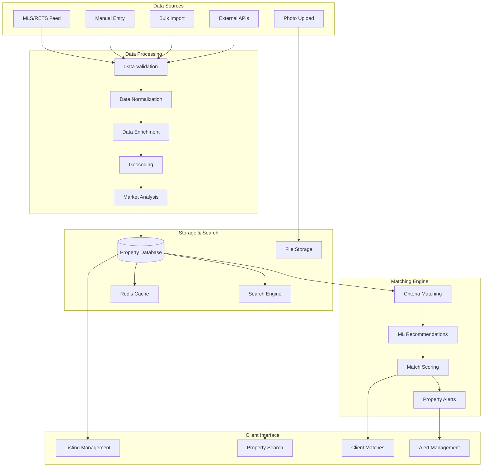

# Property Listing and Matching System

## Overview

The property listing and matching system serves as the central hub for all property-related operations, including MLS integration, intelligent property-client matching, listing management, and market analysis. This system automates property discovery, client matching, and provides comprehensive property intelligence.

## System Architecture

### 1. Property Data Flow



## MLS Integration

### 1. RETS/RESO Data Synchronization

```typescript
// MLS integration service
class MLSIntegrationService {
  private retsClient: RETSClient;
  
  constructor() {
    this.retsClient = new RETSClient({
      loginUrl: process.env.MLS_LOGIN_URL,
      username: process.env.MLS_USERNAME,
      password: process.env.MLS_PASSWORD,
      userAgent: process.env.MLS_USER_AGENT,
      retsVersion: '1.7.2'
    });
  }
  
  async syncMLSData(): Promise<SyncResult> {
    try {
      await this.retsClient.login();
      
      // Get metadata to understand available resources
      const metadata = await this.retsClient.getMetadata();
      
      // Sync properties
      const propertyResult = await this.syncProperties();
      
      // Sync agents
      const agentResult = await this.syncAgents();
      
      // Sync offices
      const officeResult = await this.syncOffices();
      
      await this.retsClient.logout();
      
      return {
        properties: propertyResult,
        agents: agentResult,
        offices: officeResult,
        syncedAt: new Date()
      };
      
    } catch (error) {
      await this.handleSyncError(error);
      throw error;
    }
  }
  
  private async syncProperties(): Promise<PropertySyncResult> {
    // Get last sync timestamp
    const lastSync = await this.getLastSyncTimestamp('properties');
    
    // Query for updated properties
    const query = `(ModificationTimestamp=${lastSync}+)`;
    
    const searchResults = await this.retsClient.search({
      resource: 'Property',
      class: 'Residential',
      query: query,
      format: 'COMPACT-DECODED',
      limit: 1000
    });
    
    let processed = 0;
    let errors = 0;
    
    for (const mlsProperty of searchResults.results) {
      try {
        await this.processMLSProperty(mlsProperty);
        processed++;
      } catch (error) {
        console.error(`Error processing property ${mlsProperty.ListingId}:`, error);
        errors++;
      }
    }
    
    // Update sync timestamp
    await this.updateSyncTimestamp('properties');
    
    return { processed, errors, total: searchResults.results.length };
  }
  
  private async processMLSProperty(mlsData: MLSProperty): Promise<void> {
    // Check if property already exists
    const existingProperty = await db.property.findUnique({
      where: { mlsNumber: mlsData.ListingId }
    });
    
    // Transform MLS data to our schema
    const propertyData = await this.transformMLSData(mlsData);
    
    if (existingProperty) {
      // Update existing property
      await db.property.update({
        where: { id: existingProperty.id },
        data: propertyData
      });
      
      // Check for significant changes that require client notifications
      await this.checkForSignificantChanges(existingProperty, propertyData);
    } else {
      // Create new property
      const newProperty = await db.property.create({
        data: {
          ...propertyData,
          userId: await this.getDefaultUserId(), // Assign to default user or based on listing agent
        }
      });
      
      // Download and process property images
      await this.processPropertyImages(newProperty.id, mlsData.Photos);
      
      // Trigger property matching for interested clients
      await this.triggerPropertyMatching(newProperty.id);
    }
  }
  
  private async transformMLSData(mlsData: MLSProperty): Promise<Partial<Property>> {
    return {
      mlsNumber: mlsData.ListingId,
      status: this.mapMLSStatus(mlsData.StandardStatus),
      propertyType: this.mapPropertyType(mlsData.PropertyType),
      listingType: 'sale',
      address: mlsData.UnparsedAddress,
      city: mlsData.City,
      state: mlsData.StateOrProvince,
      zipCode: mlsData.PostalCode,
      county: mlsData.CountyOrParish,
      latitude: parseFloat(mlsData.Latitude),
      longitude: parseFloat(mlsData.Longitude),
      price: parseFloat(mlsData.ListPrice),
      originalPrice: parseFloat(mlsData.OriginalListPrice),
      bedrooms: parseInt(mlsData.BedroomsTotal),
      bathrooms: parseFloat(mlsData.BathroomsTotalInteger),
      squareFeet: parseInt(mlsData.LivingArea),
      lotSize: parseFloat(mlsData.LotSizeAcres),
      yearBuilt: parseInt(mlsData.YearBuilt),
      description: mlsData.PublicRemarks,
      privateRemarks: mlsData.PrivateRemarks,
      listDate: new Date(mlsData.ListingContractDate),
      daysOnMarket: parseInt(mlsData.DaysOnMarket),
      // Additional MLS-specific fields
      mlsData: mlsData // Store raw MLS data for reference
    };
  }
}
```

### 2. Real-time MLS Updates

```typescript
// Real-time MLS monitoring service
class MLSMonitoringService {
  private webhookEndpoint: string;
  private pollingInterval: number = 300000; // 5 minutes
  
  async setupRealTimeMonitoring(): Promise<void> {
    // Setup webhook if MLS supports it
    if (await this.mlsSupportsWebhooks()) {
      await this.setupMLSWebhook();
    } else {
      // Fallback to polling
      await this.setupPollingMonitor();
    }
  }
  
  private async setupPollingMonitor(): Promise<void> {
    setInterval(async () => {
      try {
        // Check for new/updated properties
        await this.checkForMLSUpdates();
      } catch (error) {
        console.error('MLS polling error:', error);
        await this.notifyAdminOfMLSError(error);
      }
    }, this.pollingInterval);
  }
  
  private async checkForMLSUpdates(): Promise<void> {
    const lastCheck = await this.getLastUpdateCheck();
    const currentTime = new Date();
    
    // Query for properties modified since last check
    const updatedProperties = await this.mlsService.getUpdatedProperties(lastCheck);
    
    for (const property of updatedProperties) {
      await this.processPropertyUpdate(property);
    }
    
    // Update last check timestamp
    await this.updateLastCheckTimestamp(currentTime);
  }
  
  private async processPropertyUpdate(mlsProperty: MLSProperty): Promise<void> {
    const existingProperty = await db.property.findUnique({
      where: { mlsNumber: mlsProperty.ListingId }
    });
    
    if (!existingProperty) {
      // New property
      await this.mlsService.processMLSProperty(mlsProperty);
      await this.notifyInterestedClients(mlsProperty);
    } else {
      // Updated property
      const changes = await this.detectPropertyChanges(existingProperty, mlsProperty);
      
      if (changes.length > 0) {
        await this.mlsService.processMLSProperty(mlsProperty);
        await this.notifyClientsOfChanges(existingProperty.id, changes);
      }
    }
  }
}
```

## Intelligent Property Matching

### 1. Advanced Matching Algorithm

```typescript
// Property matching service
class PropertyMatchingService {
  async findMatchingProperties(
    clientId: string,
    preferences: ClientPreferences
  ): Promise<PropertyMatch[]> {
    // Get client's detailed preferences
    const client = await this.getClientWithPreferences(clientId);
    
    // Build search criteria
    const searchCriteria = this.buildSearchCriteria(preferences);
    
    // Execute multi-stage search
    const candidates = await this.findCandidateProperties(searchCriteria);
    
    // Score and rank matches
    const scoredMatches = await this.scorePropertyMatches(client, candidates);
    
    // Apply machine learning recommendations
    const mlEnhanced = await this.applyMLRecommendations(client, scoredMatches);
    
    // Filter and sort results
    return mlEnhanced
      .filter(match => match.score >= 0.6) // 60% minimum match
      .sort((a, b) => b.score - a.score)
      .slice(0, 50); // Top 50 matches
  }
  
  private async scorePropertyMatches(
    client: ClientWithPreferences,
    properties: Property[]
  ): Promise<PropertyMatch[]> {
    const matches: PropertyMatch[] = [];
    
    for (const property of properties) {
      const score = await this.calculateMatchScore(client, property);
      
      if (score > 0) {
        matches.push({
          property,
          client,
          score,
          matchReasons: this.getMatchReasons(client, property, score),
          createdAt: new Date()
        });
      }
    }
    
    return matches;
  }
  
  private async calculateMatchScore(
    client: ClientWithPreferences,
    property: Property
  ): Promise<number> {
    let score = 0;
    let maxScore = 0;
    
    // Price matching (25% weight)
    const priceScore = this.scorePriceMatch(client.preferences, property);
    score += priceScore * 0.25;
    maxScore += 0.25;
    
    // Location matching (20% weight)
    const locationScore = await this.scoreLocationMatch(client.preferences, property);
    score += locationScore * 0.20;
    maxScore += 0.20;
    
    // Property features matching (20% weight)
    const featuresScore = this.scoreFeaturesMatch(client.preferences, property);
    score += featuresScore * 0.20;
    maxScore += 0.20;
    
    // Size matching (15% weight)
    const sizeScore = this.scoreSizeMatch(client.preferences, property);
    score += sizeScore * 0.15;
    maxScore += 0.15;
    
    // Property type matching (10% weight)
    const typeScore = this.scoreTypeMatch(client.preferences, property);
    score += typeScore * 0.10;
    maxScore += 0.10;
    
    // Timeline matching (10% weight)
    const timelineScore = this.scoreTimelineMatch(client.preferences, property);
    score += timelineScore * 0.10;
    maxScore += 0.10;
    
    // Normalize score to 0-1 range
    return maxScore > 0 ? score / maxScore : 0;
  }
  
  private scorePriceMatch(preferences: ClientPreferences, property: Property): number {
    if (!preferences.minPrice && !preferences.maxPrice) return 1;
    
    const price = property.price;
    const minPrice = preferences.minPrice || 0;
    const maxPrice = preferences.maxPrice || Infinity;
    
    if (price < minPrice || price > maxPrice) return 0;
    
    // Perfect score if within range
    if (price >= minPrice && price <= maxPrice) return 1;
    
    // Partial score for close matches
    const range = maxPrice - minPrice;
    const tolerance = range * 0.1; // 10% tolerance
    
    if (price < minPrice && price >= minPrice - tolerance) {
      return 1 - (minPrice - price) / tolerance;
    }
    
    if (price > maxPrice && price <= maxPrice + tolerance) {
      return 1 - (price - maxPrice) / tolerance;
    }
    
    return 0;
  }
  
  private async scoreLocationMatch(
    preferences: ClientPreferences,
    property: Property
  ): Promise<number> {
    let score = 0;
    
    // Preferred areas exact match
    if (preferences.preferredAreas?.includes(property.city)) {
      score += 0.5;
    }
    
    // Commute time scoring
    if (preferences.workLocation) {
      const commuteTime = await this.calculateCommuteTime(
        property,
        preferences.workLocation
      );
      
      if (commuteTime <= preferences.maxCommuteMinutes) {
        score += 0.3 * (1 - commuteTime / preferences.maxCommuteMinutes);
      }
    }
    
    // School district scoring
    if (preferences.schoolImportance && property.schoolDistrict) {
      const schoolRating = await this.getSchoolDistrictRating(property.schoolDistrict);
      score += 0.2 * (schoolRating / 10); // Assuming 1-10 rating scale
    }
    
    return Math.min(1, score);
  }
  
  private scoreFeaturesMatch(preferences: ClientPreferences, property: Property): number {
    let matchedFeatures = 0;
    let totalFeatures = 0;
    
    // Must-have features
    if (preferences.mustHaveFeatures) {
      for (const feature of preferences.mustHaveFeatures) {
        totalFeatures++;
        if (this.propertyHasFeature(property, feature)) {
          matchedFeatures++;
        } else {
          // Must-have feature missing - significant penalty
          return 0;
        }
      }
    }
    
    // Nice-to-have features
    if (preferences.niceToHaveFeatures) {
      for (const feature of preferences.niceToHaveFeatures) {
        totalFeatures++;
        if (this.propertyHasFeature(property, feature)) {
          matchedFeatures++;
        }
      }
    }
    
    return totalFeatures > 0 ? matchedFeatures / totalFeatures : 1;
  }
}
```

### 2. Machine Learning Recommendations

```typescript
// ML-powered recommendation engine
class MLRecommendationEngine {
  private model: TensorFlowModel;
  
  async trainRecommendationModel(): Promise<void> {
    // Collect training data
    const trainingData = await this.collectTrainingData();
    
    // Prepare features
    const features = this.prepareFeatures(trainingData);
    
    // Train model
    this.model = await this.trainModel(features);
    
    // Save model
    await this.saveModel();
  }
  
  private async collectTrainingData(): Promise<TrainingData[]> {
    // Get historical data: client preferences, property views, showings, offers
    const data = await db.$queryRaw`
      SELECT 
        c.id as client_id,
        c.preferences,
        p.id as property_id,
        p.price,
        p.bedrooms,
        p.bathrooms,
        p.square_feet,
        p.property_type,
        p.city,
        p.features,
        ps.interest_level,
        CASE 
          WHEN ps.interest_level >= 4 THEN 1 
          ELSE 0 
        END as positive_interaction
      FROM contacts c
      JOIN property_showings ps ON c.id = ps.contact_id
      JOIN properties p ON ps.property_id = p.id
      WHERE c.type = 'buyer'
        AND ps.completed_date IS NOT NULL
        AND ps.interest_level IS NOT NULL
    `;
    
    return data;
  }
  
  async getMLRecommendations(
    clientId: string,
    candidateProperties: Property[]
  ): Promise<MLRecommendation[]> {
    const client = await this.getClientFeatures(clientId);
    const recommendations: MLRecommendation[] = [];
    
    for (const property of candidateProperties) {
      const propertyFeatures = this.extractPropertyFeatures(property);
      const combinedFeatures = [...client, ...propertyFeatures];
      
      // Get ML prediction
      const prediction = await this.model.predict(combinedFeatures);
      
      recommendations.push({
        propertyId: property.id,
        clientId,
        mlScore: prediction.score,
        confidence: prediction.confidence,
        reasons: this.interpretMLPrediction(prediction, property)
      });
    }
    
    return recommendations.sort((a, b) => b.mlScore - a.mlScore);
  }
  
  private extractPropertyFeatures(property: Property): number[] {
    return [
      property.price / 1000000, // Normalize price
      property.bedrooms || 0,
      property.bathrooms || 0,
      (property.squareFeet || 0) / 10000, // Normalize square feet
      property.yearBuilt ? (property.yearBuilt - 1900) / 100 : 0, // Normalize year
      property.lotSize || 0,
      this.encodePropertyType(property.propertyType),
      this.encodeLocation(property.city, property.state),
      ...this.encodeFeatures(property.features)
    ];
  }
}
```

## Property Search & Filtering

### 1. Advanced Search Engine

```typescript
// Property search service
class PropertySearchService {
  async searchProperties(
    searchParams: PropertySearchParams,
    userId: string
  ): Promise<PropertySearchResult> {
    // Build search query
    const query = this.buildSearchQuery(searchParams);
    
    // Execute search with filters
    const results = await this.executeSearch(query, userId);
    
    // Apply post-processing
    const processedResults = await this.postProcessResults(results, searchParams);
    
    // Generate search analytics
    await this.logSearchAnalytics(searchParams, results.length, userId);
    
    return {
      properties: processedResults,
      totalCount: results.totalCount,
      facets: await this.generateFacets(searchParams, userId),
      searchId: this.generateSearchId(),
      executionTime: results.executionTime
    };
  }
  
  private buildSearchQuery(params: PropertySearchParams): SearchQuery {
    const query: SearchQuery = {
      filters: [],
      sort: params.sort || 'price_asc',
      limit: params.limit || 25,
      offset: params.offset || 0
    };
    
    // Price range filter
    if (params.minPrice || params.maxPrice) {
      query.filters.push({
        field: 'price',
        operator: 'range',
        value: {
          min: params.minPrice,
          max: params.maxPrice
        }
      });
    }
    
    // Location filters
    if (params.cities?.length) {
      query.filters.push({
        field: 'city',
        operator: 'in',
        value: params.cities
      });
    }
    
    if (params.zipCodes?.length) {
      query.filters.push({
        field: 'zipCode',
        operator: 'in',
        value: params.zipCodes
      });
    }
    
    // Property characteristics
    if (params.minBedrooms) {
      query.filters.push({
        field: 'bedrooms',
        operator: 'gte',
        value: params.minBedrooms
      });
    }
    
    if (params.minBathrooms) {
      query.filters.push({
        field: 'bathrooms',
        operator: 'gte',
        value: params.minBathrooms
      });
    }
    
    if (params.propertyTypes?.length) {
      query.filters.push({
        field: 'propertyType',
        operator: 'in',
        value: params.propertyTypes
      });
    }
    
    // Geographic search
    if (params.centerPoint && params.radius) {
      query.filters.push({
        field: 'location',
        operator: 'geo_distance',
        value: {
          center: params.centerPoint,
          radius: params.radius
        }
      });
    }
    
    // Full-text search
    if (params.keywords) {
      query.textSearch = {
        query: params.keywords,
        fields: ['description', 'address', 'features']
      };
    }
    
    return query;
  }
  
  private async executeSearch(
    query: SearchQuery,
    userId: string
  ): Promise<RawSearchResult> {
    const startTime = Date.now();
    
    // Build SQL query with filters
    let sqlQuery = `
      SELECT p.*, 
             array_agg(pi.url ORDER BY pi.sort_order) as image_urls,
             ST_Distance(
               ST_Point(p.longitude, p.latitude)::geography,
               ST_Point($centerLng, $centerLat)::geography
             ) as distance
      FROM properties p
      LEFT JOIN property_images pi ON p.id = pi.property_id
      WHERE p.status = 'active'
        AND p.user_id = $userId
    `;
    
    const queryParams: any = { userId };
    
    // Apply filters
    query.filters.forEach((filter, index) => {
      const paramName = `filter${index}`;
      
      switch (filter.operator) {
        case 'range':
          if (filter.value.min) {
            sqlQuery += ` AND p.${filter.field} >= $${paramName}Min`;
            queryParams[`${paramName}Min`] = filter.value.min;
          }
          if (filter.value.max) {
            sqlQuery += ` AND p.${filter.field} <= $${paramName}Max`;
            queryParams[`${paramName}Max`] = filter.value.max;
          }
          break;
          
        case 'in':
          sqlQuery += ` AND p.${filter.field} = ANY($${paramName})`;
          queryParams[paramName] = filter.value;
          break;
          
        case 'gte':
          sqlQuery += ` AND p.${filter.field} >= $${paramName}`;
          queryParams[paramName] = filter.value;
          break;
          
        case 'geo_distance':
          sqlQuery += ` AND ST_DWithin(
            ST_Point(p.longitude, p.latitude)::geography,
            ST_Point($centerLng, $centerLat)::geography,
            $radius
          )`;
          queryParams.centerLng = filter.value.center.longitude;
          queryParams.centerLat = filter.value.center.latitude;
          queryParams.radius = filter.value.radius * 1609.34; // Convert miles to meters
          break;
      }
    });
    
    // Add full-text search
    if (query.textSearch) {
      sqlQuery += ` AND (
        to_tsvector('english', p.description) @@ plainto_tsquery('english', $searchText)
        OR p.address ILIKE $searchPattern
        OR array_to_string(p.features, ' ') ILIKE $searchPattern
      )`;
      queryParams.searchText = query.textSearch.query;
      queryParams.searchPattern = `%${query.textSearch.query}%`;
    }
    
    // Group by and order
    sqlQuery += ` GROUP BY p.id`;
    sqlQuery += ` ORDER BY ${this.buildOrderClause(query.sort)}`;
    sqlQuery += ` LIMIT $limit OFFSET $offset`;
    
    queryParams.limit = query.limit;
    queryParams.offset = query.offset;
    
    // Execute query
    const results = await db.$queryRawUnsafe(sqlQuery, queryParams);
    
    // Get total count
    const countQuery = sqlQuery.replace(
      /SELECT p\.\*, .*? FROM/,
      'SELECT COUNT(DISTINCT p.id) as total FROM'
    ).replace(/GROUP BY p\.id ORDER BY .* LIMIT .* OFFSET .*/, '');
    
    const countResult = await db.$queryRawUnsafe(countQuery, queryParams);
    
    return {
      results,
      totalCount: countResult[0].total,
      executionTime: Date.now() - startTime
    };
  }
}
```

### 2. Saved Searches & Alerts

```typescript
// Saved search service
class SavedSearchService {
  async createSavedSearch(
    userId: string,
    searchParams: PropertySearchParams,
    alertSettings: AlertSettings
  ): Promise<SavedSearch> {
    const savedSearch = await db.savedSearch.create({
      data: {
        userId,
        name: searchParams.name || 'Untitled Search',
        searchCriteria: searchParams,
        alertSettings,
        isActive: true,
        lastRun: new Date()
      }
    });
    
    // Schedule alert checking
    if (alertSettings.enabled) {
      await this.scheduleSearchAlert(savedSearch.id);
    }
    
    return savedSearch;
  }
  
  async checkSavedSearchAlerts(): Promise<void> {
    const activeSearches = await db.savedSearch.findMany({
      where: {
        isActive: true,
        alertSettings: {
          path: ['enabled'],
          equals: true
        }
      }
    });
    
    for (const search of activeSearches) {
      await this.processSearchAlert(search);
    }
  }
  
  private async processSearchAlert(savedSearch: SavedSearch): Promise<void> {
    // Check if it's time to run this alert
    const shouldRun = this.shouldRunAlert(savedSearch);
    if (!shouldRun) return;
    
    // Execute search
    const results = await this.propertySearchService.searchProperties(
      savedSearch.searchCriteria,
      savedSearch.userId
    );
    
    // Find new properties since last run
    const newProperties = await this.findNewProperties(
      results.properties,
      savedSearch.lastRun
    );
    
    if (newProperties.length > 0) {
      // Send alert
      await this.sendPropertyAlert(savedSearch, newProperties);
      
      // Update last run timestamp
      await db.savedSearch.update({
        where: { id: savedSearch.id },
        data: { lastRun: new Date() }
      });
    }
  }
  
  private async sendPropertyAlert(
    savedSearch: SavedSearch,
    newProperties: Property[]
  ): Promise<void> {
    const user = await db.user.findUnique({
      where: { id: savedSearch.userId }
    });
    
    // Generate alert email
    const emailContent = await this.generateAlertEmail(savedSearch, newProperties);
    
    // Send email
    await this.emailService.sendEmail({
      to: user.email,
      subject: `New Properties Found: ${savedSearch.name}`,
      html: emailContent,
      templateId: 'property-alert'
    });
    
    // Send push notification if enabled
    if (savedSearch.alertSettings.pushNotifications) {
      await this.pushNotificationService.send(user.id, {
        title: 'New Properties Available',
        body: `${newProperties.length} new properties match your saved search "${savedSearch.name}"`,
        data: {
          type: 'property_alert',
          savedSearchId: savedSearch.id,
          propertyCount: newProperties.length
        }
      });
    }
  }
}
```

## Market Analysis & Pricing

### 1. Comparative Market Analysis (CMA)

```typescript
// Market analysis service
class MarketAnalysisService {
  async generateCMA(
    propertyId: string,
    analysisParams: CMAParams
  ): Promise<CMAReport> {
    const subject = await this.getProperty(propertyId);
    
    // Find comparable properties
    const comparables = await this.findComparableProperties(subject, analysisParams);
    
    // Calculate market statistics
    const marketStats = await this.calculateMarketStatistics(subject, comparables);
    
    // Generate price recommendations
    const priceRecommendations = await this.generatePriceRecommendations(
      subject,
      comparables,
      marketStats
    );
    
    // Market trends analysis
    const marketTrends = await this.analyzeMarketTrends(subject);
    
    return {
      subjectProperty: subject,
      comparables,
      marketStatistics: marketStats,
      priceRecommendations,
      marketTrends,
      generatedAt: new Date(),
      validUntil: new Date(Date.now() + 30 * 24 * 60 * 60 * 1000) // 30 days
    };
  }
  
  private async findComparableProperties(
    subject: Property,
    params: CMAParams
  ): Promise<ComparableProperty[]> {
    // Define search criteria for comparables
    const searchRadius = params.radius || 1; // miles
    const timeframe = params.timeframeDays || 180; // 6 months
    const maxComps = params.maxComparables || 10;
    
    const comparables = await db.$queryRaw`
      SELECT p.*,
             ST_Distance(
               ST_Point(p.longitude, p.latitude)::geography,
               ST_Point(${subject.longitude}, ${subject.latitude})::geography
             ) / 1609.34 as distance_miles,
             t.closing_date,
             t.purchase_price as sold_price,
             (t.purchase_price - p.price) as price_adjustment
      FROM properties p
      JOIN transactions t ON p.id = t.property_id
      WHERE p.id != ${subject.id}
        AND p.property_type = ${subject.propertyType}
        AND p.bedrooms BETWEEN ${subject.bedrooms - 1} AND ${subject.bedrooms + 1}
        AND p.bathrooms BETWEEN ${subject.bathrooms - 0.5} AND ${subject