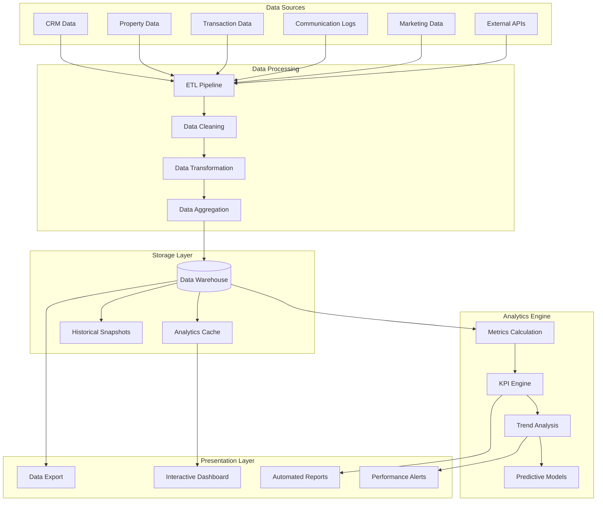

# Reporting and Analytics Dashboard

## Overview

The reporting and analytics dashboard provides comprehensive business intelligence for real estate professionals, offering insights into lead conversion, sales performance, market trends, financial metrics, and operational efficiency. The system uses real-time data processing and predictive analytics to help realtors make data-driven decisions.

## Dashboard Architecture

### 1. Analytics Data Flow



## Core Analytics Services

### 1. Real-time Metrics Engine

```typescript
// Analytics engine service
class AnalyticsEngineService {
  private metricsCache: Redis;
  private eventStream: EventEmitter;
  
  constructor() {
    this.metricsCache = new Redis(process.env.REDIS_URL);
    this.eventStream = new EventEmitter();
    this.setupRealTimeProcessing();
  }
  
  async calculateRealTimeMetrics(userId: string): Promise<RealTimeMetrics> {
    // Check cache first
    const cached = await this.metricsCache.get(`metrics:${userId}`);
    if (cached) {
      return JSON.parse(cached);
    }
    
    // Calculate fresh metrics
    const metrics = await this.computeMetrics(userId);
    
    // Cache for 5 minutes
    await this.metricsCache.setex(`metrics:${userId}`, 300, JSON.stringify(metrics));
    
    return metrics;
  }
  
  private async computeMetrics(userId: string): Promise<RealTimeMetrics> {
    const now = new Date();
    const monthStart = new Date(now.getFullYear(), now.getMonth(), 1);
    const yearStart = new Date(now.getFullYear(), 0, 1);
    
    // Parallel metric calculations
    const [
      leadMetrics,
      salesMetrics,
      activityMetrics,
      financialMetrics,
      pipelineMetrics
    ] = await Promise.all([
      this.calculateLeadMetrics(userId, monthStart),
      this.calculateSalesMetrics(userId, monthStart),
      this.calculateActivityMetrics(userId, monthStart),
      this.calculateFinancialMetrics(userId, yearStart),
      this.calculatePipelineMetrics(userId)
    ]);
    
    return {
      leads: leadMetrics,
      sales: salesMetrics,
      activity: activityMetrics,
      financial: financialMetrics,
      pipeline: pipelineMetrics,
      lastUpdated: now
    };
  }
  
  private async calculateLeadMetrics(userId: string, since: Date): Promise<LeadMetrics> {
    const leadStats = await db.$queryRaw`
      SELECT 
        COUNT(*) as total_leads,
        COUNT(*) FILTER (WHERE created_at >= ${since}) as new_this_month,
        COUNT(*) FILTER (WHERE stage = 'Closed') as converted_leads,
        COUNT(*) FILTER (WHERE lead_score >= 80) as hot_leads,
        AVG(lead_score) as avg_lead_score,
        COUNT(DISTINCT source) as lead_sources
      FROM contacts 
      WHERE user_id = ${userId} 
        AND type IN ('lead', 'buyer', 'seller')
    `;
    
    const conversionRate = leadStats[0].total_leads > 0 
      ? (leadStats[0].converted_leads / leadStats[0].total_leads) * 100 
      : 0;
    
    // Lead source breakdown
    const sourceBreakdown = await db.$queryRaw`
      SELECT source, COUNT(*) as count
      FROM contacts 
      WHERE user_id = ${userId} 
        AND created_at >= ${since}
        AND type IN ('lead', 'buyer', 'seller')
      GROUP BY source
      ORDER BY count DESC
    `;
    
    return {
      totalLeads: leadStats[0].total_leads,
      newThisMonth: leadStats[0].new_this_month,
      convertedLeads: leadStats[0].converted_leads,
      conversionRate: Math.round(conversionRate * 100) / 100,
      hotLeads: leadStats[0].hot_leads,
      averageLeadScore: Math.round(leadStats[0].avg_lead_score * 100) / 100,
      leadSources: sourceBreakdown
    };
  }
  
  private async calculateSalesMetrics(userId: string, since: Date): Promise<SalesMetrics> {
    const salesStats = await db.$queryRaw`
      SELECT 
        COUNT(*) as total_transactions,
        COUNT(*) FILTER (WHERE status = 'closed') as closed_deals,
        COUNT(*) FILTER (WHERE status = 'active') as active_deals,
        COUNT(*) FILTER (WHERE closing_date >= ${since}) as closed_this_month,
        SUM(commission_amount) FILTER (WHERE status = 'closed') as total_commission,
        SUM(commission_amount) FILTER (WHERE closing_date >= ${since}) as commission_this_month,
        AVG(commission_amount) FILTER (WHERE status = 'closed') as avg_commission,
        AVG(EXTRACT(days FROM (closing_date - contract_date))) as avg_days_to_close
      FROM transactions 
      WHERE user_id = ${userId}
    `;
    
    const stats = salesStats[0];
    
    return {
      totalTransactions: stats.total_transactions,
      closedDeals: stats.closed_deals,
      activeDeals: stats.active_deals,
      closedThisMonth: stats.closed_this_month,
      totalCommission: stats.total_commission || 0,
      commissionThisMonth: stats.commission_this_month || 0,
      averageCommission: stats.avg_commission || 0,
      averageDaysToClose: Math.round(stats.avg_days_to_close || 0)
    };
  }
  
  private async calculateActivityMetrics(userId: string, since: Date): Promise<ActivityMetrics> {
    const activityStats = await db.$queryRaw`
      SELECT 
        COUNT(*) FILTER (WHERE type = 'call') as total_calls,
        COUNT(*) FILTER (WHERE type = 'email') as total_emails,
        COUNT(*) FILTER (WHERE type = 'meeting') as total_meetings,
        COUNT(*) FILTER (WHERE created_at >= ${since}) as activities_this_month,
        COUNT(DISTINCT contact_id) as contacts_touched
      FROM communications 
      WHERE user_id = ${userId}
    `;
    
    const taskStats = await db.$queryRaw`
      SELECT 
        COUNT(*) as total_tasks,
        COUNT(*) FILTER (WHERE status = 'completed') as completed_tasks,
        COUNT(*) FILTER (WHERE due_date < NOW() AND status != 'completed') as overdue_tasks
      FROM tasks 
      WHERE user_id = ${userId}
    `;
    
    const stats = activityStats[0];
    const tasks = taskStats[0];
    
    return {
      totalCalls: stats.total_calls,
      totalEmails: stats.total_emails,
      totalMeetings: stats.total_meetings,
      activitiesThisMonth: stats.activities_this_month,
      contactsTouched: stats.contacts_touched,
      totalTasks: tasks.total_tasks,
      completedTasks: tasks.completed_tasks,
      overdueTasks: tasks.overdue_tasks,
      taskCompletionRate: tasks.total_tasks > 0 
        ? Math.round((tasks.completed_tasks / tasks.total_tasks) * 100) 
        : 0
    };
  }
}
```

### 2. Performance Analytics

```typescript
// Performance analytics service
class PerformanceAnalyticsService {
  async generatePerformanceReport(
    userId: string,
    period: AnalyticsPeriod
  ): Promise<PerformanceReport> {
    const dateRange = this.getDateRange(period);
    
    // Calculate performance metrics
    const [
      conversionFunnel,
      activityAnalysis,
      revenueAnalysis,
      marketingROI,
      clientSatisfaction
    ] = await Promise.all([
      this.analyzeConversionFunnel(userId, dateRange),
      this.analyzeActivityPerformance(userId, dateRange),
      this.analyzeRevenuePerformance(userId, dateRange),
      this.analyzeMarketingROI(userId, dateRange),
      this.analyzeClientSatisfaction(userId, dateRange)
    ]);
    
    return {
      period,
      dateRange,
      conversionFunnel,
      activityAnalysis,
      revenueAnalysis,
      marketingROI,
      clientSatisfaction,
      generatedAt: new Date()
    };
  }
  
  private async analyzeConversionFunnel(
    userId: string,
    dateRange: DateRange
  ): Promise<ConversionFunnel> {
    const funnelData = await db.$queryRaw`
      WITH funnel_stages AS (
        SELECT 
          stage,
          COUNT(*) as count,
          LAG(COUNT(*)) OVER (ORDER BY 
            CASE stage
              WHEN 'New Lead' THEN 1
              WHEN 'Qualified' THEN 2
              WHEN 'Appointment Set' THEN 3
              WHEN 'Property Shown' THEN 4
              WHEN 'Offer Prepared' THEN 5
              WHEN 'Under Contract' THEN 6
              WHEN 'Closed' THEN 7
            END
          ) as previous_count
        FROM contacts
        WHERE user_id = ${userId}
          AND created_at BETWEEN ${dateRange.start} AND ${dateRange.end}
        GROUP BY stage
        ORDER BY 
          CASE stage
            WHEN 'New Lead' THEN 1
            WHEN 'Qualified' THEN 2
            WHEN 'Appointment Set' THEN 3
            WHEN 'Property Shown' THEN 4
            WHEN 'Offer Prepared' THEN 5
            WHEN 'Under Contract' THEN 6
            WHEN 'Closed' THEN 7
          END
      )
      SELECT 
        stage,
        count,
        CASE 
          WHEN previous_count > 0 THEN (count::float / previous_count::float) * 100
          ELSE 100
        END as conversion_rate
      FROM funnel_stages
    `;
    
    return {
      stages: funnelData.map(stage => ({
        name: stage.stage,
        count: stage.count,
        conversionRate: Math.round(stage.conversion_rate * 100) / 100
      })),
      overallConversionRate: this.calculateOverallConversion(funnelData)
    };
  }
  
  private async analyzeActivityPerformance(
    userId: string,
    dateRange: DateRange
  ): Promise<ActivityAnalysis> {
    // Activity volume trends
    const activityTrends = await db.$queryRaw`
      SELECT 
        DATE_TRUNC('day', created_at) as date,
        type,
        COUNT(*) as count
      FROM communications
      WHERE user_id = ${userId}
        AND created_at BETWEEN ${dateRange.start} AND ${dateRange.end}
      GROUP BY DATE_TRUNC('day', created_at), type
      ORDER BY date
    `;
    
    // Activity effectiveness
    const effectiveness = await db.$queryRaw`
      SELECT 
        c.type,
        COUNT(*) as total_activities,
        COUNT(*) FILTER (WHERE co.stage_updated_at > c.created_at) as led_to_progression,
        AVG(EXTRACT(hours FROM (co.stage_updated_at - c.created_at))) as avg_hours_to_progression
      FROM communications c
      JOIN contacts co ON c.contact_id = co.id
      WHERE c.user_id = ${userId}
        AND c.created_at BETWEEN ${dateRange.start} AND ${dateRange.end}
      GROUP BY c.type
    `;
    
    return {
      trends: this.formatActivityTrends(activityTrends),
      effectiveness: effectiveness.map(eff => ({
        activityType: eff.type,
        totalActivities: eff.total_activities,
        progressionRate: eff.total_activities > 0 
          ? Math.round((eff.led_to_progression / eff.total_activities) * 100) 
          : 0,
        averageHoursToProgression: Math.round(eff.avg_hours_to_progression || 0)
      }))
    };
  }
}
```

## Dashboard Components

### 1. Executive Dashboard

```typescript
// Executive dashboard service
class ExecutiveDashboardService {
  async getExecutiveDashboard(userId: string): Promise<ExecutiveDashboard> {
    const currentMonth = new Date();
    const lastMonth = new Date(currentMonth.getFullYear(), currentMonth.getMonth() - 1, 1);
    const currentYear = new Date(currentMonth.getFullYear(), 0, 1);
    
    // Key performance indicators
    const kpis = await this.calculateKPIs(userId, currentMonth, lastMonth);
    
    // Revenue trends
    const revenueTrends = await this.getRevenueTrends(userId, currentYear);
    
    // Pipeline health
    const pipelineHealth = await this.assessPipelineHealth(userId);
    
    // Market insights
    const marketInsights = await this.getMarketInsights(userId);
    
    // Goal progress
    const goalProgress = await this.getGoalProgress(userId, currentYear);
    
    return {
      kpis,
      revenueTrends,
      pipelineHealth,
      marketInsights,
      goalProgress,
      lastUpdated: new Date()
    };
  }
  
  private async calculateKPIs(
    userId: string,
    currentMonth: Date,
    lastMonth: Date
  ): Promise<KPIMetrics> {
    const currentMonthStart = new Date(currentMonth.getFullYear(), currentMonth.getMonth(), 1);
    const lastMonthStart = new Date(lastMonth.getFullYear(), lastMonth.getMonth(), 1);
    const lastMonthEnd = new Date(currentMonth.getFullYear(), currentMonth.getMonth(), 0);
    
    // Current month metrics
    const currentMetrics = await db.$queryRaw`
      SELECT 
        COUNT(*) FILTER (WHERE type IN ('lead', 'buyer', 'seller')) as new_leads,
        COUNT(*) FILTER (WHERE stage = 'Closed') as closed_deals,
        COALESCE(SUM(t.commission_amount), 0) as revenue
      FROM contacts c
      LEFT JOIN transactions t ON c.id = t.buyer_contact_id OR c.id = t.seller_contact_id
      WHERE c.user_id = ${userId}
        AND c.created_at >= ${currentMonthStart}
        AND (t.status = 'closed' OR t.status IS NULL)
    `;
    
    // Last month metrics for comparison
    const lastMetrics = await db.$queryRaw`
      SELECT 
        COUNT(*) FILTER (WHERE type IN ('lead', 'buyer', 'seller')) as new_leads,
        COUNT(*) FILTER (WHERE stage = 'Closed') as closed_deals,
        COALESCE(SUM(t.commission_amount), 0) as revenue
      FROM contacts c
      LEFT JOIN transactions t ON c.id = t.buyer_contact_id OR c.id = t.seller_contact_id
      WHERE c.user_id = ${userId}
        AND c.created_at BETWEEN ${lastMonthStart} AND ${lastMonthEnd}
        AND (t.status = 'closed' OR t.status IS NULL)
    `;
    
    const current = currentMetrics[0];
    const last = lastMetrics[0];
    
    return {
      newLeads: {
        value: current.new_leads,
        change: this.calculatePercentageChange(current.new_leads, last.new_leads),
        trend: current.new_leads >= last.new_leads ? 'up' : 'down'
      },
      closedDeals: {
        value: current.closed_deals,
        change: this.calculatePercentageChange(current.closed_deals, last.closed_deals),
        trend: current.closed_deals >= last.closed_deals ? 'up' : 'down'
      },
      revenue: {
        value: current.revenue,
        change: this.calculatePercentageChange(current.revenue, last.revenue),
        trend: current.revenue >= last.revenue ? 'up' : 'down'
      }
    };
  }
  
  private async getRevenueTrends(userId: string, yearStart: Date): Promise<RevenueTrend[]> {
    const trends = await db.$queryRaw`
      SELECT 
        DATE_TRUNC('month', t.closing_date) as month,
        SUM(t.commission_amount) as revenue,
        COUNT(*) as deals_closed,
        AVG(t.commission_amount) as avg_commission
      FROM transactions t
      WHERE t.user_id = ${userId}
        AND t.status = 'closed'
        AND t.closing_date >= ${yearStart}
      GROUP BY DATE_TRUNC('month', t.closing_date)
      ORDER BY month
    `;
    
    return trends.map(trend => ({
      month: trend.month,
      revenue: trend.revenue || 0,
      dealsCount: trend.deals_closed,
      averageCommission: trend.avg_commission || 0
    }));
  }
}
```

### 2. Interactive Charts and Visualizations

```typescript
// Chart data service
class ChartDataService {
  async getLeadSourceChart(userId: string, period: string): Promise<ChartData> {
    const dateRange = this.getDateRange(period);
    
    const data = await db.$queryRaw`
      SELECT 
        COALESCE(source, 'Unknown') as source,
        COUNT(*) as count,
        COUNT(*) FILTER (WHERE stage = 'Closed') as converted
      FROM contacts
      WHERE user_id = ${userId}
        AND created_at BETWEEN ${dateRange.start} AND ${dateRange.end}
        AND type IN ('lead', 'buyer', 'seller')
      GROUP BY source
      ORDER BY count DESC
    `;
    
    return {
      type: 'doughnut',
      labels: data.map(item => item.source),
      datasets: [{
        label: 'Lead Sources',
        data: data.map(item => item.count),
        backgroundColor: this.generateColors(data.length),
        borderWidth: 2
      }],
      metadata: {
        total: data.reduce((sum, item) => sum + item.count, 0),
        converted: data.reduce((sum, item) => sum + item.converted, 0)
      }
    };
  }
  
  async getConversionFunnelChart(userId: string, period: string): Promise<ChartData> {
    const dateRange = this.getDateRange(period);
    
    const stages = [
      'New Lead', 'Qualified', 'Appointment Set', 
      'Property Shown', 'Offer Prepared', 'Under Contract', 'Closed'
    ];
    
    const data = await db.$queryRaw`
      SELECT 
        stage,
        COUNT(*) as count
      FROM contacts
      WHERE user_id = ${userId}
        AND created_at BETWEEN ${dateRange.start} AND ${dateRange.end}
        AND stage = ANY(${stages})
      GROUP BY stage
      ORDER BY 
        CASE stage
          WHEN 'New Lead' THEN 1
          WHEN 'Qualified' THEN 2
          WHEN 'Appointment Set' THEN 3
          WHEN 'Property Shown' THEN 4
          WHEN 'Offer Prepared' THEN 5
          WHEN 'Under Contract' THEN 6
          WHEN 'Closed' THEN 7
        END
    `;
    
    // Fill in missing stages with 0
    const stageData = stages.map(stage => {
      const found = data.find(item => item.stage === stage);
      return found ? found.count : 0;
    });
    
    return {
      type: 'funnel',
      labels: stages,
      datasets: [{
        label: 'Lead Conversion Funnel',
        data: stageData,
        backgroundColor: '#3B82F6',
        borderColor: '#1E40AF',
        borderWidth: 1
      }],
      metadata: {
        conversionRate: stageData[0] > 0 
          ? Math.round((stageData[stageData.length - 1] / stageData[0]) * 100) 
          : 0
      }
    };
  }
  
  async getRevenueTimelineChart(userId: string, period: string): Promise<ChartData> {
    const dateRange = this.getDateRange(period);
    const groupBy = period === 'year' ? 'month' : 'day';
    
    const data = await db.$queryRaw`
      SELECT 
        DATE_TRUNC(${groupBy}, t.closing_date) as period,
        SUM(t.commission_amount) as revenue,
        COUNT(*) as deals
      FROM transactions t
      WHERE t.user_id = ${userId}
        AND t.status = 'closed'
        AND t.closing_date BETWEEN ${dateRange.start} AND ${dateRange.end}
      GROUP BY DATE_TRUNC(${groupBy}, t.closing_date)
      ORDER BY period
    `;
    
    return {
      type: 'line',
      labels: data.map(item => this.formatPeriodLabel(item.period, groupBy)),
      datasets: [
        {
          label: 'Revenue',
          data: data.map(item => item.revenue || 0),
          borderColor: '#10B981',
          backgroundColor: 'rgba(16, 185, 129, 0.1)',
          tension: 0.4,
          yAxisID: 'revenue'
        },
        {
          label: 'Deals Closed',
          data: data.map(item => item.deals),
          borderColor: '#F59E0B',
          backgroundColor: 'rgba(245, 158, 11, 0.1)',
          tension: 0.4,
          yAxisID: 'deals'
        }
      ],
      options: {
        scales: {
          revenue: {
            type: 'linear',
            position: 'left',
            ticks: {
              callback: (value) => `$${value.toLocaleString()}`
            }
          },
          deals: {
            type: 'linear',
            position: 'right',
            grid: {
              drawOnChartArea: false
            }
          }
        }
      }
    };
  }
}
```

### 3. Automated Report Generation

```typescript
// Report generation service
class ReportGenerationService {
  async generateMonthlyReport(userId: string, month: Date): Promise<MonthlyReport> {
    const monthStart = new Date(month.getFullYear(), month.getMonth(), 1);
    const monthEnd = new Date(month.getFullYear(), month.getMonth() + 1, 0);
    
    // Gather all report data
    const [
      summary,
      leadAnalysis,
      salesPerformance,
      activitySummary,
      marketAnalysis,
      goals
    ] = await Promise.all([
      this.generateExecutiveSummary(userId, monthStart, monthEnd),
      this.generateLeadAnalysis(userId, monthStart, monthEnd),
      this.generateSalesPerformance(userId, monthStart, monthEnd),
      this.generateActivitySummary(userId, monthStart, monthEnd),
      this.generateMarketAnalysis(userId, monthStart, monthEnd),
      this.generateGoalProgress(userId, monthStart, monthEnd)
    ]);
    
    // Generate PDF report
    const pdfBuffer = await this.generatePDFReport({
      month,
      summary,
      leadAnalysis,
      salesPerformance,
      activitySummary,
      marketAnalysis,
      goals
    });
    
    // Store report
    const reportFile = await this.fileStorageService.uploadFile(
      new File([pdfBuffer], `monthly-report-${month.getFullYear()}-${month.getMonth() + 1}.pdf`),
      {
        category: 'report',
        originalName: `Monthly Report - ${month.toLocaleDateString()}`,
        userId
      },
      { encrypt: false }
    );
    
    return {
      reportId: crypto.randomUUID(),
      month,
      summary,
      leadAnalysis,
      salesPerformance,
      activitySummary,
      marketAnalysis,
      goals,
      pdfUrl: reportFile.url,
      generatedAt: new Date()
    };
  }
  
  async scheduleAutomatedReports(userId: string): Promise<void> {
    // Schedule monthly reports
    await this.jobQueue.add('generate-monthly-report', {
      userId,
      reportType: 'monthly'
    }, {
      repeat: { cron: '0 9 1 * *' } // 9 AM on the 1st of each month
    });
    
    // Schedule weekly reports
    await this.jobQueue.add('generate-weekly-report', {
      userId,
      reportType: 'weekly'
    }, {
      repeat: { cron: '0 9 * * 1' } // 9 AM every Monday
    });
    
    // Schedule quarterly reports
    await this.jobQueue.add('generate-quarterly-report', {
      userId,
      reportType: 'quarterly'
    }, {
      repeat: { cron: '0 9 1 1,4,7,10 *' } // 9 AM on Jan 1, Apr 1, Jul 1, Oct 1
    });
  }
}
```

## Predictive Analytics

### 1. Sales Forecasting

```typescript
// Sales forecasting service
class SalesForecastingService {
  async generateSalesForecast(
    userId: string,
    forecastPeriod: number // months
  ): Promise<SalesForecast> {
    // Get historical data
    const historicalData = await this.getHistoricalSalesData(userId, 24); // 2 years
    
    // Apply forecasting models
    const [
      trendForecast,
      seasonalForecast,
      pipelineForecast
    ] = await Promise.all([
      this.applyTrendAnalysis(historicalData, forecastPeriod),
      this.applySeasonalAnalysis(historicalData, forecastPeriod),
      this.applyPipelineAnalysis(userId, forecastPeriod)
    ]);
    
    // Combine forecasts with weights
    const combinedForecast = this.combineForecastModels({
      trend: { forecast: trendForecast, weight: 0.4 },
      seasonal: { forecast: seasonalForecast, weight: 0.3 },
      pipeline: { forecast: pipelineForecast, weight: 0.3 }
    });
    
    return {
      forecastPeriod,
      predictions: combinedForecast,
      confidence: this.calculateConfidenceInterval(combinedForecast),
      methodology: 'Combined trend, seasonal, and pipeline analysis',
      generatedAt: new Date()
    };
  }
  
  private async applyPipelineAnalysis(
    userId: string,
    forecastPeriod: number
  ): Promise<ForecastData[]> {
    // Get current pipeline
    const pipeline = await db.$queryRaw`
      SELECT 
        stage,
        COUNT(*) as count,
        AVG(commission_amount) as avg_commission,
        AVG(EXTRACT(days FROM (closing_date - contract_date))) as avg_days_to_close
      FROM transactions t
      JOIN contacts c ON t.buyer_contact_id = c.id OR t.seller_contact_id = c.id
      WHERE t.user_id = ${userId}
        AND t.status = 'active'
      GROUP BY stage
    `;
    
    // Calculate conversion probabilities by stage
    const conversionRates = await this.getHistoricalConversionRates(userId);
    
    // Project pipeline closings
    const projections: ForecastData[] = [];
    
    for (let month = 1; month <= forecastPeriod; month++) {
      let projectedRevenue = 0;
      let projectedDeals = 0;
      
      pipeline.forEach(stage => {
        const conversionRate = conversionRates[stage.stage] || 0;
        const monthlyClosingRate = this.calculateMonthlyClosingRate(
          stage.avg_days_to_close,
          month
        );
        
        const expectedDeals = stage.count * conversionRate * monthlyClosingRate;
        const expectedRevenue = expectedDeals * stage.avg_commission;
        
        projectedRevenue += expectedRevenue;
        projectedDeals += expectedDeals;
      });
      
      projections.push({
        period: this.getMonthFromNow(month),
        revenue: projectedRevenue,
        deals: Math.round(projectedDeals),
        confidence: this.calculatePipelineConfidence(month)
      });
    }
    
    return projections;
  }
}
```

### 2. Market Trend Analysis

```typescript
// Market trend analysis service
class MarketTrendAnalysisService {
  async analyzeMarketTrends(
    userId: string,
    marketArea: string
  ): Promise<MarketTrendAnalysis> {
    // Get market data
    const [
      pricetrends,
      inventoryTrends,
      demandTrends,
      competitorAnalysis
    ] = await Promise.all([
      this.analyzePriceTrends(marketArea),
      this.analyzeInventoryTrends(marketArea),
      this.analyzeDemandTrends(marketArea),
      this.analyzeCompetitorActivity(userId, marketArea)
    ]);
    
    // Generate insights
    const insights = this.generateMarketInsights({
      pricetrends,
      inventoryTrends,
      demandTrends,
      competitorAnalysis
    });
    