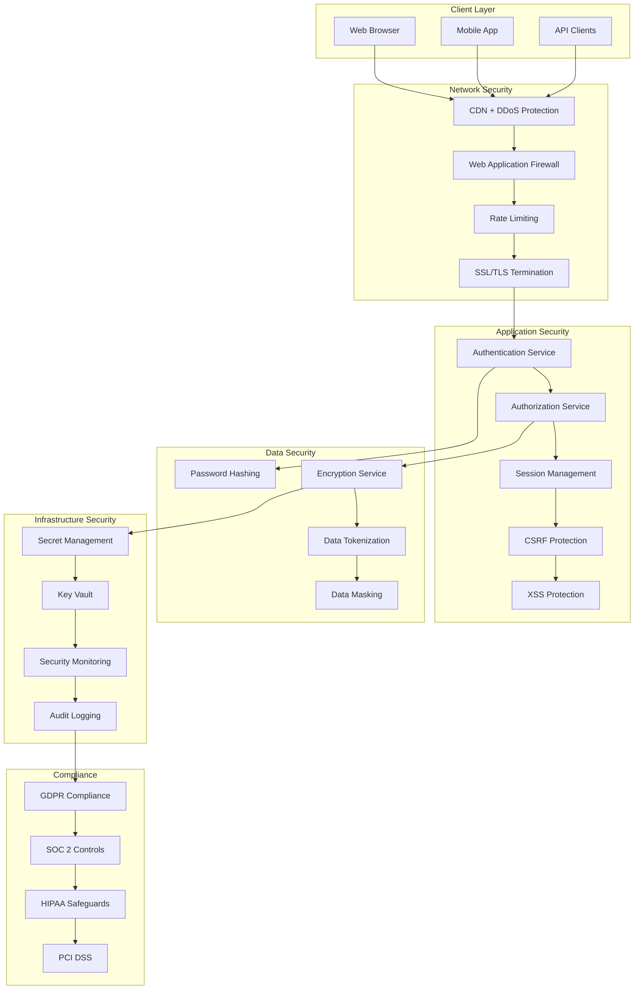

# Security and Authentication Framework

## Overview

The security framework provides comprehensive protection for the realtor platform, including multi-factor authentication, role-based access control, data encryption, audit logging, and compliance with real estate industry regulations. This framework ensures that sensitive client data, financial information, and business documents are protected against unauthorized access and cyber threats.

## Security Architecture

### 1. Security Layers



## Authentication System

### 1. Multi-Factor Authentication (MFA)

```typescript
// Authentication service with MFA support
class AuthenticationService {
  private jwtService: JWTService;
  private mfaService: MFAService;
  private auditService: AuditService;
  
  constructor() {
    this.jwtService = new JWTService();
    this.mfaService = new MFAService();
    this.auditService = new AuditService();
  }
  
  async authenticate(credentials: LoginCredentials): Promise<AuthResult> {
    try {
      // Step 1: Validate credentials
      const user = await this.validateCredentials(credentials);
      if (!user) {
        await this.auditService.logFailedLogin(credentials.email, 'invalid_credentials');
        throw new AuthenticationError('Invalid credentials');
      }
      
      // Step 2: Check account status
      await this.checkAccountStatus(user);
      
      // Step 3: Check for MFA requirement
      if (user.mfaEnabled || this.requiresMFA(user)) {
        return await this.initiateMFAChallenge(user, credentials);
      }
      
      // Step 4: Generate tokens
      const tokens = await this.generateTokens(user);
      
      // Step 5: Create session
      const session = await this.createSession(user, tokens, credentials);
      
      // Step 6: Log successful login
      await this.auditService.logSuccessfulLogin(user.id, credentials.ipAddress);
      
      return {
        success: true,
        user: this.sanitizeUser(user),
        tokens,
        session,
        requiresMFA: false
      };
      
    } catch (error) {
      await this.handleAuthenticationError(error, credentials);
      throw error;
    }
  }
  
  private async validateCredentials(credentials: LoginCredentials): Promise<User | null> {
    const user = await db.user.findUnique({
      where: { email: credentials.email.toLowerCase() }
    });
    
    if (!user) return null;
    
    // Check password
    const isValidPassword = await bcrypt.compare(credentials.password, user.passwordHash);
    if (!isValidPassword) return null;
    
    // Check for password expiration
    if (this.isPasswordExpired(user)) {
      throw new AuthenticationError('Password expired', 'PASSWORD_EXPIRED');
    }
    
    return user;
  }
  
  private async initiateMFAChallenge(
    user: User, 
    credentials: LoginCredentials
  ): Promise<AuthResult> {
    // Generate MFA challenge
    const challenge = await this.mfaService.generateChallenge(user.id);
    
    // Create temporary session
    const tempSession = await this.createTemporarySession(user, credentials);
    
    // Send MFA code (SMS, email, or app notification)
    await this.mfaService.sendMFACode(user, challenge);
    
    return {
      success: false,
      requiresMFA: true,
      mfaChallenge: challenge.id,
      tempSession: tempSession.token,
      availableMethods: user.mfaMethods
    };
  }
  
  async verifyMFA(mfaVerification: MFAVerification): Promise<AuthResult> {
    // Validate temporary session
    const tempSession = await this.validateTemporarySession(mfaVerification.tempSession);
    if (!tempSession) {
      throw new AuthenticationError('Invalid or expired MFA session');
    }
    
    // Verify MFA code
    const isValidMFA = await this.mfaService.verifyCode(
      mfaVerification.challengeId,
      mfaVerification.code,
      mfaVerification.method
    );
    
    if (!isValidMFA) {
      await this.auditService.logFailedMFA(tempSession.userId);
      throw new AuthenticationError('Invalid MFA code');
    }
    
    // Get user
    const user = await db.user.findUnique({
      where: { id: tempSession.userId }
    });
    
    // Generate full tokens
    const tokens = await this.generateTokens(user);
    
    // Create full session
    const session = await this.createSession(user, tokens, {
      ipAddress: tempSession.ipAddress,
      userAgent: tempSession.userAgent
    });
    
    // Clean up temporary session
    await this.cleanupTemporarySession(mfaVerification.tempSession);
    
    // Log successful MFA
    await this.auditService.logSuccessfulMFA(user.id);
    
    return {
      success: true,
      user: this.sanitizeUser(user),
      tokens,
      session,
      requiresMFA: false
    };
  }
}
```

### 2. JWT Token Management

```typescript
// JWT service with secure token handling
class JWTService {
  private accessTokenSecret: string;
  private refreshTokenSecret: string;
  private accessTokenExpiry: string = '15m';
  private refreshTokenExpiry: string = '7d';
  
  constructor() {
    this.accessTokenSecret = process.env.JWT_ACCESS_SECRET;
    this.refreshTokenSecret = process.env.JWT_REFRESH_SECRET;
  }
  
  async generateTokenPair(user: User): Promise<TokenPair> {
    const payload = {
      userId: user.id,
      email: user.email,
      role: user.role,
      permissions: await this.getUserPermissions(user.id)
    };
    
    // Generate access token
    const accessToken = jwt.sign(payload, this.accessTokenSecret, {
      expiresIn: this.accessTokenExpiry,
      issuer: 'realtor-platform',
      audience: 'realtor-app',
      subject: user.id
    });
    
    // Generate refresh token
    const refreshToken = jwt.sign(
      { userId: user.id, tokenType: 'refresh' },
      this.refreshTokenSecret,
      {
        expiresIn: this.refreshTokenExpiry,
        issuer: 'realtor-platform',
        audience: 'realtor-app',
        subject: user.id
      }
    );
    
    // Store refresh token hash in database
    await this.storeRefreshToken(user.id, refreshToken);
    
    return {
      accessToken,
      refreshToken,
      expiresIn: this.parseExpiry(this.accessTokenExpiry),
      tokenType: 'Bearer'
    };
  }
  
  async verifyAccessToken(token: string): Promise<JWTPayload> {
    try {
      const payload = jwt.verify(token, this.accessTokenSecret) as JWTPayload;
      
      // Check if user is still active
      const user = await db.user.findUnique({
        where: { id: payload.userId }
      });
      
      if (!user || !user.isActive) {
        throw new AuthenticationError('User account is inactive');
      }
      
      return payload;
    } catch (error) {
      if (error instanceof jwt.TokenExpiredError) {
        throw new AuthenticationError('Access token expired', 'TOKEN_EXPIRED');
      } else if (error instanceof jwt.JsonWebTokenError) {
        throw new AuthenticationError('Invalid access token', 'INVALID_TOKEN');
      }
      throw error;
    }
  }
  
  async refreshTokens(refreshToken: string): Promise<TokenPair> {
    try {
      // Verify refresh token
      const payload = jwt.verify(refreshToken, this.refreshTokenSecret) as JWTPayload;
      
      // Check if refresh token exists in database
      const storedToken = await db.refreshToken.findFirst({
        where: {
          userId: payload.userId,
          tokenHash: await this.hashToken(refreshToken),
          expiresAt: { gt: new Date() },
          isRevoked: false
        }
      });
      
      if (!storedToken) {
        throw new AuthenticationError('Invalid or expired refresh token');
      }
      
      // Get user
      const user = await db.user.findUnique({
        where: { id: payload.userId }
      });
      
      if (!user || !user.isActive) {
        throw new AuthenticationError('User account is inactive');
      }
      
      // Revoke old refresh token
      await this.revokeRefreshToken(storedToken.id);
      
      // Generate new token pair
      return await this.generateTokenPair(user);
      
    } catch (error) {
      if (error instanceof jwt.TokenExpiredError) {
        throw new AuthenticationError('Refresh token expired', 'REFRESH_EXPIRED');
      } else if (error instanceof jwt.JsonWebTokenError) {
        throw new AuthenticationError('Invalid refresh token', 'INVALID_REFRESH');
      }
      throw error;
    }
  }
  
  private async storeRefreshToken(userId: string, token: string): Promise<void> {
    const tokenHash = await this.hashToken(token);
    const expiresAt = new Date();
    expiresAt.setDate(expiresAt.getDate() + 7); // 7 days
    
    await db.refreshToken.create({
      data: {
        userId,
        tokenHash,
        expiresAt,
        isRevoked: false
      }
    });
  }
  
  private async hashToken(token: string): Promise<string> {
    return crypto.createHash('sha256').update(token).digest('hex');
  }
}
```

## Authorization & Access Control

### 1. Role-Based Access Control (RBAC)

```typescript
// Authorization service with RBAC
class AuthorizationService {
  private permissions: Map<string, Permission[]> = new Map();
  
  constructor() {
    this.initializePermissions();
  }
  
  private initializePermissions(): void {
    // Define role-based permissions
    this.permissions.set('admin', [
      'users:read', 'users:write', 'users:delete',
      'contacts:read', 'contacts:write', 'contacts:delete',
      'properties:read', 'properties:write', 'properties:delete',
      'documents:read', 'documents:write', 'documents:delete',
      'transactions:read', 'transactions:write', 'transactions:delete',
      'reports:read', 'reports:write',
      'settings:read', 'settings:write',
      'audit:read'
    ]);
    
    this.permissions.set('realtor', [
      'contacts:read', 'contacts:write',
      'properties:read', 'properties:write',
      'documents:read', 'documents:write',
      'transactions:read', 'transactions:write',
      'reports:read',
      'settings:read'
    ]);
    
    this.permissions.set('assistant', [
      'contacts:read', 'contacts:write',
      'properties:read',
      'documents:read', 'documents:write',
      'transactions:read',
      'reports:read'
    ]);
    
    this.permissions.set('client', [
      'documents:read', // Only own documents
      'properties:read', // Only matched properties
      'transactions:read' // Only own transactions
    ]);
  }
  
  async checkPermission(
    userId: string,
    resource: string,
    action: string,
    context?: AuthorizationContext
  ): Promise<boolean> {
    // Get user with roles
    const user = await db.user.findUnique({
      where: { id: userId },
      include: { roles: true }
    });
    
    if (!user || !user.isActive) {
      return false;
    }
    
    // Check each role's permissions
    for (const role of user.roles) {
      const rolePermissions = this.permissions.get(role.name) || [];
      const requiredPermission = `${resource}:${action}`;
      
      if (rolePermissions.includes(requiredPermission)) {
        // Additional context-based checks
        if (context) {
          return await this.checkContextualPermission(user, resource, action, context);
        }
        return true;
      }
    }
    
    return false;
  }
  
  private async checkContextualPermission(
    user: User,
    resource: string,
    action: string,
    context: AuthorizationContext
  ): Promise<boolean> {
    switch (resource) {
      case 'contacts':
        return await this.checkContactPermission(user, action, context);
      case 'documents':
        return await this.checkDocumentPermission(user, action, context);
      case 'transactions':
        return await this.checkTransactionPermission(user, action, context);
      default:
        return true;
    }
  }
  
  private async checkContactPermission(
    user: User,
    action: string,
    context: AuthorizationContext
  ): Promise<boolean> {
    if (user.role === 'admin') return true;
    
    // Users can only access their own contacts
    if (context.resourceId) {
      const contact = await db.contact.findUnique({
        where: { id: context.resourceId }
      });
      return contact?.userId === user.id;
    }
    
    return true;
  }
  
  private async checkDocumentPermission(
    user: User,
    action: string,
    context: AuthorizationContext
  ): Promise<boolean> {
    if (user.role === 'admin') return true;
    
    if (context.resourceId) {
      const document = await db.document.findUnique({
        where: { id: context.resourceId },
        include: { sharedWith: true }
      });
      
      if (!document) return false;
      
      // Owner has full access
      if (document.userId === user.id) return true;
      
      // Check if document is shared with user
      const sharedAccess = document.sharedWith.find(share => 
        share.userId === user.id || share.email === user.email
      );
      
      if (sharedAccess) {
        // Check permission level
        if (action === 'read') return true;
        if (action === 'write' && sharedAccess.permission === 'write') return true;
      }
    }
    
    return false;
  }
}
```

### 2. Resource-Level Security

```typescript
// Resource security middleware
class ResourceSecurityMiddleware {
  async secureResource(
    req: AuthenticatedRequest,
    res: Response,
    next: NextFunction
  ): Promise<void> {
    try {
      const { resource, action, resourceId } = this.extractResourceInfo(req);
      
      // Check basic permission
      const hasPermission = await this.authorizationService.checkPermission(
        req.user.id,
        resource,
        action,
        { resourceId, userId: req.user.id }
      );
      
      if (!hasPermission) {
        return res.status(403).json({
          error: 'Forbidden',
          message: 'Insufficient permissions to access this resource'
        });
      }
      
      // Apply data filtering based on user context
      req.securityContext = await this.buildSecurityContext(req.user, resource);
      
      next();
    } catch (error) {
      res.status(500).json({
        error: 'Security Error',
        message: 'Failed to validate resource access'
      });
    }
  }
  
  private async buildSecurityContext(
    user: User,
    resource: string
  ): Promise<SecurityContext> {
    const context: SecurityContext = {
      userId: user.id,
      role: user.role,
      filters: {}
    };
    
    // Apply role-based data filters
    switch (user.role) {
      case 'realtor':
        // Realtors can only see their own data
        context.filters.userId = user.id;
        break;
        
      case 'assistant':
        // Assistants can see data from their assigned realtor
        const assignedRealtor = await this.getAssignedRealtor(user.id);
        if (assignedRealtor) {
          context.filters.userId = assignedRealtor.id;
        }
        break;
        
      case 'client':
        // Clients can only see data related to them
        context.filters.clientId = user.id;
        break;
        
      case 'admin':
        // Admins can see all data (no filters)
        break;
    }
    
    return context;
  }
}
```

## Data Encryption & Protection

### 1. Encryption Service

```typescript
// Comprehensive encryption service
class EncryptionService {
  private readonly algorithm = 'aes-256-gcm';
  private readonly keyDerivationIterations = 100000;
  
  async encryptSensitiveData(data: string, context: string): Promise<EncryptedData> {
    // Generate unique key for this data
    const salt = crypto.randomBytes(32);
    const key = await this.deriveKey(context, salt);
    const iv = crypto.randomBytes(16);
    
    // Encrypt data
    const cipher = crypto.createCipher(this.algorithm, key, iv);
    let encrypted = cipher.update(data, 'utf8', 'hex');
    encrypted += cipher.final('hex');
    
    const authTag = cipher.getAuthTag();
    
    return {
      encryptedData: encrypted,
      iv: iv.toString('hex'),
      salt: salt.toString('hex'),
      authTag: authTag.toString('hex'),
      algorithm: this.algorithm
    };
  }
  
  async decryptSensitiveData(
    encryptedData: EncryptedData,
    context: string
  ): Promise<string> {
    // Derive key using stored salt
    const salt = Buffer.from(encryptedData.salt, 'hex');
    const key = await this.deriveKey(context, salt);
    const iv = Buffer.from(encryptedData.iv, 'hex');
    const authTag = Buffer.from(encryptedData.authTag, 'hex');
    
    // Decrypt data
    const decipher = crypto.createDecipher(this.algorithm, key, iv);
    decipher.setAuthTag(authTag);
    
    let decrypted = decipher.update(encryptedData.encryptedData, 'hex', 'utf8');
    decrypted += decipher.final('utf8');
    
    return decrypted;
  }
  
  private async deriveKey(context: string, salt: Buffer): Promise<Buffer> {
    const masterKey = process.env.MASTER_ENCRYPTION_KEY;
    const contextKey = crypto.createHash('sha256').update(context).digest();
    
    return crypto.pbkdf2Sync(
      masterKey + contextKey.toString('hex'),
      salt,
      this.keyDerivationIterations,
      32,
      'sha256'
    );
  }
  
  // Field-level encryption for database
  async encryptDatabaseField(
    tableName: string,
    fieldName: string,
    value: string,
    recordId: string
  ): Promise<string> {
    const context = `${tableName}.${fieldName}.${recordId}`;
    const encrypted = await this.encryptSensitiveData(value, context);
    return JSON.stringify(encrypted);
  }
  
  async decryptDatabaseField(
    tableName: string,
    fieldName: string,
    encryptedValue: string,
    recordId: string
  ): Promise<string> {
    const context = `${tableName}.${fieldName}.${recordId}`;
    const encrypted = JSON.parse(encryptedValue) as EncryptedData;
    return await this.decryptSensitiveData(encrypted, context);
  }
}
```

### 2. Data Masking & Tokenization

```typescript
// Data masking service for PII protection
class DataMaskingService {
  async maskSensitiveData(data: any, maskingRules: MaskingRule[]): Promise<any> {
    const maskedData = { ...data };
    
    for (const rule of maskingRules) {
      if (maskedData[rule.field]) {
        maskedData[rule.field] = this.applyMaskingRule(
          maskedData[rule.field],
          rule
        );
      }
    }
    
    return maskedData;
  }
  
  private applyMaskingRule(value: string, rule: MaskingRule): string {
    switch (rule.type) {
      case 'email':
        return this.maskEmail(value);
      case 'phone':
        return this.maskPhone(value);
      case 'ssn':
        return this.maskSSN(value);
      case 'credit_card':
        return this.maskCreditCard(value);
      case 'partial':
        return this.maskPartial(value, rule.visibleChars || 4);
      case 'full':
        return '*'.repeat(value.length);
      default:
        return value;
    }
  }
  
  private maskEmail(email: string): string {
    const [username, domain] = email.split('@');
    const maskedUsername = username.charAt(0) + 
      '*'.repeat(Math.max(0, username.length - 2)) + 
      username.charAt(username.length - 1);
    return `${maskedUsername}@${domain}`;
  }
  
  private maskPhone(phone: string): string {
    const digits = phone.replace(/\D/g, '');
    if (digits.length === 10) {
      return `(${digits.substr(0, 3)}) ***-${digits.substr(6, 4)}`;
    }
    return phone;
  }
  
  private maskSSN(ssn: string): string {
    const digits = ssn.replace(/\D/g, '');
    if (digits.length === 9) {
      return `***-**-${digits.substr(5, 4)}`;
    }
    return ssn;
  }
}
```

## Security Monitoring & Audit

### 1. Security Event Monitoring

```typescript
// Security monitoring service
class SecurityMonitoringService {
  private alertThresholds = {
    failedLogins: { count: 5, window: 300000 }, // 5 attempts in 5 minutes
    suspiciousActivity: { count: 10, window: 600000 }, // 10 events in 10 minutes
    dataAccess: { count: 100, window: 3600000 } // 100 accesses in 1 hour
  };
  
  async monitorSecurityEvent(event: SecurityEvent): Promise<void> {
    // Log the event
    await this.logSecurityEvent(event);
    
    // Check for suspicious patterns
    await this.checkSuspiciousActivity(event);
    
    // Update security metrics
    await this.updateSecurityMetrics(event);
    
    // Trigger alerts if necessary
    await this.checkAlertThresholds(event);
  }
  
  private async checkSuspiciousActivity(event: SecurityEvent): Promise<void> {
    const suspiciousPatterns = [
      this.checkBruteForceAttack(event),
      this.checkUnusualAccessPatterns(event),
      this.checkDataExfiltration(event),
      this.checkPrivilegeEscalation(event)
    ];
    
    const results = await Promise.all(suspiciousPatterns);
    
    for (const result of results) {
      if (result.isSuspicious) {
        await this.handleSuspiciousActivity(result);
      }
    }
  }
  
  private async checkBruteForceAttack(event: SecurityEvent): Promise<SuspiciousActivityResult> {
    if (event.type !== 'failed_login') {
      return { isSuspicious: false };
    }
    
    const recentFailures = await db.securityEvent.count({
      where: {
        type: 'failed_login',
        ipAddress: event.ipAddress,
        createdAt: {
          gte: new Date(Date.now() - this.alertThresholds.failedLogins.window)
        }
      }
    });
    
    if (recentFailures >= this.alertThresholds.failedLogins.count) {
      return {
        isSuspicious: true,
        type: 'brute_force_attack',
        severity: 'high',
        details: {
          ipAddress: event.ipAddress,
          failedAttempts: recentFailures,
          timeWindow: this.alertThresholds.failedLogins.window
        }
      };
    }
    
    return { isSuspicious: false };
  }
  
  private async handleSuspiciousActivity(result: SuspiciousActivityResult): Promise<void> {
    // Create security incident
    const incident = await db.securityIncident.create({
      data: {
        type: result.type,
        severity: result.severity,
        details: result.details,
        status: 'open',
        createdAt: new Date()
      }
    });
    
    // Take immediate action based on severity
    switch (result.severity) {
      case 'critical':
        await this.handleCriticalIncident(incident);
        break;
      case 'high':
        await this.handleHighSeverityIncident(incident);
        break;
      case 'medium':
        await this.handleMediumSeverityIncident(incident);
        break;
    }
    
    // Notify security team
    await this.notifySecurityTeam(incident);
  }
  
  private async handleCriticalIncident(incident: SecurityIncident): Promise<void> {
    // Immediate actions for critical incidents
    if (incident.details.ipAddress) {
      // Block IP address
      await this.blockIPAddress(incident.details.ipAddress);
    }
    
    if (incident.details.userId) {
      // Suspend user account
      await this.suspendUserAccount(incident.details.userId);
      
      // Revoke all user sessions
      await this.revokeAllUserSessions(incident.details.userId);
    }
    
    // Send immediate alert
    await this.sendImmediateAlert(incident);
  }
}
```

### 2. Comprehensive Audit Logging

```typescript
// Audit logging service
class AuditLoggingService {
  async logUserAction(
    userId: string,
    action: string,
    resource: string,
    resourceId?: string,
    details?: any,
    ipAddress?: string,
    userAgent?: string
  ): Promise<void> {
    await db.auditLog.create({
      data: {
        userId,
        action,
        resource,
        resourceId,
        details: details ? JSON.stringify(details) : null,
        ipAddress,
        userAgent,
        timestamp: new Date()
      }
    });
    
    // Check for sensitive actions that require additional logging
    if (this.isSensitiveAction(action, resource)) {
      await this.logSensitiveAction(userId, action, resource, resourceId, details);
    }
  }
  
  async generateAuditReport(
    startDate: Date,
    endDate: Date,
    filters?: AuditFilters
  ): Promise<AuditReport> {
    const auditLogs = await db.auditLog.findMany({
      where: {
        timestamp: { gte: startDate, lte: endDate },
        ...(filters?.userId && { userId: filters.userId }),
        ...(filters?.resource && { resource: filters.resource }),
        ...(filters?.action && { action: filters.action })
      },
      include: {
        user: { select: { firstName: true, lastName: true, email: true } }
      },
      orderBy: { timestamp: 'desc' }
    });
    
    return {
      period: { start: startDate, end: endDate },
      totalEvents: auditLogs.length,
      events: auditLogs.map(log => ({
        id: log.id,
        timestamp: log.timestamp,
        user: `${log.user.firstName} ${log.user.lastName}`,
        action: log.action,
        resource: log.resource,
        resourceId: log.resourceId,
        details: log.details ? JSON.parse(log.details) : null,
        ipAddress: log.ipAddress
      })),
      summary: this.generateAuditSummary(auditLogs)
    };
  }
  
  private isSensitiveAction(action: string, resource: string): boolean {
    const sensitiveActions = [
      'delete', 'export', 'share', 'permission_change',
      'password_change', 'mfa_disable', 'account_unlock'
    ];
    
    const sensitiveResources = [
      'user', 'document', 'transaction', 'financial_data'
    ];
    
    return sensitiveActions.includes(action) || sensitiveResources.includes(resource);
  }
}
```

## Compliance Framework

### 1. GDPR Compliance

```typescript
// GDPR compliance service
class GDPRComplianceService {
  async handleDataSubjectRequest(request: DataSubjectRequest): Promise<DataSubjectResponse> {
    switch (request.type) {
      case 'access':
        return await this.handleAccessRequest(request);
      case 'rectification':
        return await this.handleRectificationRequest