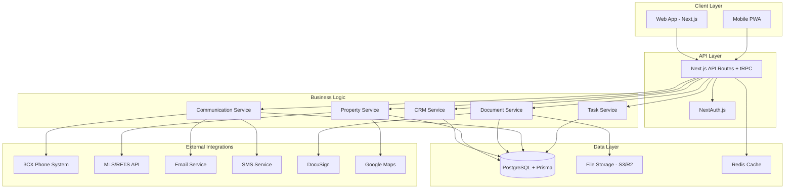

# Realtor Platform System Architecture

## Recommended Technology Stack

### Frontend
- **Framework**: Next.js 14+ (React-based)
  - Server-side rendering for SEO
  - Built-in API routes
  - Excellent performance
  - TypeScript support
- **UI Library**: Tailwind CSS + Shadcn/ui
  - Modern, responsive design
  - Component library for consistency
  - Dark/light mode support
- **State Management**: Zustand or React Query
  - Simple, lightweight state management
  - Excellent caching for API calls

### Backend
- **Runtime**: Node.js with TypeScript
- **Framework**: Next.js API routes + tRPC
  - Type-safe API calls
  - Automatic API documentation
  - Built-in validation
- **Database**: PostgreSQL with Prisma ORM
  - Robust relational database
  - Type-safe database queries
  - Automatic migrations
- **File Storage**: AWS S3 or Cloudflare R2
  - Scalable document storage
  - CDN integration
  - Cost-effective

### Authentication & Security
- **Auth**: NextAuth.js v5 (Auth.js)
  - Multiple providers support
  - JWT tokens
  - Role-based access control
- **Security**: 
  - HTTPS everywhere
  - Rate limiting
  - Input validation
  - File upload restrictions

### Integrations
- **3CX**: REST API + WebRTC
- **Email**: Resend or SendGrid
- **SMS**: Twilio
- **Documents**: DocuSign API
- **MLS**: RETS/RESO integration
- **Maps**: Google Maps API

### Deployment & Infrastructure
- **Hosting**: Vercel (recommended) or AWS
- **Database**: Supabase or AWS RDS
- **CDN**: Cloudflare
- **Monitoring**: Sentry + Vercel Analytics
- **Backup**: Automated daily backups

## System Architecture Diagram

## Key Architectural Decisions

### 1. Monolithic vs Microservices
**Decision**: Monolithic Next.js application with modular services
**Reasoning**: 
- Simpler deployment and maintenance
- Better performance for single-tenant use
- Easier development and debugging
- Can evolve to microservices later if needed

### 2. Database Choice
**Decision**: PostgreSQL with Prisma ORM
**Reasoning**:
- ACID compliance for financial data
- Complex relationships between entities
- Full-text search capabilities
- JSON support for flexible data
- Excellent TypeScript integration

### 3. Real-time Features
**Decision**: Server-Sent Events (SSE) + WebSockets for critical features
**Reasoning**:
- Real-time notifications
- Live chat functionality
- Property update alerts
- Task reminders

### 4. File Storage Strategy
**Decision**: Cloud storage (S3/R2) with CDN
**Reasoning**:
- Scalable and cost-effective
- Global content delivery
- Automatic backups
- Integration with document signing

### 5. Mobile Strategy
**Decision**: Progressive Web App (PWA)
**Reasoning**:
- Single codebase maintenance
- Native-like experience
- Offline capabilities
- Push notifications
- App store distribution optional

## Performance Considerations

### Caching Strategy
- **Database**: Query result caching with Redis
- **API**: Response caching for static data
- **CDN**: Asset and document caching
- **Browser**: Service worker for offline access

### Optimization
- **Images**: Next.js Image optimization
- **Code Splitting**: Route-based splitting
- **Lazy Loading**: Component and data lazy loading
- **Database**: Proper indexing and query optimization

## Security Framework

### Data Protection
- **Encryption**: At rest and in transit
- **Access Control**: Role-based permissions
- **Audit Logging**: All sensitive operations
- **Backup**: Encrypted, automated backups

### Compliance
- **GDPR**: Data privacy controls
- **SOC 2**: Security compliance
- **Real Estate**: Industry-specific requirements
- **Financial**: Transaction security

## Scalability Plan

### Phase 1: Single Realtor (MVP)
- Basic CRM and property management
- Document storage and signing
- 3CX integration
- Mobile-responsive design

### Phase 2: Enhanced Features
- Advanced reporting and analytics
- Marketing automation
- Advanced integrations
- Performance optimizations

### Phase 3: Multi-tenant (Future)
- Multiple realtor support
- White-label capabilities
- Advanced admin features
- Enterprise integrations