# User Interface & User Experience Design

## Design Philosophy

### Core Principles
1. **Efficiency First**: Minimize clicks and time to complete common tasks
2. **Mobile-First**: Responsive design that works seamlessly on all devices
3. **Data-Driven**: Present information in actionable, digestible formats
4. **Professional**: Clean, modern interface that builds client confidence
5. **Accessible**: WCAG 2.1 AA compliant for all users

### User Personas

#### Primary User: Real Estate Agent
- **Goals**: Manage leads, close deals, maintain client relationships
- **Pain Points**: Information scattered across systems, manual data entry
- **Behavior**: Mobile-heavy usage, multitasking, time-constrained
- **Tech Comfort**: Moderate to high

#### Secondary Users: Clients (Buyers/Sellers)
- **Goals**: Find properties, track transaction progress, communicate with agent
- **Pain Points**: Lack of transparency, communication gaps
- **Behavior**: Mobile browsing, visual-focused
- **Tech Comfort**: Varies widely

## Information Architecture

### Main Navigation Structure

```mermaid
graph TD
    DASHBOARD[Dashboard]
    
    CONTACTS[Contacts & CRM]
    CONTACTS --> LEADS[Leads]
    CONTACTS --> CLIENTS[Active Clients]
    CONTACTS --> VENDORS[Vendors]
    
    PROPERTIES[Properties]
    PROPERTIES --> LISTINGS[My Listings]
    PROPERTIES --> SEARCH[Property Search]
    PROPERTIES --> SHOWINGS[Showings]
    
    TRANSACTIONS[Transactions]
    TRANSACTIONS --> ACTIVE[Active Deals]
    TRANSACTIONS --> PIPELINE[Deal Pipeline]
    TRANSACTIONS --> CLOSED[Closed Deals]
    
    COMMUNICATIONS[Communications]
    COMMUNICATIONS --> CALLS[Call Log]
    COMMUNICATIONS --> EMAILS[Email Center]
    COMMUNICATIONS --> CAMPAIGNS[Marketing Campaigns]
    
    DOCUMENTS[Documents]
    DOCUMENTS --> CONTRACTS[Contracts]
    DOCUMENTS --> TEMPLATES[Templates]
    DOCUMENTS --> SIGNATURES[E-Signatures]
    
    TASKS[Tasks & Calendar]
    TASKS --> TODAY[Today's Tasks]
    TASKS --> CALENDAR[Calendar View]
    TASKS --> REMINDERS[Reminders]
    
    REPORTS[Reports & Analytics]
    REPORTS --> PERFORMANCE[Performance]
    REPORTS --> FINANCIALS[Commission Tracking]
    REPORTS --> MARKET[Market Analysis]
    
    SETTINGS[Settings]
    SETTINGS --> PROFILE[Profile]
    SETTINGS --> INTEGRATIONS[Integrations]
    SETTINGS --> PREFERENCES[Preferences]
```



## Page Layouts & Components

### 1. Dashboard Layout

**Purpose**: Central command center with key metrics and quick actions

**Layout Structure**:
```
┌─────────────────────────────────────────────────────────────┐
│ Header: Logo | Search | Notifications | Profile             │
├─────────────────────────────────────────────────────────────┤
│ Sidebar Navigation                                          │
├─────────────────────────────────────────────────────────────┤
│ Quick Stats Cards                                           │
│ ┌─────────┐ ┌─────────┐ ┌─────────┐ ┌─────────┐            │
│ │ Active  │ │ New     │ │ This    │ │ Pending │            │
│ │ Leads   │ │ Listings│ │ Month   │ │ Closings│            │
│ │   24    │ │    3    │ │ $45K    │ │    2    │            │
│ └─────────┘ └─────────┘ └─────────┘ └─────────┘            │
├─────────────────────────────────────────────────────────────┤
│ Main Content Area (2-column)                               │
│ ┌─────────────────────────┐ ┌─────────────────────────────┐ │
│ │ Today's Tasks           │ │ Recent Activity             │ │
│ │ • Call John Smith       │ │ • New lead from website     │ │
│ │ • Property showing      │ │ • Contract signed           │ │
│ │ • Follow up with...     │ │ • Listing price updated     │ │
│ └─────────────────────────┘ └─────────────────────────────┘ │
│ ┌─────────────────────────┐ ┌─────────────────────────────┐ │
│ │ Deal Pipeline           │ │ Upcoming Appointments       │ │
│ │ [Visual pipeline view]  │ │ • 2:00 PM - Property tour   │ │
│ └─────────────────────────┘ └─────────────────────────────┘ │
└─────────────────────────────────────────────────────────────┘
```

**Key Components**:
- **Quick Action Buttons**: Add Lead, New Listing, Schedule Showing
- **Smart Notifications**: Overdue tasks, new leads, contract deadlines
- **Performance Widgets**: Monthly goals, conversion rates, revenue tracking
- **Weather Widget**: For scheduling outdoor showings

### 2. Contact Management Interface

**Purpose**: Comprehensive CRM with lead tracking and client management

**Features**:
- **Contact Cards**: Photo, key info, last interaction, next action
- **Lead Scoring**: Visual indicators for lead quality and urgency
- **Communication Timeline**: All interactions in chronological order
- **Quick Actions**: Call, email, text, schedule meeting
- **Property Matching**: Automated suggestions based on preferences

**List View**:
```
┌─────────────────────────────────────────────────────────────┐
│ Filters: [All] [Leads] [Buyers] [Sellers] | Search: [____]  │
├─────────────────────────────────────────────────────────────┤
│ ┌─────┐ John Smith        Lead Score: ●●●○○  Last: 2 days   │
│ │ JS  │ john@email.com    Budget: $300-400K   Next: Call    │
│ └─────┘ (555) 123-4567    Looking: Single Family           │
│         [📞] [✉️] [💬] [📅] Source: Website                  │
├─────────────────────────────────────────────────────────────┤
│ ┌─────┐ Sarah Johnson     Lead Score: ●●●●○  Last: Today    │
│ │ SJ  │ sarah@email.com   Budget: $250-350K   Next: Showing │
│ └─────┘ (555) 987-6543    Looking: Condo                   │
│         [📞] [✉️] [💬] [📅] Source: Referral                 │
└─────────────────────────────────────────────────────────────┘
```

### 3. Property Management Interface

**Purpose**: Listing management, property search, and showing coordination

**Property Card Design**:
```
┌─────────────────────────────────────────────────────────────┐
│ ┌─────────────┐ 123 Main Street                    $425,000 │
│ │   [Image]   │ Anytown, ST 12345                           │
│ │             │ 3 bed • 2 bath • 1,850 sq ft               │
│ └─────────────┘ Listed: 15 days ago                         │
│ Status: Active  | MLS: 12345678  | Showings: 8             │
│ [📅 Schedule] [📄 Documents] [📊 Analytics] [✏️ Edit]        │
└─────────────────────────────────────────────────────────────┘
```

**Map Integration**:
- Interactive map with property pins
- Neighborhood information overlay
- School districts and amenities
- Comparable sales data

### 4. Communication Center

**Purpose**: Unified communication hub for all client interactions

**Features**:
- **Unified Inbox**: Emails, texts, voicemails in one place
- **3CX Integration**: Click-to-call, call recording, call history
- **Email Templates**: Pre-written responses for common scenarios
- **Bulk Messaging**: Property alerts, market updates, newsletters
- **Communication Tracking**: All interactions logged automatically

**Interface Layout**:
```
┌─────────────────────────────────────────────────────────────┐
│ Inbox (23) | Sent | Drafts | Templates | Campaigns          │
├─────────────────────────────────────────────────────────────┤
│ ┌─────────────────────────────────────────────────────────┐ │
│ │ 📧 John Smith - RE: Property Inquiry        2:30 PM    │ │
│ │    "I'm interested in the listing on Main Street..."   │ │
│ └─────────────────────────────────────────────────────────┘ │
│ ┌─────────────────────────────────────────────────────────┐ │
│ │ 📞 Sarah Johnson - Missed Call               1:45 PM    │ │
│ │    Duration: 0:00 | Voicemail: Yes | [Play]           │ │
│ └─────────────────────────────────────────────────────────┘ │
│ ┌─────────────────────────────────────────────────────────┐ │
│ │ 💬 Mike Wilson - Text Message                12:15 PM   │ │
│ │    "Can we reschedule the showing for tomorrow?"       │ │
│ └─────────────────────────────────────────────────────────┘ │
└─────────────────────────────────────────────────────────────┘
```

## Mobile-First Design

### Mobile Navigation
- **Bottom Tab Bar**: Dashboard, Contacts, Properties, Tasks, More
- **Swipe Gestures**: Quick actions on list items
- **Voice Input**: For notes and quick data entry
- **Offline Mode**: Core functionality available without internet

### Mobile-Optimized Features
- **Quick Call**: One-tap calling from any contact
- **Photo Capture**: Instant property photos with auto-tagging
- **GPS Integration**: Automatic location tracking for showings
- **Push Notifications**: Real-time alerts for important events

## Design System

### Color Palette
```css
/* Primary Colors */
--primary-blue: #2563eb;      /* Trust, professionalism */
--primary-dark: #1e40af;      /* Hover states */
--primary-light: #dbeafe;     /* Backgrounds */

/* Secondary Colors */
--success-green: #059669;     /* Completed, positive */
--warning-orange: #d97706;    /* Attention needed */
--error-red: #dc2626;         /* Urgent, errors */
--neutral-gray: #6b7280;      /* Text, borders */

/* Background Colors */
--bg-primary: #ffffff;        /* Main background */
--bg-secondary: #f9fafb;      /* Card backgrounds */
--bg-tertiary: #f3f4f6;       /* Section dividers */
```

### Typography
```css
/* Font Stack */
font-family: 'Inter', -apple-system, BlinkMacSystemFont, sans-serif;

/* Font Sizes */
--text-xs: 0.75rem;    /* 12px - Labels, captions */
--text-sm: 0.875rem;   /* 14px - Body text, forms */
--text-base: 1rem;     /* 16px - Default body */
--text-lg: 1.125rem;   /* 18px - Subheadings */
--text-xl: 1.25rem;    /* 20px - Card titles */
--text-2xl: 1.5rem;    /* 24px - Page headings */
--text-3xl: 1.875rem;  /* 30px - Main headings */
```

### Component Library

#### Buttons
- **Primary**: Main actions (Save, Submit, Add)
- **Secondary**: Secondary actions (Cancel, Edit)
- **Outline**: Tertiary actions (View Details)
- **Icon**: Quick actions (Call, Email, Delete)

#### Cards
- **Contact Card**: Photo, name, key info, quick actions
- **Property Card**: Image, details, status, actions
- **Task Card**: Title, due date, priority, completion
- **Metric Card**: Number, label, trend indicator

#### Forms
- **Input Fields**: Consistent styling with validation states
- **Dropdowns**: Searchable with common options
- **Date Pickers**: Calendar integration
- **File Uploads**: Drag-and-drop with progress

## Accessibility Features

### WCAG 2.1 AA Compliance
- **Color Contrast**: Minimum 4.5:1 ratio for text
- **Keyboard Navigation**: Full functionality without mouse
- **Screen Reader**: Proper ARIA labels and descriptions
- **Focus Indicators**: Clear visual focus states
- **Alternative Text**: All images have descriptive alt text

### Inclusive Design
- **Font Size**: Scalable text up to 200%
- **High Contrast Mode**: Alternative color scheme
- **Reduced Motion**: Respect user preferences
- **Simple Language**: Clear, jargon-free interface text

## Performance Considerations

### Loading States
- **Skeleton Screens**: For content loading
- **Progressive Loading**: Critical content first
- **Lazy Loading**: Images and non-critical components
- **Offline Indicators**: Clear network status

### Optimization
- **Image Optimization**: WebP format, responsive sizes
- **Code Splitting**: Route-based and component-based
- **Caching Strategy**: Service worker for offline access
- **Bundle Size**: Tree shaking and compression

## User Testing & Feedback

### Usability Testing Plan
1. **Task-Based Testing**: Common workflows (add lead, schedule showing)
2. **A/B Testing**: Interface variations for key features
3. **Accessibility Testing**: Screen reader and keyboard navigation
4. **Mobile Testing**: Touch interactions and responsive design
5. **Performance Testing**: Load times and responsiveness

### Feedback Collection
- **In-App Feedback**: Quick rating and comment system
- **User Analytics**: Heat maps and usage patterns
- **Regular Surveys**: Quarterly satisfaction surveys
- **Feature Requests**: Voting system for new features

This UI/UX design provides a comprehensive, user-friendly interface that addresses the specific needs of real estate professionals while maintaining modern design standards and accessibility requirements.